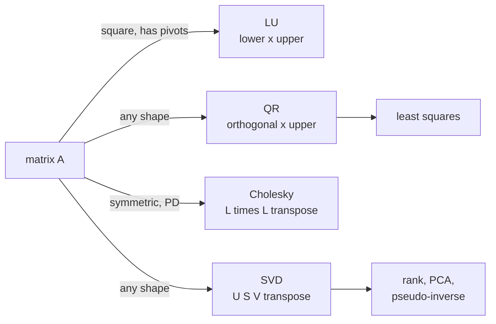

Inverting a matrix is expensive and numerically fragile. Instead, numerical linear
algebra solves $Ax = b$ by **factoring** $A$ into simpler matrices, solving two
easy triangular systems, and never forming $A^{-1}$<FN n="1" />.

## Why triangular systems are cheap

A triangular system $Lx = b$ (lower triangular) is solved by **forward
substitution** in $O(n^2)$ time:

$$
x_1 = b_1 / l_{11}, \quad x_2 = (b_2 - l_{21}x_1)/l_{22}, \quad \ldots
$$

Upper triangular $Ux = b$ is solved by **backward substitution**, the same idea
from bottom up. Factoring $A$ into two triangular matrices reduces the $O(n^3)$
work of building $A^{-1}$ to $O(n^3)$ work of factoring once, then $O(n^2)$ per
right-hand side.

## LU factorization

For a square $A$ (under mild conditions), Gaussian elimination produces

$$
A = LU,
$$

where $L$ is unit lower-triangular (1s on the diagonal) and $U$ is upper
triangular. In practice, partial pivoting permutes rows: $PA = LU$.

**Algorithm.** At step $k$, eliminate column $k$ below the diagonal: for each row
$i > k$, set multiplier $m_{ik} = a_{ik}/a_{kk}$, subtract $m_{ik}$ times row $k$
from row $i$. The multipliers $m_{ik}$ fill the lower triangle of $L$.

**Cost:** $O(n^3)$ to factor, $O(n^2)$ to solve for each new $b$.

**Determinant:** $\det A = \pm \prod_i u_{ii}$ (the sign from the permutation).

## QR factorization

For any (possibly rectangular) $A \in \mathbb{R}^{m \times n}$ with $m \ge n$:

$$
A = QR,
$$

where $Q \in \mathbb{R}^{m \times m}$ is orthogonal and $R \in \mathbb{R}^{m \times n}$
is upper triangular. The economy (thin) form uses $Q \in \mathbb{R}^{m \times n}$
with $Q^\top Q = I_n$.

**Construction via Gram–Schmidt** (previous lesson): the $j$-th column of $R$ has
$r_{ij} = \langle v_j, q_i\rangle$ for $i \le j$ and $0$ above; the process
exactly builds $Q$ and $R$ simultaneously.

**Solving $Ax = b$ via QR:** multiply both sides by $Q^\top$:
$Rx = Q^\top b$, then backward-substitute. For least-squares problems ($m > n$),
QR avoids the formation of $A^\top A$ and is numerically more stable than the
normal equations.

## Cholesky factorization

For a symmetric positive definite matrix $A$:

$$
A = LL^\top,
$$

where $L$ is lower triangular with positive diagonal. Cholesky exists if and only
if $A$ is PD (converse: if Cholesky succeeds, every leading minor is positive,
confirming PD by Sylvester's criterion)<FN n="2" />.

**Cost:** $\approx n^3/3$, roughly half the cost of LU, exploiting symmetry.

**Algorithm.** Column by column, from $j = 1$ to $n$:

$$
l_{jj} = \sqrt{a_{jj} - \sum_{k=1}^{j-1} l_{jk}^2}, \qquad
l_{ij} = \frac{1}{l_{jj}}\left(a_{ij} - \sum_{k=1}^{j-1} l_{ik} l_{jk}\right) \quad (i > j).
$$

A negative value under the square root means $A$ is not PD.

**Inverse:** $A^{-1} = (L^{-1})^\top L^{-1}$, but forming the inverse is usually
unnecessary: solve $Ly = b$ (forward substitution) then $L^\top x = y$ (backward
substitution).



## Check it on arrays

```python
import numpy as np

A = np.array([[4.0, 3.0, 2.0],
              [3.0, 6.0, 1.0],
              [2.0, 1.0, 5.0]])   # symmetric PD

b = np.array([1.0, 2.0, 3.0])

# Triangular solves (the cheap O(n^2) step every factorization reduces to):
def forward_sub(L, b):       # L lower triangular
    x = np.zeros_like(b)
    for i in range(len(b)):
        x[i] = (b[i] - L[i, :i] @ x[:i]) / L[i, i]
    return x

def back_sub(U, b):          # U upper triangular
    x = np.zeros_like(b)
    for i in reversed(range(len(b))):
        x[i] = (b[i] - U[i, i + 1:] @ x[i + 1:]) / U[i, i]
    return x

# LU without pivoting (A is PD here, so no row swaps are needed):
def lu(A):
    n = A.shape[0]
    L, U = np.eye(n), A.astype(float).copy()
    for k in range(n):
        for i in range(k + 1, n):
            L[i, k] = U[i, k] / U[k, k]
            U[i, k:] -= L[i, k] * U[k, k:]
    return L, U

L, U = lu(A)
print("LU reconstructs A:", np.allclose(L @ U, A))
x_lu = back_sub(U, forward_sub(L, b))      # solve Ly=b, then Ux=y

# QR: A = QR, so Ax=b becomes Rx = Q^T b
Q, R = np.linalg.qr(A)
x_qr = back_sub(R, Q.T @ b)
print("LU == QR solution:", np.allclose(x_lu, x_qr))

# Cholesky: A = L L^T, solve Ly=b then L^T x=y
L_chol = np.linalg.cholesky(A)             # lower triangular
y = forward_sub(L_chol, b)
x_chol = back_sub(L_chol.T, y)
print("LU == Cholesky solution:", np.allclose(x_lu, x_chol))

# Never invert: compare condition number
print("cond(A):", np.linalg.cond(A))       # moderate -> solving is fine
```

All three paths give the same solution; the Cholesky factorization halves the
arithmetic. The next lesson uses QR and the SVD together to handle the case where
$Ax = b$ has no exact solution.

<Footnotes>
  <FNItem n="1">**Trefethen, L. N., & Bau, D.** (1997). *Numerical Linear Algebra.* SIAM. LU, QR, and Cholesky factorizations and why factoring beats inverting (Lectures 7, 20, 23).</FNItem>
  <FNItem n="2">**Golub, G. H., & Van Loan, C. F.** (2013). *Matrix Computations* (4th ed.). Johns Hopkins University Press. The canonical reference for matrix factorization algorithms and their costs ([doi:10.56021/9781421407944](https://doi.org/10.56021/9781421407944)).</FNItem>
</Footnotes>
