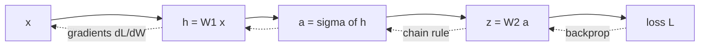

Neural networks are compositions of differentiable maps. Computing their gradients
by hand requires differentiating expressions that involve matrices, not just
scalars. The key is to fix a layout convention once, then derive the gradient of
each building block systematically.

## Layout convention: numerator layout

When a scalar $f$ depends on a vector $x \in \mathbb{R}^n$, the gradient
$\nabla_x f$ is a column vector of partial derivatives:

$$
\nabla_x f = \frac{\partial f}{\partial x} = \begin{pmatrix}\partial f/\partial x_1 \\ \vdots \\ \partial f/\partial x_n\end{pmatrix} \in \mathbb{R}^n.
$$

When a vector $y \in \mathbb{R}^m$ depends on $x \in \mathbb{R}^n$, the
**Jacobian** is the $m \times n$ matrix

$$
J = \frac{\partial y}{\partial x}, \qquad J_{ij} = \frac{\partial y_i}{\partial x_j}.
$$

Row $i$ of $J$ is the gradient of $y_i$ with respect to $x$ (transposed). This
**numerator layout** (also called "denominator layout" in some texts; conventions
differ) makes the chain rule stack Jacobians in the natural left-to-right
multiplication order: $\frac{\partial z}{\partial x} = \frac{\partial z}{\partial y}\frac{\partial y}{\partial x}$.

## Gradient of the linear form

Let $f(x) = a^\top x = a_1 x_1 + \cdots + a_n x_n$.

$$
\frac{\partial f}{\partial x_j} = a_j \implies \nabla_x(a^\top x) = a.
$$

## Gradient of the quadratic form

Let $f(x) = x^\top A x$ with $A$ symmetric. Write index-by-index:

$$
f = \sum_{i,j} a_{ij} x_i x_j.
$$

The partial derivative with respect to $x_k$:

$$
\frac{\partial f}{\partial x_k} = \sum_j a_{kj} x_j + \sum_i a_{ik} x_i = (Ax)_k + (A^\top x)_k = 2(Ax)_k,
$$

where the last step uses $A = A^\top$. So

$$
\nabla_x(x^\top A x) = 2Ax.
$$

## Jacobian of the affine map

Let $y = Ax + b$ with $A \in \mathbb{R}^{m \times n}$, $b \in \mathbb{R}^m$.

$$
y_i = \sum_j a_{ij} x_j + b_i \implies \frac{\partial y_i}{\partial x_j} = a_{ij}.
$$

So the Jacobian is $\frac{\partial y}{\partial x} = A$.

The intuition is direct: differentiating an affine map with respect to its input
recovers its linear part.

## Chain rule for matrix expressions

If $z = h(y)$ and $y = g(x)$, the chain rule gives

$$
\frac{\partial z}{\partial x} = \frac{\partial z}{\partial y} \cdot \frac{\partial y}{\partial x}.
$$

For a scalar loss $L = \ell(y)$ and $y = Ax + b$:

$$
\nabla_x L = \left(\frac{\partial y}{\partial x}\right)^\top \nabla_y L = A^\top \nabla_y L.
$$

The transpose appears because the gradient is a column vector: the chain rule
produces a Jacobian transpose times the upstream gradient.

## Backprop as repeated chain rule

Training a network means nudging its weights to lower the loss, and gradient
descent needs the gradient of the loss with respect to every weight matrix.
Backpropagation is the procedure that produces all of those gradients in a single
backward sweep. Instead of re-differentiating the whole network once per weight,
it applies the chain rule from the previous section one operation at a time,
reusing work as it goes.

Take a two-layer network $z = W_2 \sigma(W_1 x)$ with a scalar loss $L(z)$, where
$\sigma$ is a nonlinearity (such as $\tanh$) applied to each entry. The forward
pass computes the output and stores the intermediate quantities; the backward pass
walks the same operations in reverse, carrying one gradient backward through each.

**Forward pass.** Computed left to right, saving each intermediate for the
backward pass:

$$
h = W_1 x, \quad a = \sigma(h)\ \text{(elementwise)}, \quad z = W_2 a, \quad L = L(z).
$$

With $x \in \mathbb{R}^n$, $W_1 \in \mathbb{R}^{m \times n}$, and
$W_2 \in \mathbb{R}^{k \times m}$, the shapes are $h, a \in \mathbb{R}^m$ and
$z \in \mathbb{R}^k$.

**Backward pass.** Write $\delta_u = \nabla_u L$ for the gradient of the loss with
respect to an intermediate $u$. Read $\delta_u$ as the *upstream gradient* at $u$:
how much the loss changes per unit change in $u$, with everything earlier in the
forward pass held fixed. Each step takes the $\delta$ of one quantity and pushes
it one operation backward, using a rule already derived above.

*Step 1, start at the output.* $\delta_z = \nabla_z L$ comes from differentiating
the loss directly. For a squared error $L = \tfrac12 \lVert z - y \rVert^2$, for
example, $\delta_z = z - y$. Nothing is upstream of the output yet, so this is the
seed of the whole sweep.

*Step 2, through the linear layer $z = W_2 a$.* This is the affine map whose
Jacobian is $W_2$. The chain-rule result $\nabla_a L = (\partial z / \partial a)^\top \delta_z$
gives

$$
\delta_a = W_2^\top \delta_z \in \mathbb{R}^m.
$$

*Step 3, through the nonlinearity $a = \sigma(h)$.* Because $\sigma$ acts
entrywise, $a_i$ depends only on $h_i$, so the Jacobian $\partial a / \partial h$
is diagonal with entries $\sigma'(h_i)$. Multiplying a vector by a diagonal matrix
is the same as scaling it entrywise, which gives

$$
\delta_h = \delta_a \odot \sigma'(h) \in \mathbb{R}^m,
$$

where $\odot$ is the elementwise (Hadamard) product and $\sigma'(h)$ means
$\sigma'$ applied to each entry of $h$.

*Step 4, into the weights $h = W_1 x$.* Here the target is the gradient with
respect to $W_1$ itself, not its input. Since $h_i = \sum_j (W_1)_{ij}\, x_j$, the
weight $(W_1)_{ij}$ enters only through $h_i$ with coefficient $x_j$, so
$\partial L / \partial (W_1)_{ij} = \delta_{h,i}\, x_j$. Collecting all entries
$(i,j)$ is exactly an outer product:

$$
\nabla_{W_1} L = \delta_h\, x^\top \in \mathbb{R}^{m \times n}.
$$

Every step is a Jacobian transpose acting on the gradient handed down from the
step above (or, for the weights, an outer product with the saved input). Chaining
them from the output backward is backpropagation, and the intermediates saved on
the forward pass ($x$, $h$, $a$) are precisely what each step consumes.



## Check it on arrays

```python
import numpy as np

# Verify gradients with finite differences
def finite_diff(f, x, eps=1e-5):
    grad = np.zeros_like(x)
    for i in range(len(x)):
        x_plus = x.copy(); x_plus[i] += eps
        x_minus = x.copy(); x_minus[i] -= eps
        grad[i] = (f(x_plus) - f(x_minus)) / (2 * eps)
    return grad

x = np.array([1.0, 2.0, 3.0])
A = np.array([[2.0, 1.0, 0.0],
              [1.0, 3.0, 1.0],
              [0.0, 1.0, 4.0]])  # symmetric

# Quadratic form: f(x) = x^T A x, grad = 2Ax
f_quad = lambda x: x @ A @ x
grad_analytic = 2 * A @ x
grad_fd = finite_diff(f_quad, x)
print("quadratic form gradient error:", np.max(np.abs(grad_analytic - grad_fd)))  # ~1e-9

# Affine map composed with squared L2: L = ||Ax - b||^2, grad = 2 A^T (Ax - b)
b = np.array([1.0, 0.0, -1.0])
f_ls = lambda x: np.sum((A @ x - b)**2)
grad_ls_analytic = 2 * A.T @ (A @ x - b)
grad_ls_fd = finite_diff(f_ls, x)
print("least-squares gradient error:", np.max(np.abs(grad_ls_analytic - grad_ls_fd)))  # ~1e-9

# Backprop: two-layer net z = W2 @ tanh(W1 @ x), squared-error loss L = 0.5 * ||z - y||^2
rng = np.random.default_rng(0)
W1 = rng.standard_normal((4, 3))   # m x n
W2 = rng.standard_normal((2, 4))   # k x m
y = np.array([0.5, -0.5])

def loss(W1, W2):
    z = W2 @ np.tanh(W1 @ x)
    return 0.5 * np.sum((z - y)**2)

# forward pass, saving intermediates
h = W1 @ x
a = np.tanh(h)
z = W2 @ a

# backward pass (the four steps above)
delta_z = z - y                 # step 1: dL/dz for squared error
delta_a = W2.T @ delta_z         # step 2: through the linear layer
delta_h = delta_a * (1 - a**2)   # step 3: tanh'(h) = 1 - tanh(h)^2, applied entrywise
grad_W1 = np.outer(delta_h, x)   # step 4: outer product into the weights

# finite-difference check on every entry of W1
grad_W1_fd = np.zeros_like(W1)
for i in range(W1.shape[0]):
    for j in range(W1.shape[1]):
        Wp = W1.copy(); Wp[i, j] += 1e-5
        Wm = W1.copy(); Wm[i, j] -= 1e-5
        grad_W1_fd[i, j] = (loss(Wp, W2) - loss(Wm, W2)) / (2e-5)
print("backprop dW1 error:", np.max(np.abs(grad_W1 - grad_W1_fd)))  # ~1e-9
```

Finite differences confirm the analytic gradients, including the backpropagated
$\nabla_{W_1} L$, to near-float precision.
The final lesson generalizes this calculus to higher-order arrays (tensors) and
the Einstein summation notation that batch computations in deep learning rely on.
