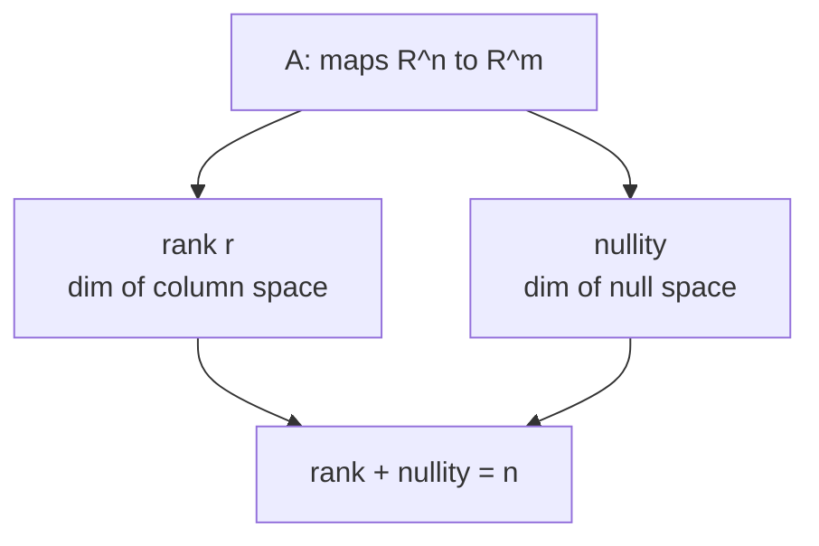

The matrix $A$ of a linear map $T: \mathbb{R}^n \to \mathbb{R}^m$ carves out four
subspaces: two inside the domain, two inside the codomain. Their dimensions are
linked by a single equation, and that equation tells you everything about the
solvability of $Ax = b$.

## The four fundamental subspaces

For an $m \times n$ matrix $A$:

| Subspace | Space | Definition |
|---|---|---|
| Column space $\operatorname{col}(A)$ | $\mathbb{R}^m$ | $\{Ax : x \in \mathbb{R}^n\}$ |
| Null space $\operatorname{null}(A)$ | $\mathbb{R}^n$ | $\{x : Ax = 0\}$ |
| Row space $\operatorname{row}(A)$ | $\mathbb{R}^n$ | $\operatorname{col}(A^\top)$ |
| Left null space | $\mathbb{R}^m$ | $\{y : A^\top y = 0\}$ |

The column space is where $Ax$ can land; the null space is what $A$ collapses
to zero. The **rank** is $r = \dim\operatorname{col}(A)$, the number of linearly
independent columns (equivalently, independent rows: row rank equals column rank,
a nontrivial fact<FN n="1" />). The **nullity** is $\dim\operatorname{null}(A)$.

## Rank–nullity theorem

**Theorem.** For any $A \in \mathbb{R}^{m \times n}$<FN n="2" />,

$$
\operatorname{rank}(A) + \operatorname{nullity}(A) = n.
$$

*Proof.* Let $r = \operatorname{rank}(A)$ and $k = \operatorname{nullity}(A)$;
pick a basis $\{z_1, \dots, z_k\}$ for $\operatorname{null}(A)$. Extend it to a
basis of $\mathbb{R}^n$ by adding $\{w_1, \dots, w_r\}$.

**Step 1: $\{Aw_1, \dots, Aw_r\}$ spans $\operatorname{col}(A)$.** Any $Ax$ with
$x = \sum c_i z_i + \sum d_j w_j$ satisfies $Ax = \sum d_j Aw_j$ (the $z_i$ are
annihilated). So every column-space vector is a combination of the $Aw_j$.

**Step 2: $\{Aw_1, \dots, Aw_r\}$ is independent.** Suppose
$\sum d_j Aw_j = 0$, i.e. $A(\sum d_j w_j) = 0$. Then $v = \sum d_j w_j \in
\operatorname{null}(A)$, so $v = \sum c_i z_i$ for some $c_i$. But
$\{z_1, \dots, z_k, w_1, \dots, w_r\}$ is a basis of $\mathbb{R}^n$, so all
coefficients are zero. Hence all $d_j = 0$.

Steps 1 and 2 together say $\{Aw_1, \dots, Aw_r\}$ is a basis of
$\operatorname{col}(A)$, confirming $\dim\operatorname{col}(A) = r$. The
original basis of $\mathbb{R}^n$ had $k + r = n$ elements.
$\qquad\blacksquare$

## Solvability and solution structure

The system $Ax = b$ is consistent if and only if $b \in \operatorname{col}(A)$.

When it is consistent, the solution set is a **coset** of the null space: pick any
particular solution $x_p$ (i.e. $Ax_p = b$), then every solution has the form

$$
x = x_p + z, \qquad z \in \operatorname{null}(A).
$$

*Proof.* If $Ax = b$ and $Ax_p = b$, then $A(x - x_p) = 0$, so $x - x_p \in
\operatorname{null}(A)$. Conversely, $A(x_p + z) = b + 0 = b$ for any
$z \in \operatorname{null}(A)$. $\qquad\blacksquare$

In particular: if $\operatorname{nullity}(A) = 0$ (the null space is just $\{0\}$),
the solution is unique when it exists. If nullity is positive, there are infinitely
many.

## Orthogonality of the four spaces

Row space and null space are orthogonal complements in $\mathbb{R}^n$: every row-
space vector is orthogonal to every null-space vector. The cleanest route to this
is: if $Ax = 0$ and $y$ is any row of $A$, then $y \cdot x = 0$ by definition.
So the null space is perpendicular to every row, hence to the entire row space.
By dimension count (row space has dimension $r$, null space has dimension $n - r$,
and they are orthogonal), they are orthogonal complements. The same argument gives
col space $\perp$ left null space in $\mathbb{R}^m$.



## Check it on arrays

```python
import numpy as np

A = np.array([
    [1.0, 2.0, 3.0],
    [2.0, 4.0, 6.0],   # row 2 = 2 * row 1
    [0.0, 1.0, 1.0],
], dtype=float)

r = np.linalg.matrix_rank(A)
n = A.shape[1]
print(f"rank={r}, nullity={n - r}, rank+nullity={n}")  # 2, 1, 3

# Null space via SVD (last right singular vectors for near-zero singular values):
_, s, Vt = np.linalg.svd(A)
print("singular values:", np.round(s, 6))  # one near zero
null_vec = Vt[-1]   # approximate null vector
print("A @ null_vec:", np.round(A @ null_vec, 10))   # ~zero

# Verify row space ⊥ null space:
# Row 0 should be orthogonal to null_vec
print("row0 . null_vec:", np.round(A[0] @ null_vec, 10))  # ~0
```

The near-zero singular value flags the one-dimensional null space; the null
vector is numerically orthogonal to every row.

## Exercises

**Exercise 1.** Let $A = \begin{bmatrix} 1 & 2 & 3 \\ 2 & 4 & 6 \end{bmatrix}$.
Find the rank and nullity, and verify the rank-nullity theorem.

<details>
<summary>Solution</summary>

**Step 1.** Row 2 is $2 \times$ row 1, so the two rows are linearly dependent and
there is exactly one independent row. Hence $\operatorname{rank}(A) = 1$.

**Step 2.** The matrix has $n = 3$ columns, so rank-nullity gives
$\operatorname{nullity}(A) = n - \operatorname{rank}(A) = 3 - 1 = 2$.

**Step 3.** Check directly: $Ax = 0$ reduces to the single equation
$x_1 + 2x_2 + 3x_3 = 0$ (row 2 is redundant). One linear constraint on three
unknowns leaves a $2$-dimensional solution space, matching nullity $2$. The sum
$1 + 2 = 3 = n$ confirms the theorem.

</details>

**Exercise 2.** A matrix $A$ is $4 \times 6$ with $\operatorname{rank}(A) = 4$.
For how many right-hand sides $b \in \mathbb{R}^4$ is $Ax = b$ consistent, and
when consistent, how many solutions does it have?

<details>
<summary>Solution</summary>

**Step 1.** Consistency. The column space lives in $\mathbb{R}^4$ and has
dimension $\operatorname{rank}(A) = 4$, so $\operatorname{col}(A) = \mathbb{R}^4$.
Every $b \in \mathbb{R}^4$ is in the column space, so $Ax = b$ is consistent for
all $b$.

**Step 2.** Count solutions. By rank-nullity, $\operatorname{nullity}(A) =
n - \operatorname{rank}(A) = 6 - 4 = 2$, which is positive.

**Step 3.** When consistent, the solution set is the coset $x_p +
\operatorname{null}(A)$ from the lesson. A null space of dimension $2$ contains
infinitely many vectors, so there are infinitely many solutions for every $b$.

</details>

**Exercise 3 (code).** Build a $5 \times 4$ matrix whose 4th column is a fixed
combination of the first three (so rank $3$, nullity $1$). Confirm the rank and
nullity numerically, recover a null vector from the SVD, and verify it is
orthogonal to every row of $A$.

<details>
<summary>Solution</summary>

A column dependence forces nullity $\ge 1$; with three independent columns the
rank is exactly $3$. The null space is the orthogonal complement of the row
space, so the null vector must be orthogonal to each row.

```python
import numpy as np

rng = np.random.default_rng(0)
A = rng.normal(size=(5, 4))
A[:, 3] = 2.0 * A[:, 0] - A[:, 1]      # 4th column depends on cols 0 and 1

r = np.linalg.matrix_rank(A)
n = A.shape[1]
assert r == 3 and n - r == 1           # rank 3, nullity 1

# Null vector: right singular vector of the smallest singular value.
_, s, Vt = np.linalg.svd(A)
null_vec = Vt[-1]
assert np.allclose(A @ null_vec, 0, atol=1e-12)

# Row space is orthogonal to the null space: every row . null_vec == 0.
assert np.allclose(A @ null_vec, A.dot(null_vec))   # rows dotted with null_vec
print("rank:", r, "nullity:", n - r, "max |row . null|:",
      np.max(np.abs(A @ null_vec)))
```

The smallest singular value is numerically zero, flagging the one-dimensional
null space, and $A v = 0$ states exactly that $v$ is orthogonal to every row of
$A$, the row-space/null-space orthogonality from the lesson.

</details>

The next lesson builds a ruler for
measuring the length of vectors sitting in these spaces.

<Footnotes>
  <FNItem n="1">**Strang, G.** (2016). *Introduction to Linear Algebra* (5th ed.). Wellesley-Cambridge Press. The four fundamental subspaces and the equality of row and column rank.</FNItem>
  <FNItem n="2">**Axler, S.** (2015). *Linear Algebra Done Right* (3rd ed.), ch. 3. Springer. The rank-nullity theorem (fundamental theorem of linear maps) ([doi:10.1007/978-3-319-11080-6](https://doi.org/10.1007/978-3-319-11080-6)).</FNItem>
</Footnotes>
