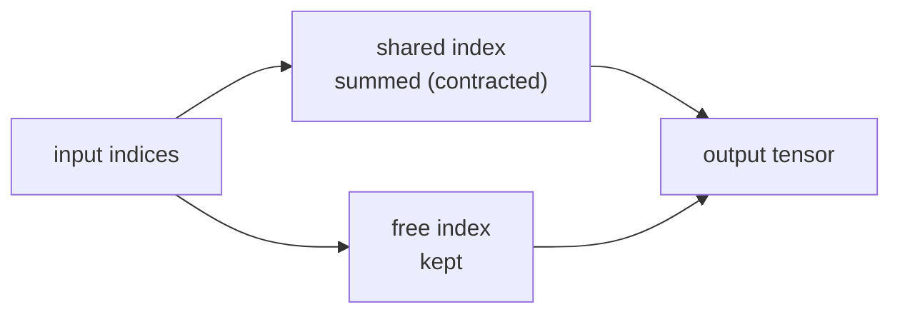

A matrix is an array indexed by two indices; a weight tensor in a neural network
might have four. Index notation lets you write any contraction (dot product,
matrix multiply, batch outer product, attention scores) in a single, unambiguous
expression, and `numpy.einsum` evaluates it directly.

## What a tensor is

A **tensor** of order $k$ over $\mathbb{R}$ is a multidimensional array indexed
by $k$ integers<FN n="1" />. Order-0 is a scalar, order-1 a vector, order-2 a matrix. An
order-3 tensor $T \in \mathbb{R}^{d_1 \times d_2 \times d_3}$ has entry $T_{ijk}$
for $1 \le i \le d_1$, $1 \le j \le d_2$, $1 \le k \le d_3$.

Tensors are not just "multidimensional arrays": they transform in a specific way
under a change of basis. For the purposes of machine learning, the transformation
law matters mainly when reasoning about equivariance; in computation, the array
viewpoint suffices.

## The Einstein summation convention

In the **Einstein convention**, a repeated index appearing once "up" and once
"down" (or in practice: in two factor arrays) is summed over its full range<FN n="2" />:

$$
c_i = \sum_j a_{ij} b_j \quad\longrightarrow\quad c_i = a_{ij} b_j.
$$

The summation sign is dropped; the repeated $j$ implies it. This makes long
expressions readable:

| Operation | Conventional | Einstein / einsum |
|---|---|---|
| Dot product | $\sum_i u_i v_i$ | $u_i v_i$ → scalar |
| Matrix–vector | $\sum_j A_{ij} x_j$ | $A_{ij} x_j$ → $c_i$ |
| Matrix multiply | $\sum_k A_{ik} B_{kj}$ | $A_{ik} B_{kj}$ → $C_{ij}$ |
| Trace | $\sum_i A_{ii}$ | $A_{ii}$ → scalar |
| Outer product | $u_i v_j$ (no sum) | $u_i v_j$ → $C_{ij}$ |
| Batch matmul | $\sum_k A_{bik} B_{bkj}$ | `bij,bjk->bik` |

## Numpy's einsum

`np.einsum(subscript, *arrays)` reads a string like `'ij,jk->ik'` and executes
the corresponding index expression:

- Letters before `->` label the indices in each input array.
- Letters after `->` label the indices of the output.
- Letters that appear in inputs but not in the output are summed over.

The notation is unambiguous: there is no convention about row-major vs. column-
major, no hidden transpose. The subscript string *is* the computation.

## Broadcasting vs. contraction

Indices that appear in only one input array appear in the output: they are
**free** (broadcast). Indices shared between two inputs that do not appear in
the output are **contracted** (summed). For example:

- `'i,j->ij'`: outer product ($u_i v_j$, no contraction).
- `'i,i->'`: dot product ($u_i v_i$, contracts $i$, output is scalar).
- `'ij,ij->ij'`: elementwise product (no contraction, both indices free).
- `'ij,ij->'`: Frobenius inner product (contracts both, scalar output).



## Check it on arrays

```python
import numpy as np

u = np.array([1.0, 2.0, 3.0])
v = np.array([4.0, 5.0, 6.0])
A = np.arange(1.0, 7.0).reshape(2, 3)
B = np.arange(1.0, 7.0).reshape(3, 2)

# Dot product
print("dot:", np.einsum("i,i->", u, v), "==", u @ v)  # 32

# Outer product
C = np.einsum("i,j->ij", u, v)
print("outer shape:", C.shape, "== ", np.outer(u, v).shape)

# Matrix multiply
D = np.einsum("ij,jk->ik", A, B)
print("matmul:\n", D, "\n", A @ B)   # identical

# Trace
M = np.array([[1.0, 2.0], [3.0, 4.0]])
print("trace:", np.einsum("ii->", M), "==", np.trace(M))  # 5

# Batch matrix multiply: (batch, m, k) x (batch, k, n) -> (batch, m, n)
batch = 4
X = np.random.default_rng(0).normal(size=(batch, 3, 5))
Y = np.random.default_rng(1).normal(size=(batch, 5, 2))
Z = np.einsum("bik,bkj->bij", X, Y)
Z_ref = np.stack([X[b] @ Y[b] for b in range(batch)])
print("batch matmul error:", np.max(np.abs(Z - Z_ref)))  # ~0

# Gradient of a bilinear form x^T A y w.r.t. x: result is Ay
x = np.array([1.0, 2.0])
y = np.array([3.0, 4.0])
A2 = np.array([[1.0, 2.0], [3.0, 4.0]])
# f = x_i A_ij y_j; df/dx_k = A_kj y_j
grad_x = np.einsum("kj,j->k", A2, y)   # same as A @ y
print("bilinear grad:", grad_x, "==", A2 @ y)
```

Every operation resolves to the same result as its explicit loop or built-in
equivalent. Index notation makes the computation visible and the gradient derivation
mechanical: just differentiate the subscript expression index by index.

## Exercises

**Exercise 1.** Write each operation as an `einsum` subscript string, naming
which indices are free and which are contracted: (a) the trace of $A$, (b) the
matrix-vector product $Ax$, (c) the Frobenius inner product $\sum_{ij} A_{ij}
B_{ij}$.

<details>
<summary>Solution</summary>

**Step 1.** Trace. $\operatorname{tr}(A) = \sum_i A_{ii}$ repeats $i$ on one
array and keeps nothing, so $i$ is contracted: `"ii->"`. Output is a scalar.

**Step 2.** Matrix-vector. $c_i = \sum_j A_{ij} x_j$ shares $j$ between $A$ and
$x$ with $j$ absent from the output, so $j$ is contracted and $i$ is free:
`"ij,j->i"`.

**Step 3.** Frobenius inner product. $\sum_{ij} A_{ij} B_{ij}$ shares both $i$
and $j$ between the two arrays and keeps neither, so both are contracted:
`"ij,ij->"`. Output is a scalar.

</details>

**Exercise 2.** Two students disagree about `np.einsum("ij,jk->ki", A, B)`. One
says it is $AB$; the other says it is $(AB)^\top$. Settle it by reading the
output indices, and state the shape if $A$ is $2 \times 3$ and $B$ is $3 \times
4$.

<details>
<summary>Solution</summary>

**Step 1.** The body $A_{ij} B_{jk}$ contracts $j$ (shared, absent from output),
producing an object with free indices $i$ and $k$. The plain product $C_{ik} =
A_{ij} B_{jk}$ is exactly $AB$.

**Step 2.** The output specifier is `ki`, not `ik`, so the result entry at row
$k$, column $i$ holds $C_{ik}$. That is $(AB)^\top$. The second student is right.

**Step 3.** Shapes: $AB$ is $2 \times 4$, so its transpose is $4 \times 2$. The
output is $4 \times 2$.

</details>

**Exercise 3 (code).** The attention score matrix in a transformer is $S_{ij} =
\sum_d Q_{id} K_{jd}$ for queries $Q$ and keys $K$. Express it as a single
`einsum` call and verify it against $Q K^\top$ on random arrays.

<details>
<summary>Solution</summary>

The index $d$ (the feature dimension) is shared between $Q$ and $K$ and absent
from the output, so it is contracted; $i$ and $j$ are free. The subscript is
`"id,jd->ij"`, which is $Q K^\top$.

```python
import numpy as np

rng = np.random.default_rng(0)
Q = rng.normal(size=(5, 8))   # 5 queries, dim 8
K = rng.normal(size=(7, 8))   # 7 keys, dim 8

S = np.einsum("id,jd->ij", Q, K)   # contract the feature index d
assert S.shape == (5, 7)
assert np.allclose(S, Q @ K.T)
print("max |S - Q K^T| =", np.max(np.abs(S - Q @ K.T)))
```

Contracting the feature index $d$ leaves the query index $i$ and key index $j$
free, producing the $5 \times 7$ score matrix that equals $Q K^\top$, the
similarity scores attention then normalizes.

</details>

This
closes the A1 curriculum on linear algebra; the next subsections build probability
and calculus on top of these foundations.

<Footnotes>
  <FNItem n="1">**Goodfellow, I., Bengio, Y., & Courville, A.** (2016). *Deep Learning*, ch. 2 (Linear Algebra). MIT Press. Tensors as multidimensional arrays in the machine-learning sense.</FNItem>
  <FNItem n="2">**Kolda, T. G., & Bader, B. W.** (2009). "Tensor decompositions and applications". *SIAM Review*, 51, 455-500. [doi:10.1137/07070111X](https://doi.org/10.1137/07070111X). Index notation and contraction for higher-order tensors.</FNItem>
</Footnotes>
