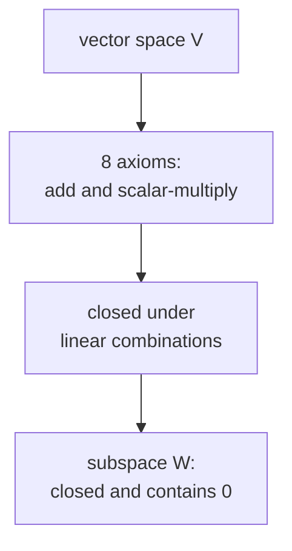

Everything in this course, a dataset, a layer of a network, a gradient, lives in
a vector space. Before using that word freely we should pin down exactly what it
means, and notice that out of the long list of axioms, almost all of our work
leans on a single consequence: you can take **linear combinations** and stay
inside the space.

## What problem are we solving?

We want a setting where "add two things" and "scale a thing by a number" both
make sense and behave the way arrows in the plane behave. Points in $\mathbb{R}^2$
work; so do polynomials, and so do functions. Rather than re-derive facts for
each case, we name the shared structure once and prove things there.

## The definition

A **vector space** over the real numbers is a set $V$ together with two
operations, addition $u + v$ and scalar multiplication $\alpha v$ (with
$\alpha \in \mathbb{R}$), such that the following hold for all $u, v, w \in V$
and all $\alpha, \beta \in \mathbb{R}$<FN ns="1, 2" />:

$$
\begin{aligned}
&\text{(1) } u + v = v + u && \text{(2) } (u+v)+w = u+(v+w) \\
&\text{(3) } \exists\, 0 \in V:\ v + 0 = v && \text{(4) } \exists\, (-v):\ v + (-v) = 0 \\
&\text{(5) } 1\,v = v && \text{(6) } (\alpha\beta)v = \alpha(\beta v) \\
&\text{(7) } \alpha(u+v) = \alpha u + \alpha v && \text{(8) } (\alpha+\beta)v = \alpha v + \beta v
\end{aligned}
$$

The list looks long, but read it once and move on. Its only purpose is to
guarantee that the next definition behaves sensibly.

## The one move: linear combinations

A **linear combination** of vectors $v_1, \dots, v_k$ is any expression

$$
c_1 v_1 + c_2 v_2 + \cdots + c_k v_k, \qquad c_i \in \mathbb{R}.
$$

Axioms (1) through (8) are exactly what we need to know that this expression is
again a well-defined element of $V$, no matter how we group or reorder the
terms. This is the property the rest of the course actually uses. When we later
write a model output as a weighted sum of features, or a gradient as a
combination of per-example gradients, we are relying on nothing more than
closure under linear combination.

## Subspaces

Often we care about a smaller set sitting inside $V$ that is itself a vector
space under the same operations. Call $W \subseteq V$ a **subspace** if it is a
vector space in its own right. Checking all eight axioms again would be tedious,
so we prove a shortcut.

**Subspace test.** A nonempty subset $W \subseteq V$ is a subspace if and only if
it is closed under addition and scalar multiplication<FN n="3" />:

$$
u, v \in W \implies u + v \in W, \qquad \alpha \in \mathbb{R},\ v \in W \implies \alpha v \in W.
$$

*Proof.* ($\Rightarrow$) If $W$ is a subspace it is closed under its own
operations by definition, so both conditions hold.

($\Leftarrow$) Suppose the two closure conditions hold and $W$ is nonempty; we
must recover the axioms. Take any $v \in W$ (one exists since $W \neq \varnothing$).

1. **Zero vector.** Scalar-multiply by $0$: closure under scalar multiplication
   gives $0\cdot v \in W$. And $0 \cdot v = 0$ (a one-line consequence of axiom (8):
   $0v = (0+0)v = 0v + 0v$, then subtract $0v$). So $0 \in W$.
2. **Additive inverses.** Scalar-multiply by $-1$: $(-1)v \in W$, and
   $(-1)v = -v$ (again from the axioms). So every element of $W$ has its inverse
   in $W$.
3. **Remaining axioms.** Commutativity, associativity, and the scalar laws hold
   for *all* elements of $V$, so in particular they hold for the elements of $W$.

So $W$, being closed and containing $0$ and inverses while inheriting the rest, is
a vector space. $\qquad\blacksquare$

The test collapses eight checks into two. A quick consequence, proved the same
way: the intersection of two subspaces is a subspace (if $u, v$ lie in both, so
does $u+v$ and $\alpha v$, since each subspace is closed).

## Examples and one non-example

- The line $\{(t, 2t) : t \in \mathbb{R}\} \subseteq \mathbb{R}^2$ is a subspace:
  adding two such points or scaling one keeps the $y = 2x$ relation.
- The set of degree-$\le n$ polynomials is a subspace of all polynomials.
- The line $\{(t, 2t + 1)\}$ is **not** a subspace: it misses the origin
  ($0 \notin W$), so it fails the test immediately. Any set not containing $0$ is
  disqualified.



## Check it on arrays

The subspace test is something you can probe numerically: take the plane spanned
by two vectors in $\mathbb{R}^3$, form a random linear combination of points
already in it, and confirm the result still satisfies the plane's defining
equation (its normal vector stays orthogonal to it).

```python
import numpy as np

# A plane through the origin in R^3: span of b1, b2. Its normal is b1 x b2.
b1 = np.array([1.0, 0.0, 2.0])
b2 = np.array([0.0, 1.0, -1.0])
normal = np.cross(b1, b2)

# Two points already in the subspace (linear combinations of b1, b2):
u = 3.0 * b1 - 2.0 * b2
v = -1.0 * b1 + 4.0 * b2

# A further linear combination of them:
w = 0.7 * u + 5.0 * v

# Closure check: w still lies in the plane <=> normal . w == 0
for name, vec in [("u", u), ("v", v), ("w", w)]:
    print(f"normal . {name} = {np.dot(normal, vec):.12f}")   # all ~0
```

Every point built as a linear combination of $b_1, b_2$ stays on the plane. That
is the subspace test confirmed: closed under addition and scaling. A point off
the plane (say $b_1 + (0,0,1)$) would give a nonzero dot product, landing outside
$W$.

With the container defined, the next lesson asks the sharper question: how many
vectors do we actually need to *generate* a space, and when is a set of them
non-redundant. That is span, independence, basis, and dimension.

<Footnotes>
  <FNItem n="1">**Axler, S.** (2015). *Linear Algebra Done Right* (3rd ed.), ch. 1. Springer. The axiomatic, basis-free development of vector spaces ([doi:10.1007/978-3-319-11080-6](https://doi.org/10.1007/978-3-319-11080-6)).</FNItem>
  <FNItem n="2">**Goodfellow, I., Bengio, Y., & Courville, A.** (2016). *Deep Learning*, ch. 2 (Linear Algebra). MIT Press. The machine-learning reader's review of the same objects.</FNItem>
  <FNItem n="3">**Strang, G.** (2016). *Introduction to Linear Algebra* (5th ed.). Wellesley-Cambridge Press. Subspaces and the closure conditions.</FNItem>
</Footnotes>
