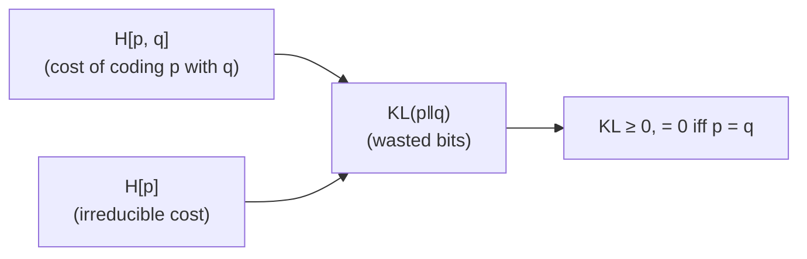

Probability assigns mass to outcomes; information theory measures how surprising
those outcomes are. The two together give the vocabulary every loss function in
ML is written in. This page builds that vocabulary and ends at the identity that
makes cross-entropy and maximum likelihood the same objective.

## Distributions, in one breath

A few families cover most of what appears in practice:

- **Bernoulli** $p(x) = \mu^x (1-\mu)^{1-x}$ for $x \in \{0, 1\}$ — a single
  binary event.
- **Gaussian** $p(x) = \frac{1}{\sqrt{2\pi\sigma^2}} \exp\!\left(-\frac{(x-\mu)^2}{2\sigma^2}\right)$ — the
  default for continuous quantities, justified by the central limit theorem.
- **Exponential family**, $p(x) = h(x)\exp\!\left(\eta^\top T(x) - A(\eta)\right)$,
  which contains both of the above. The form is what makes maximum likelihood
  tractable: the gradient of the log-partition $A(\eta)$ returns the expected
  sufficient statistic.

## Bayes' rule

Conditioning reverses with the product rule $p(x, y) = p(x \mid y)\,p(y)$:

$$ p(y \mid x) = \frac{p(x \mid y)\, p(y)}{p(x)}, \qquad p(x) = \sum_y p(x \mid y)\, p(y). $$

Posterior $\propto$ likelihood $\times$ prior. Every Bayesian model in pillar B
and every latent-variable model in pillar F is an application of this single
line; the difficulty is always computing the normalizer $p(x)$.

## Entropy, cross-entropy, KL

The information in an outcome of probability $p$ is $-\log p$: certain outcomes
($p=1$) carry none, rare ones carry a lot. **Entropy** is its expectation under
the true distribution,

$$ H[p] = -\sum_x p(x)\log p(x), $$

the average surprise of a draw from $p$. If you instead code those draws with a
model $q$, you pay the **cross-entropy**

$$ H[p, q] = -\sum_x p(x)\log q(x), $$

and the gap between paying with $q$ and paying with the truth $p$ is the
**Kullback–Leibler divergence**:

$$ \mathrm{KL}(p\,\|\,q) = \sum_x p(x)\log\frac{p(x)}{q(x)} = H[p, q] - H[p]. $$



$\mathrm{KL} \ge 0$ (with equality only when $p = q$) follows from Jensen's
inequality applied to the concave $\log$, which is why every "loss bounded below
by zero" argument in ML routes through it. KL is not symmetric: the first slot
is the truth, the second is the model.

## Cross-entropy is maximum likelihood

Take the true distribution to be the empirical data distribution
$p_\text{data}$, which puts mass $1/N$ on each of $N$ samples. Then

$$ H[p_\text{data}, q_\theta] = -\frac{1}{N}\sum_{i=1}^{N} \log q_\theta(x_i), $$

which is exactly the negative average log-likelihood. The entropy term $H[p_\text{data}]$
does not depend on $\theta$, so minimizing cross-entropy over $\theta$ and
maximizing likelihood are the same optimization. This is why classifiers train
on cross-entropy without anyone calling it "likelihood".

## Compute the trio

For two distributions over the same outcomes, the identity
$\mathrm{KL}(p\|q) = H[p,q] - H[p]$ should hold exactly, and swapping the
arguments should give a different number.

```python
import numpy as np

p = np.array([0.5, 0.5])
q = np.array([0.9, 0.1])

H_p  = -np.sum(p * np.log(p))
H_pq = -np.sum(p * np.log(q))
kl_pq = np.sum(p * np.log(p / q))
kl_qp = np.sum(q * np.log(q / p))

print(f"H[p]        = {H_p:.4f} nats")
print(f"H[p, q]     = {H_pq:.4f} nats")
print(f"KL(p||q)    = {kl_pq:.4f}")
print(f"H[p,q]-H[p] = {H_pq - H_p:.4f}   (== KL(p||q))")
print(f"KL(q||p)    = {kl_qp:.4f}   (asymmetric: != KL(p||q))")
```

## Maximum likelihood in one line

For a Gaussian, the log-likelihood is maximized by the sample mean and sample
variance — the MLE estimates. Drawing samples and recovering the parameters
shows the estimator converging as $N$ grows.

```python
import numpy as np

rng = np.random.default_rng(0)
true_mu, true_sigma = 2.0, 1.5
x = rng.normal(true_mu, true_sigma, size=10000)

mu_hat = x.mean()                       # argmax of the Gaussian log-likelihood
sigma_hat = x.std()                     # MLE uses the 1/N variance

print(f"true  mu={true_mu}, sigma={true_sigma}")
print(f"MLE   mu={mu_hat:.3f}, sigma={sigma_hat:.3f}")
```

The estimate is close because maximum likelihood is consistent: as $N \to
\infty$ it converges to the parameters that minimize $\mathrm{KL}(p_\text{data}\,\|\,q_\theta)$,
which are the true ones when the model family contains the truth.
