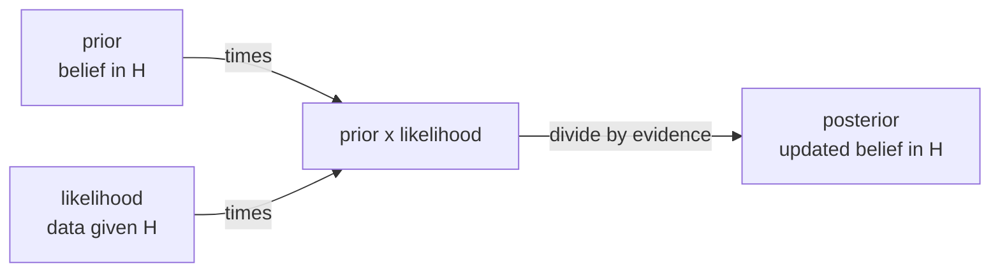

Often you can measure $P(\text{evidence} \mid \text{cause})$ but you actually want
$P(\text{cause} \mid \text{evidence})$: the test detects the disease with known
reliability, but the patient wants the probability of disease given a positive test.
**Bayes' rule** inverts the conditioning, and it is the engine of all probabilistic
inference.

## From the chain rule to Bayes

The chain rule writes the same joint two ways:

$$
P(A \cap B) = P(A \mid B)\, P(B) = P(B \mid A)\, P(A).
$$

Setting the two products equal and dividing by $P(B)$ gives **Bayes' rule**:

$$
P(A \mid B) = \frac{P(B \mid A)\, P(A)}{P(B)}.
$$

The pieces have standard names when $A$ is a hypothesis and $B$ is observed data:

- $P(A)$ is the **prior**: belief in $A$ before seeing $B$.
- $P(B \mid A)$ is the **likelihood**: how well $A$ predicts the data.
- $P(A \mid B)$ is the **posterior**: updated belief after seeing $B$.
- $P(B)$ is the **evidence** (or marginal likelihood), a normalizing constant.

## The law of total probability

The evidence $P(B)$ usually is not given directly; it is assembled from the
hypotheses. If $A_1, \dots, A_n$ are a **partition** of the sample space (disjoint,
covering everything), then

$$
P(B) = \sum_{i=1}^n P(B \mid A_i)\, P(A_i).
$$

*Derivation.* The event $B$ splits into the disjoint pieces $B \cap A_i$, so
$P(B) = \sum_i P(B \cap A_i)$ by additivity, and each term is $P(B \mid A_i)P(A_i)$
by the chain rule. Substituting into the denominator gives the working form of
Bayes' rule:

$$
P(A_k \mid B) = \frac{P(B \mid A_k)\, P(A_k)}{\sum_i P(B \mid A_i)\, P(A_i)}.
$$

## The base-rate worked example

A disease affects 1 in 1000 people. A test has 99% sensitivity
($P(+ \mid \text{disease}) = 0.99$) and 95% specificity
($P(- \mid \text{healthy}) = 0.95$, so the false-positive rate is 0.05). A patient
tests positive. What is $P(\text{disease} \mid +)$?

$$
P(\text{disease} \mid +) = \frac{0.99 \cdot 0.001}{0.99 \cdot 0.001 + 0.05 \cdot 0.999} = \frac{0.00099}{0.00099 + 0.04995} \approx 0.0194.
$$

Under 2%. The rare prior dominates: most positives come from the large healthy
population multiplied by the small false-positive rate. Ignoring the base rate
$P(A)$ is the classic error Bayes' rule guards against.

## Posterior odds form

Dividing the posterior for $A$ by the posterior for $A^c$ cancels the shared
evidence term and gives a clean update:

$$
\underbrace{\frac{P(A \mid B)}{P(A^c \mid B)}}_{\text{posterior odds}} = \underbrace{\frac{P(B \mid A)}{P(B \mid A^c)}}_{\text{likelihood ratio}} \cdot \underbrace{\frac{P(A)}{P(A^c)}}_{\text{prior odds}}.
$$

Belief updating is multiplying prior odds by the likelihood ratio, which is why
log-odds turn sequential Bayesian updates into addition.



## Check it on arrays

```python
import numpy as np

rng = np.random.default_rng(5)
N = 5_000_000

# Simulate the disease/test scenario
disease = rng.random(N) < 0.001
test_pos = np.where(
    disease,
    rng.random(N) < 0.99,    # sensitivity
    rng.random(N) < 0.05,    # false positive rate
)

# P(disease | positive) empirically
p_disease_given_pos = disease[test_pos].mean()
print("P(disease | +) simulated:", round(p_disease_given_pos, 4))

# Bayes' rule closed form
num = 0.99 * 0.001
den = 0.99 * 0.001 + 0.05 * 0.999
print("P(disease | +) Bayes:    ", round(num / den, 4))

# Posterior odds = likelihood ratio * prior odds
prior_odds = 0.001 / 0.999
lr = 0.99 / 0.05
post_odds = lr * prior_odds
print("posterior prob from odds:", round(post_odds / (1 + post_odds), 4))
```

The simulation, the direct Bayes computation, and the odds form all agree on the
counterintuitive ~2%. Adding a prior to the likelihood is the bridge to the next
lesson's distributions, which supply the likelihoods this rule consumes.
