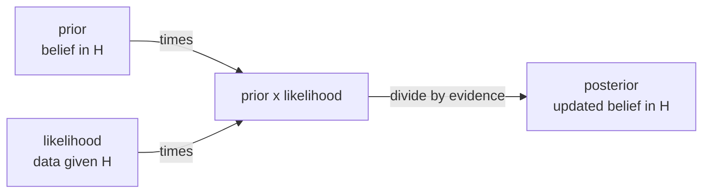

Often you can measure $P(\text{evidence} \mid \text{cause})$ but you actually want
$P(\text{cause} \mid \text{evidence})$: the test detects the disease with known
reliability, but the patient wants the probability of disease given a positive test.
**Bayes' rule** inverts the conditioning, and it is the engine of all probabilistic
inference<FN n="1" />.

## From the chain rule to Bayes

The chain rule writes the same joint two ways:

$$
P(A \cap B) = P(A \mid B)\, P(B) = P(B \mid A)\, P(A).
$$

Setting the two products equal and dividing by $P(B)$ gives **Bayes' rule**<FN n="2" />:

$$
P(A \mid B) = \frac{P(B \mid A)\, P(A)}{P(B)}.
$$

The pieces have standard names when $A$ is a hypothesis and $B$ is observed data:

- $P(A)$ is the **prior**: belief in $A$ before seeing $B$.
- $P(B \mid A)$ is the **likelihood**: how well $A$ predicts the data.
- $P(A \mid B)$ is the **posterior**: updated belief after seeing $B$.
- $P(B)$ is the **evidence** (or marginal likelihood), a normalizing constant.

## The law of total probability

The evidence $P(B)$ usually is not given directly; it is assembled from the
hypotheses. If $A_1, \dots, A_n$ are a **partition** of the sample space (disjoint,
covering everything), then

$$
P(B) = \sum_{i=1}^n P(B \mid A_i)\, P(A_i).
$$

*Derivation.* The event $B$ splits into the disjoint pieces $B \cap A_i$, so
$P(B) = \sum_i P(B \cap A_i)$ by additivity, and each term is $P(B \mid A_i)P(A_i)$
by the chain rule. Substituting into the denominator gives the working form of
Bayes' rule:

$$
P(A_k \mid B) = \frac{P(B \mid A_k)\, P(A_k)}{\sum_i P(B \mid A_i)\, P(A_i)}.
$$

## The base-rate worked example

A disease affects 1 in 1000 people. A test has 99% sensitivity
($P(+ \mid \text{disease}) = 0.99$) and 95% specificity
($P(- \mid \text{healthy}) = 0.95$, so the false-positive rate is 0.05). A patient
tests positive. What is $P(\text{disease} \mid +)$?

$$
P(\text{disease} \mid +) = \frac{0.99 \cdot 0.001}{0.99 \cdot 0.001 + 0.05 \cdot 0.999} = \frac{0.00099}{0.00099 + 0.04995} \approx 0.0194.
$$

Under 2%. The rare prior dominates: most positives come from the large healthy
population multiplied by the small false-positive rate. Ignoring the base rate
$P(A)$ is the classic error Bayes' rule guards against.

## Posterior odds form

Dividing the posterior for $A$ by the posterior for $A^c$ cancels the shared
evidence term and gives a clean update:

$$
\underbrace{\frac{P(A \mid B)}{P(A^c \mid B)}}_{\text{posterior odds}} = \underbrace{\frac{P(B \mid A)}{P(B \mid A^c)}}_{\text{likelihood ratio}} \cdot \underbrace{\frac{P(A)}{P(A^c)}}_{\text{prior odds}}.
$$

Belief updating is multiplying prior odds by the likelihood ratio, which is why
log-odds turn sequential Bayesian updates into addition.



## Check it on arrays

```python
import numpy as np

rng = np.random.default_rng(5)
N = 5_000_000

# Simulate the disease/test scenario
disease = rng.random(N) < 0.001
test_pos = np.where(
    disease,
    rng.random(N) < 0.99,    # sensitivity
    rng.random(N) < 0.05,    # false positive rate
)

# P(disease | positive) empirically
p_disease_given_pos = disease[test_pos].mean()
print("P(disease | +) simulated:", round(p_disease_given_pos, 4))

# Bayes' rule closed form
num = 0.99 * 0.001
den = 0.99 * 0.001 + 0.05 * 0.999
print("P(disease | +) Bayes:    ", round(num / den, 4))

# Posterior odds = likelihood ratio * prior odds
prior_odds = 0.001 / 0.999
lr = 0.99 / 0.05
post_odds = lr * prior_odds
print("posterior prob from odds:", round(post_odds / (1 + post_odds), 4))
```

The simulation, the direct Bayes computation, and the odds form all agree on the
counterintuitive ~2%.

## Exercises

**Exercise 1.** A box has two coins: a fair coin ($P(\text{head}) = 0.5$) and a
biased coin ($P(\text{head}) = 0.9$). You pick one at random and flip it once,
getting heads. Compute the posterior probability that you picked the biased coin.

<details>
<summary>Solution</summary>

**Step 1.** Set the hypotheses and prior. Let $B$ = "biased coin" and
$F$ = "fair coin", each chosen with prior $P(B) = P(F) = 0.5$. The data is
$D = \text{heads}$ with likelihoods $P(D \mid B) = 0.9$ and $P(D \mid F) = 0.5$.

**Step 2.** Assemble the evidence by the law of total probability:

$$
P(D) = P(D \mid B)P(B) + P(D \mid F)P(F) = 0.9 \cdot 0.5 + 0.5 \cdot 0.5 = 0.7.
$$

**Step 3.** Apply Bayes' rule:

$$
P(B \mid D) = \frac{P(D \mid B)P(B)}{P(D)} = \frac{0.9 \cdot 0.5}{0.7} = \frac{0.45}{0.7} \approx 0.6429.
$$

One head nudges belief in the biased coin from 0.5 up to about 0.64, not all the
way: a single head is only mild evidence.

</details>

**Exercise 2.** Continue Exercise 1: you flip the same coin a second time and get
heads again. Using the posterior after one flip as the new prior, compute the
posterior after two heads. Verify it matches computing from the two-head
likelihoods directly.

<details>
<summary>Solution</summary>

**Step 1.** Update sequentially. The posterior from Exercise 1 becomes the prior:
$P(B) = 0.6429$, $P(F) = 0.3571$. A second head has the same likelihoods,
$P(D \mid B) = 0.9$, $P(D \mid F) = 0.5$.

$$
P(B \mid DD) = \frac{0.9 \cdot 0.6429}{0.9 \cdot 0.6429 + 0.5 \cdot 0.3571} = \frac{0.5786}{0.5786 + 0.1786} \approx 0.7642.
$$

**Step 2.** Compute from scratch with the two-flip likelihood
$P(\text{HH} \mid B) = 0.9^2 = 0.81$ and $P(\text{HH} \mid F) = 0.5^2 = 0.25$,
starting from the original prior $0.5$:

$$
P(B \mid \text{HH}) = \frac{0.81 \cdot 0.5}{0.81 \cdot 0.5 + 0.25 \cdot 0.5} = \frac{0.81}{0.81 + 0.25} = \frac{0.81}{1.06} \approx 0.7642.
$$

The two agree. Bayesian updating is associative: feeding evidence one piece at a
time, reusing each posterior as the next prior, lands on the same belief as
conditioning on all the evidence at once.

</details>

**Exercise 3 (code).** A spam filter sees the word "free". Spam has prior
$P(\text{spam}) = 0.4$; "free" appears in 30% of spam and 2% of ham. Simulate
emails and confirm the empirical $P(\text{spam} \mid \text{free})$ matches Bayes'
rule.

<details>
<summary>Solution</summary>

```python
import numpy as np

rng = np.random.default_rng(0)
N = 5_000_000

spam = rng.random(N) < 0.4
has_free = np.where(
    spam,
    rng.random(N) < 0.30,     # P(free | spam)
    rng.random(N) < 0.02,     # P(free | ham)
)

p_sim = spam[has_free].mean()

# Bayes' rule closed form
num = 0.30 * 0.4
den = 0.30 * 0.4 + 0.02 * 0.6
p_bayes = num / den

print("P(spam | free) simulated:", round(p_sim, 4))
print("P(spam | free) Bayes:    ", round(p_bayes, 4))
assert np.isclose(p_sim, p_bayes, atol=1e-3)
```

The closed form is $0.12 / (0.12 + 0.012) \approx 0.9091$, and the simulation
lands on the same value: seeing "free" raises the spam probability from the 0.4
prior to about 0.91.

</details>

Adding a prior to the likelihood is the bridge to the next
lesson's distributions, which supply the likelihoods this rule consumes.

<Footnotes>
  <FNItem n="1">**Bishop, C. M.** (2006). *Pattern Recognition and Machine Learning.* Springer. §1.2.3, Bayes' theorem and the prior/likelihood/posterior decomposition.</FNItem>
  <FNItem n="2">**Wasserman, L.** (2004). *All of Statistics.* Springer. §1.6-1.7, conditional probability, the law of total probability, and Bayes' rule. [doi:10.1007/978-0-387-21736-9](https://doi.org/10.1007/978-0-387-21736-9)</FNItem>
</Footnotes>
