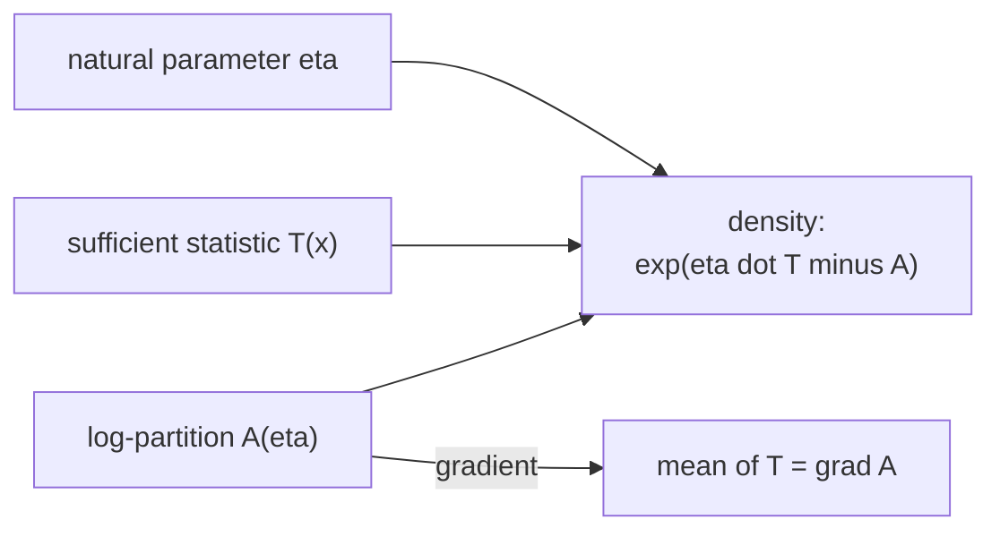

The Bernoulli, Poisson, Gaussian, and many others look unrelated until you write
them in one common algebraic form. The **exponential family** is that form<FN n="1" />. Once a
distribution is in it, the sufficient statistics, the mean, and the maximum-likelihood
equations all fall out of the same template, which is why generalized linear models
and much of classical statistics are built on it.

## The canonical form

A family of distributions is an **exponential family** if its PMF or PDF can be
written as<FN n="2" />

$$
p(x \mid \theta) = h(x)\, \exp\!\big(\eta(\theta)^\top T(x) - A(\theta)\big),
$$

where:

- $T(x)$ is the **sufficient statistic** (a vector function of the data),
- $\eta(\theta)$ is the **natural parameter**,
- $A(\theta)$ is the **log-partition function** (the normalizer),
- $h(x)$ is the **base measure** (no parameter dependence).

In **canonical form** the parameter is $\eta$ itself:
$p(x \mid \eta) = h(x)\exp(\eta^\top T(x) - A(\eta))$. The whole parametric family is
determined by the choice of $T$, $h$, and the resulting $A$.

## Bernoulli in exponential form

Start from $p(x \mid q) = q^x(1-q)^{1-x}$ and take the log inside an exponential:

$$
p(x \mid q) = \exp\!\big(x\log q + (1-x)\log(1-q)\big) = \exp\!\left(x\log\frac{q}{1-q} + \log(1-q)\right).
$$

Matching the template: $T(x) = x$, the natural parameter is the **log-odds**
$\eta = \log\frac{q}{1-q}$, the base measure is $h(x) = 1$, and
$A(\eta) = -\log(1-q) = \log(1 + e^\eta)$ after inverting $q = \sigma(\eta)$ with the
logistic $\sigma$. The logistic link of classification is not a convenient guess: it
is the exponential-family natural parameter of the Bernoulli.

## The log-partition generates moments

Differentiating $A$ with respect to the natural parameter produces the moments of
the sufficient statistic. From $\int h(x)\exp(\eta^\top T(x) - A(\eta))\,dx = 1$,
differentiate both sides with respect to $\eta$:

$$
\nabla_\eta A(\eta) = \mathbb{E}[T(X)], \qquad \nabla^2_\eta A(\eta) = \operatorname{Cov}(T(X)).
$$

*Sketch.* Differentiating the normalization identity and moving the derivative
inside the integral brings down a factor $T(x) - \nabla_\eta A$; setting the result
to zero gives the mean. A second derivative gives the covariance. The log-partition
is a moment generator built into the structure, and because its Hessian is a
covariance, $A$ is **convex** in $\eta$, which makes maximum-likelihood fitting a
convex problem.

## Sufficiency

$T(x)$ is **sufficient** because the data enters the likelihood only through it: two
datasets with the same $\sum_i T(x_i)$ produce the same likelihood and hence the same
inference about $\eta$. For $n$ i.i.d. samples, the likelihood depends on the data
only through $\sum_i T(x_i)$, so that sum (plus $n$) is all you need to store. This
collapses an arbitrarily large dataset to a fixed-size summary without losing
information about the parameter.



## Check it on arrays

```python
import numpy as np

rng = np.random.default_rng(7)
N = 2_000_000

# Bernoulli(q): verify A'(eta) = E[T(X)] = E[X] = q
q = 0.3
X = (rng.random(N) < q).astype(float)
eta = np.log(q / (1 - q))                 # natural parameter (log-odds)
A = np.log(1 + np.exp(eta))               # log-partition
# A'(eta) = sigmoid(eta) should equal E[X]
sigmoid = lambda z: 1 / (1 + np.exp(-z))
print("A'(eta) =", round(sigmoid(eta), 4), "  E[X] =", round(X.mean(), 4))

# A''(eta) = Var(T(X)) = q(1-q)
print("A''(eta) =", round(sigmoid(eta) * (1 - sigmoid(eta)), 4),
      "  Var(X) =", round(X.var(), 4))

# Sufficiency: likelihood depends on data only through sum(T(x)) = sum(x)
def loglik(eta, data):
    return np.sum(eta * data - np.log(1 + np.exp(eta)))
data_a = X[:1000]
data_b = np.zeros(1000); data_b[:int(X[:1000].sum())] = 1.0   # same number of 1s
print("same sum -> same loglik:",
      np.isclose(loglik(0.4, data_a), loglik(0.4, data_b)))
```

The first and second derivatives of the log-partition reproduce the Bernoulli mean
and variance, and two datasets with the same success count give identical
likelihoods.

## Exercises

**Exercise 1.** Write the Poisson PMF
$p(x \mid \lambda) = \frac{\lambda^x e^{-\lambda}}{x!}$ in canonical exponential
form. Identify $T(x)$, the natural parameter $\eta$, the base measure $h(x)$, and
the log-partition $A(\eta)$.

<details>
<summary>Solution</summary>

**Step 1.** Take the log inside an exponential:

$$
p(x \mid \lambda) = \frac{1}{x!}\exp\!\big(x\log\lambda - \lambda\big).
$$

**Step 2.** Match the template
$h(x)\exp(\eta\, T(x) - A(\eta))$. The factor outside the exponential is the base
measure $h(x) = 1/x!$, the term multiplying $x$ is the natural parameter, and the
remaining $\lambda$ is the normalizer:

$$
T(x) = x, \qquad \eta = \log\lambda, \qquad h(x) = \frac{1}{x!}, \qquad A(\eta) = \lambda = e^{\eta}.
$$

The substitution $\lambda = e^\eta$ rewrites $A$ as a function of $\eta$ alone, as
the canonical form requires.

</details>

**Exercise 2.** For the Poisson of Exercise 1, confirm that the log-partition
generates the moments: show $A'(\eta) = \mathbb{E}[X]$ and
$A''(\eta) = \operatorname{Var}(X)$, recovering the Poisson's equal mean and
variance.

<details>
<summary>Solution</summary>

**Step 1.** From Exercise 1, $A(\eta) = e^{\eta}$. Differentiate once:

$$
A'(\eta) = e^{\eta} = \lambda.
$$

By the moment identity $A'(\eta) = \mathbb{E}[T(X)] = \mathbb{E}[X]$, this gives
$\mathbb{E}[X] = \lambda$, the known Poisson mean.

**Step 2.** Differentiate again:

$$
A''(\eta) = e^{\eta} = \lambda.
$$

By $A''(\eta) = \operatorname{Var}(T(X)) = \operatorname{Var}(X)$, this gives
$\operatorname{Var}(X) = \lambda$. The same exponential reappears at every
derivative, so mean and variance coincide: the equal-mean-and-variance fact is the
log-partition being its own derivative.

</details>

**Exercise 3 (code).** Verify Exercise 2 numerically: sample from a Poisson, set
$\eta = \log\lambda$, and confirm $A'(\eta)$ and $A''(\eta)$ match the empirical
mean and variance.

<details>
<summary>Solution</summary>

```python
import numpy as np

rng = np.random.default_rng(0)
N = 2_000_000

lam = 4.0
X = rng.poisson(lam, size=N)

eta = np.log(lam)
A_prime = np.exp(eta)          # A'(eta) = e^eta
A_double = np.exp(eta)         # A''(eta) = e^eta

print("A'(eta) =", round(A_prime, 4), " E[X] =", round(X.mean(), 4))
print("A''(eta) =", round(A_double, 4), " Var(X) =", round(X.var(), 4))
assert np.isclose(A_prime, X.mean(), atol=1e-2)
assert np.isclose(A_double, X.var(), atol=2e-2)
```

Both derivatives equal $\lambda = 4$, and the sampled mean and variance both land
near 4, confirming the Poisson's defining equality through the log-partition.

</details>

The next lesson handles a different transformation question: what
happens to a distribution when you pass the variable through a function.

<Footnotes>
  <FNItem n="1">**Bishop, C. M.** (2006). *Pattern Recognition and Machine Learning.* Springer. §2.4, the exponential family and conjugacy.</FNItem>
  <FNItem n="2">**Casella, G., & Berger, R. L.** (2002). *Statistical Inference* (2nd ed.). Duxbury. §3.4, exponential families and sufficient statistics.</FNItem>
</Footnotes>
