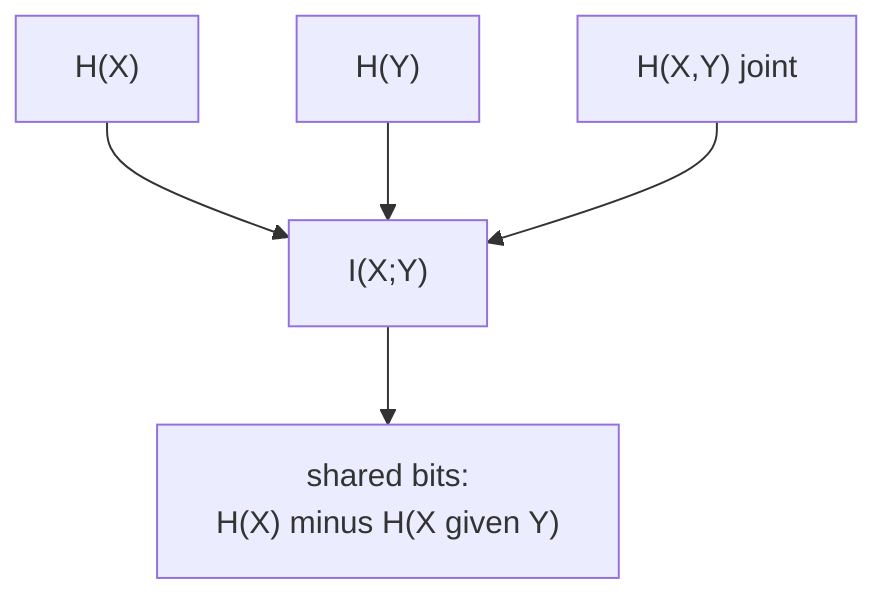

Covariance measures linear co-movement and misses everything nonlinear. **Mutual
information** measures dependence of any kind: it is zero exactly when two variables
are independent, and it counts the bits one variable reveals about the other<FN ns="1, 2" />. It
underlies feature selection, the information bottleneck, and representation-learning
objectives.

## Definition

The **mutual information** between $X$ and $Y$ is the KL divergence between their
joint distribution and the product of their marginals<FN n="3" />:

$$
I(X; Y) = D_{\mathrm{KL}}\big(p_{X,Y} \,\|\, p_X\, p_Y\big) = \sum_{x, y} p(x, y)\log\frac{p(x, y)}{p(x)\,p(y)}.
$$

The product $p_X p_Y$ is what the joint would be if $X$ and $Y$ were independent. So
$I(X; Y)$ measures how far the true joint sits from independence, in the KL sense.

## Nonnegativity and the independence test

Because mutual information is a KL divergence, the previous lesson's Gibbs inequality
applies directly:

$$
I(X; Y) \ge 0, \quad \text{with } I(X; Y) = 0 \iff p_{X,Y} = p_X\,p_Y.
$$

Zero mutual information is exactly independence. Unlike zero covariance, this detects
every form of dependence, linear or not.

This is the confusion worth naming: **zero covariance is not independence**, and the
two measures can disagree completely. Take $X$ uniform on $\{-1, 0, 1\}$ and
$Y = X^2$, so $Y$ is fully determined by $X$. Covariance sees nothing, $\operatorname{Cov}(X, Y) = 0$,
because the symmetric $\pm 1$ contributions cancel. Mutual information sees the whole
dependence: $Y$ takes value $0$ with probability $1/3$ and $1$ with probability $2/3$,
so $I(X; Y) = H(Y) = -\tfrac13\log_2\tfrac13 - \tfrac23\log_2\tfrac23 = 0.918$ bits.
A linear summary reports independence; the information measure reports near-complete
dependence. Where the dependence *is* linear the gap closes: for a bivariate Gaussian
with correlation $\rho$, $I = -\tfrac12\log_2(1 - \rho^2)$, which is $0$ at $\rho = 0$,
$0.21$ bits at $\rho = 0.5$, and $1.20$ bits at $\rho = 0.9$. Covariance and mutual
information agree on independence only when the dependence has no nonlinear part to
miss.

## The entropy decomposition

Expanding the log of the ratio connects mutual information to entropy:

$$
I(X; Y) = H(X) - H(X \mid Y) = H(Y) - H(Y \mid X) = H(X) + H(Y) - H(X, Y),
$$

where $H(X \mid Y) = -\sum_{x,y} p(x,y)\log p(x \mid y)$ is the **conditional
entropy**, the average remaining uncertainty in $X$ once $Y$ is known.

*Derivation of the first equality.* Use $p(x, y) = p(x \mid y)p(y)$ in the definition:

$$
I(X; Y) = \sum_{x,y} p(x,y)\log\frac{p(x \mid y)}{p(x)} = -\sum_{x,y} p(x,y)\log p(x) + \sum_{x,y} p(x,y)\log p(x \mid y).
$$

The first term is $-\sum_x p(x)\log p(x) = H(X)$ (after marginalizing out $y$); the
second is $-H(X \mid Y)$. So $I(X; Y) = H(X) - H(X \mid Y)$.

The reading is direct: mutual information is the reduction in uncertainty about $X$
from learning $Y$. It is symmetric, $I(X; Y) = I(Y; X)$, so the bits flow both ways
equally. It is also bounded: $I(X; Y) \le \min(H(X), H(Y))$, since conditional
entropy is nonnegative.



## Check it on arrays

```python
import numpy as np

rng = np.random.default_rng(15)

def mutual_info(joint):
    """MI in bits from a joint PMF table."""
    joint = joint / joint.sum()
    px = joint.sum(axis=1, keepdims=True)
    py = joint.sum(axis=0, keepdims=True)
    mask = joint > 0
    return np.sum(joint[mask] * np.log2(joint[mask] / (px * py)[mask]))

# Independent variables: MI ~ 0
indep = np.outer([0.3, 0.7], [0.4, 0.6])
print("MI(independent):", round(mutual_info(indep), 6), " (~0)")

# Perfectly dependent: Y = X, MI = H(X)
perfect = np.array([[0.5, 0.0], [0.0, 0.5]])
print("MI(Y=X):", round(mutual_info(perfect), 4), " = H(X) = 1 bit")

# Nonlinear dependence with zero covariance: Y = X^2, X in {-1,0,1}
rng2 = np.random.default_rng(16)
X = rng2.choice([-1, 0, 1], size=500_000)
Y = X**2
cov = np.mean((X - X.mean()) * (Y - Y.mean()))
# Build empirical joint over the value grid
xs, ys = np.unique(X), np.unique(Y)
joint = np.zeros((len(xs), len(ys)))
for i, xv in enumerate(xs):
    for j, yv in enumerate(ys):
        joint[i, j] = np.mean((X == xv) & (Y == yv))
print("Cov(X, X^2):", round(cov, 4), " but MI:", round(mutual_info(joint), 4), "bits")
```

Independent variables score zero, $Y = X$ scores the full entropy, and the
nonlinear $Y = X^2$ has zero covariance yet clearly positive mutual information.
The next lesson moves from static dependence to dependence over time: Markov chains.

<Footnotes>
  <FNItem n="1">**Shannon, C. E.** (1948). "A mathematical theory of communication". *Bell System Technical Journal*, 27, 379-423. The origin of mutual information as the rate of information transmission. [doi:10.1002/j.1538-7305.1948.tb01338.x](https://doi.org/10.1002/j.1538-7305.1948.tb01338.x)</FNItem>
  <FNItem n="2">**MacKay, D. J. C.** (2003). *Information Theory, Inference, and Learning Algorithms.* Cambridge University Press. §8.1, mutual information and dependence.</FNItem>
  <FNItem n="3">**Cover, T. M., & Thomas, J. A.** (2006). *Elements of Information Theory* (2nd ed.). Wiley. §2.4, mutual information as relative entropy between joint and product marginals. [doi:10.1002/047174882X](https://doi.org/10.1002/047174882X)</FNItem>
</Footnotes>
