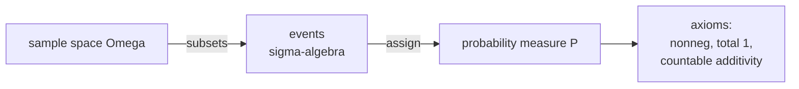

Before any random variable, distribution, or expectation, probability needs a
foundation: what is the set of things that can happen, and what rule assigns each
of them a number between 0 and 1? Kolmogorov's three axioms answer this<FN ns="1, 2" />, and every
later result is a consequence of them.

## Sample space and events

The **sample space** $\Omega$ is the set of all possible outcomes of an experiment.
A single roll of a die has $\Omega = \{1, 2, 3, 4, 5, 6\}$; a coin flip has
$\Omega = \{H, T\}$.

An **event** is a subset $A \subseteq \Omega$: a collection of outcomes we want to
assign a probability to. "The die shows an even number" is the event
$A = \{2, 4, 6\}$. Events combine with set operations: $A \cup B$ ("$A$ or $B$"),
$A \cap B$ ("$A$ and $B$"), and $A^c = \Omega \setminus A$ ("not $A$").

For technical reasons (uncountable sample spaces have non-measurable subsets), the
events form a **$\sigma$-algebra** $\mathcal{F}$<FN n="2" />: a collection of subsets closed
under complement and countable union, containing $\Omega$. For a finite or
countable $\Omega$ one can take $\mathcal{F}$ to be all subsets, and the technical
layer never intrudes.

## The three axioms

A **probability measure** is a function $P: \mathcal{F} \to \mathbb{R}$ satisfying:

1. **Nonnegativity:** $P(A) \ge 0$ for every event $A$.
2. **Normalization:** $P(\Omega) = 1$.
3. **Countable additivity:** for pairwise disjoint events $A_1, A_2, \dots$
   (meaning $A_i \cap A_j = \varnothing$ when $i \neq j$),
   $$
   P\!\left(\bigcup_{i=1}^\infty A_i\right) = \sum_{i=1}^\infty P(A_i).
   $$

The triple $(\Omega, \mathcal{F}, P)$ is a **probability space**. Everything else
is derived.

## Consequences

**Probability of the complement.** Since $A$ and $A^c$ are disjoint and their union
is $\Omega$, axioms 2 and 3 give $P(A) + P(A^c) = P(\Omega) = 1$, so

$$
P(A^c) = 1 - P(A).
$$

Setting $A = \Omega$ gives $P(\varnothing) = 0$.

**Monotonicity.** If $A \subseteq B$, write $B = A \cup (B \setminus A)$ as a
disjoint union. Then $P(B) = P(A) + P(B \setminus A) \ge P(A)$ by nonnegativity.

**Inclusion-exclusion.** For any two events,

$$
P(A \cup B) = P(A) + P(B) - P(A \cap B).
$$

*Derivation.* Split $A \cup B$ into three disjoint pieces: $A \setminus B$,
$B \setminus A$, and $A \cap B$. Additivity gives
$P(A \cup B) = P(A \setminus B) + P(B \setminus A) + P(A \cap B)$. Also
$P(A) = P(A \setminus B) + P(A \cap B)$ and similarly for $B$. Substituting and
collecting terms yields the formula: the intersection is added twice when summing
$P(A) + P(B)$, so it is subtracted once.

## Equally likely outcomes

When $\Omega$ is finite and every outcome is equally likely, axioms 2 and 3 force
$P(\{\omega\}) = 1/|\Omega|$, so for any event

$$
P(A) = \frac{|A|}{|\Omega|}.
$$

Probability reduces to counting. This is the classical model behind dice, cards,
and uniform sampling.



## Check it on arrays

A probability is the long-run fraction of trials in which an event occurs. Monte
Carlo sampling makes the axioms tangible: simulate many trials, count, and watch
the empirical frequencies obey the rules above.

```python
import numpy as np

rng = np.random.default_rng(0)
N = 1_000_000

# Two independent dice
d1 = rng.integers(1, 7, size=N)
d2 = rng.integers(1, 7, size=N)

A = (d1 + d2 == 7)          # event: sum is 7
B = (d1 == d2)              # event: doubles

pA = A.mean()
pB = B.mean()
pAB = (A & B).mean()        # sum 7 AND doubles is impossible
pA_or_B = (A | B).mean()

print(f"P(A)        = {pA:.4f}   (exact 6/36 = {6/36:.4f})")
print(f"P(B)        = {pB:.4f}   (exact 6/36 = {6/36:.4f})")
print(f"P(A and B)  = {pAB:.4f}   (exact 0)")
print(f"P(A or B)   = {pA_or_B:.4f}")

# Inclusion-exclusion: P(A or B) = P(A) + P(B) - P(A and B)
print(f"incl-excl   = {pA + pB - pAB:.4f}")

# Complement rule: P(not A) = 1 - P(A)
print(f"P(not A)    = {(~A).mean():.4f}   1 - P(A) = {1 - pA:.4f}")
```

The empirical frequencies match the counting probabilities, and inclusion-exclusion
and the complement rule hold to sampling precision.

## Exercises

**Exercise 1.** A fair die is rolled once. Let $A = \{2, 4, 6\}$ (even) and
$B = \{4, 5, 6\}$ (greater than 3). Compute $P(A \cup B)$ two ways: by counting the
union directly, and by inclusion-exclusion.

<details>
<summary>Solution</summary>

**Step 1.** By counting: $A \cup B = \{2, 4, 5, 6\}$ has 4 outcomes out of 6, so
$P(A \cup B) = 4/6 = 2/3$.

**Step 2.** By inclusion-exclusion: $P(A) = 3/6$, $P(B) = 3/6$, and the
intersection $A \cap B = \{4, 6\}$ has $P(A \cap B) = 2/6$. Then

$$
P(A \cup B) = \frac{3}{6} + \frac{3}{6} - \frac{2}{6} = \frac{4}{6} = \frac{2}{3}.
$$

Both routes agree, as the inclusion-exclusion derivation guarantees.

</details>

**Exercise 2.** Prove **Boole's inequality** (the union bound) for two events:
$P(A \cup B) \le P(A) + P(B)$, using only the axioms and the results derived in this
lesson.

<details>
<summary>Solution</summary>

**Step 1.** Inclusion-exclusion gives the exact identity

$$
P(A \cup B) = P(A) + P(B) - P(A \cap B).
$$

**Step 2.** By nonnegativity (axiom 1), $P(A \cap B) \ge 0$. Subtracting a
nonnegative quantity can only decrease the right side:

$$
P(A) + P(B) - P(A \cap B) \le P(A) + P(B).
$$

**Step 3.** Chaining the two lines,

$$
P(A \cup B) \le P(A) + P(B),
$$

with equality exactly when $P(A \cap B) = 0$ (the events overlap on a
probability-zero set). The bound trades the exact overlap correction for a one-sided
estimate.

</details>

**Exercise 3 (code).** Simulate one million rolls of two fair dice. Estimate
$P(A \cup B)$ for $A = \{\text{sum} = 8\}$ and $B = \{\text{at least one } 6\}$, and
check that the Monte Carlo estimate matches the inclusion-exclusion value computed
from the empirical pieces.

<details>
<summary>Solution</summary>

```python
import numpy as np

rng = np.random.default_rng(2)
N = 1_000_000
d1 = rng.integers(1, 7, size=N)
d2 = rng.integers(1, 7, size=N)

A = (d1 + d2 == 8)              # sum is 8
B = (d1 == 6) | (d2 == 6)       # at least one 6

pA, pB, pAB = A.mean(), B.mean(), (A & B).mean()
direct = (A | B).mean()
incl_excl = pA + pB - pAB

assert np.isclose(direct, incl_excl, atol=1e-12)
print("P(A or B) direct:", round(direct, 4),
      " incl-excl:", round(incl_excl, 4))
```

The direct union frequency and the inclusion-exclusion reconstruction agree
exactly, since both are computed from the same simulated trials.

</details>

With a probability space in place, the next lesson attaches numbers to outcomes
through random variables.

<Footnotes>
  <FNItem n="1">**Wasserman, L.** (2004). *All of Statistics.* Springer. Ch. 1, sample spaces and the probability axioms. [doi:10.1007/978-0-387-21736-9](https://doi.org/10.1007/978-0-387-21736-9)</FNItem>
  <FNItem n="2">**Billingsley, P.** (1995). *Probability and Measure* (3rd ed.). Wiley. The measure-theoretic treatment of probability spaces and $\sigma$-algebras.</FNItem>
</Footnotes>
