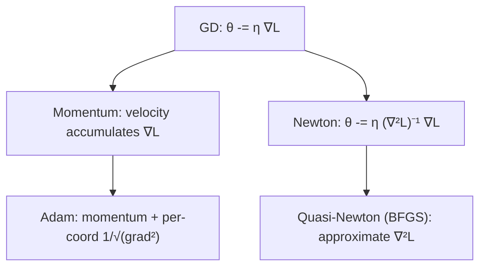

Training is the problem $\min_\theta L(\theta)$. Two facts decide how hard it is:
whether moving against the gradient reliably helps, and whether a point with zero
gradient is actually the best point. Convexity answers the second; a short
Cauchy–Schwarz argument answers the first.

## The gradient is steepest ascent

For a unit direction $u$, the rate of change of $L$ at $\theta$ is the
directional derivative $\nabla L(\theta)^\top u$. Cauchy–Schwarz bounds it:

$$ \nabla L(\theta)^\top u \le \lVert \nabla L(\theta) \rVert \, \lVert u \rVert = \lVert \nabla L(\theta) \rVert, $$

with equality exactly when $u$ aligns with $\nabla L(\theta)$. So the gradient
points in the direction of steepest ascent, and $-\nabla L(\theta)$ is steepest
descent — the move taken at every step of gradient descent:

$$ \theta_{k+1} = \theta_k - \eta\, \nabla L(\theta_k). $$

## Convexity makes local global

$L$ is convex if its graph lies above every tangent:

$$ L(y) \ge L(x) + \nabla L(x)^\top (y - x) \quad \text{for all } x, y. $$

Set $x = \theta^\star$ with $\nabla L(\theta^\star) = 0$: the inequality collapses
to $L(y) \ge L(\theta^\star)$ for all $y$. A stationary point of a convex
function is a global minimum. Equivalently, for twice-differentiable $L$,
convexity is $\nabla^2 L \succeq 0$ everywhere. Linear and logistic regression
are convex in their parameters; neural networks are not, which is why
stationarity guarantees nothing there and the rest of pillar D exists.

## The step, reshaped

Plain gradient descent uses a scalar step $\eta$ in the steepest direction.
Every practical optimizer modifies one of two things: the direction, or the
per-coordinate scale.



- **Momentum** keeps a running average of past gradients, damping oscillation
  across narrow valleys and accelerating along consistent directions.
- **Adam** adds a per-coordinate learning rate, dividing each step by a running
  RMS of that coordinate's gradients — useful when curvature differs wildly
  across parameters.
- **Newton's method** multiplies the gradient by the inverse Hessian
  $(\nabla^2 L)^{-1}$, which is the steepest-descent direction under the metric
  set by curvature. It converges in one step on a quadratic but costs an
  $n\times n$ solve; **BFGS/L-BFGS** approximate the inverse Hessian to dodge that
  cost. Constraints bring in **KKT conditions** and Lagrange multipliers, the
  generalization of "gradient is zero" to "gradient lies in the span of the
  active constraints".

## Descent vs. Newton on a quadratic

For $L(\theta) = \tfrac12 \theta^\top A \theta - b^\top \theta$ with $A \succ 0$,
the gradient is $A\theta - b$ and the minimizer is $\theta^\star = A^{-1}b$.
Gradient descent crawls toward it; Newton lands in a single step because the
Hessian is exactly $A$.

```python
import numpy as np

A = np.array([[3.0, 0.0], [0.0, 20.0]])   # ill-conditioned: curvatures 3 vs 20
b = np.array([1.0, 1.0])
grad = lambda t: A @ t - b
theta_star = np.linalg.solve(A, b)

# Gradient descent
t = np.zeros(2)
eta = 2.0 / (3 + 20)        # ~1/largest curvature, to stay stable
for _ in range(50):
    t = t - eta * grad(t)
print(f"GD after 50 steps: {t.round(4)}   error={np.linalg.norm(t-theta_star):.4f}")

# Newton: one step
t_newton = np.zeros(2)
t_newton = t_newton - np.linalg.solve(A, grad(t_newton))
print(f"Newton after 1 step: {t_newton.round(4)}   error={np.linalg.norm(t_newton-theta_star):.2e}")
print(f"optimum: {theta_star.round(4)}")
```

The conditioning gap (curvatures 3 vs 20) is what slows gradient descent: a step
size safe for the steep coordinate is tiny for the shallow one. Momentum and
Adam are the cheap fixes; Newton is the expensive one that removes the problem
entirely by working in the curvature-corrected metric.
