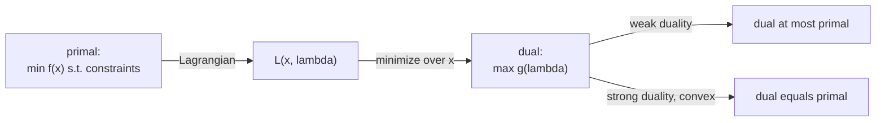

Every constrained minimization has a shadow problem, its **dual**, built from the
Lagrangian. The dual is always a concave maximization (even when the original is not
convex), it always lower-bounds the original, and for convex problems the two have the
same optimal value. This is the theory behind SVM solvers and the certificates that
prove a solution optimal.

## The primal and the Lagrangian

The **primal** problem, now with inequality constraints, is

$$
p^\star = \min_x f(x) \quad \text{s.t.} \quad g_i(x) \le 0,\ \ h_j(x) = 0.
$$

The **Lagrangian** attaches a multiplier to each constraint, with $\lambda_i \ge 0$
for inequalities and free $\nu_j$ for equalities:

$$
\mathcal{L}(x, \lambda, \nu) = f(x) + \sum_i \lambda_i g_i(x) + \sum_j \nu_j h_j(x).
$$

## The dual function

The **Lagrange dual function** minimizes the Lagrangian over $x$ for fixed
multipliers:

$$
\mathcal{D}(\lambda, \nu) = \min_x \mathcal{L}(x, \lambda, \nu).
$$

It is a pointwise minimum of functions that are **affine** in $(\lambda, \nu)$, and a
pointwise minimum of affine functions is **concave**. So $\mathcal{D}$ is concave
regardless of whether $f$ or the constraints are convex, which is why the dual is
always a well-behaved maximization.

## Weak duality

**Theorem.** For any $\lambda \ge 0$ and any $\nu$, $\mathcal{D}(\lambda, \nu) \le p^\star$.

*Proof.* Let $x$ be any feasible point for the primal, so $g_i(x) \le 0$ and
$h_j(x) = 0$. With $\lambda_i \ge 0$, the term $\sum_i \lambda_i g_i(x) \le 0$ and
$\sum_j \nu_j h_j(x) = 0$, hence

$$
\mathcal{L}(x, \lambda, \nu) = f(x) + \underbrace{\sum_i \lambda_i g_i(x)}_{\le 0} + \underbrace{\sum_j \nu_j h_j(x)}_{= 0} \le f(x).
$$

Minimizing the left side over all $x$ only decreases it, so
$\mathcal{D}(\lambda, \nu) = \min_x \mathcal{L} \le f(x)$ for every feasible $x$, and
in particular $\le p^\star$. $\qquad\blacksquare$

## The dual problem and the duality gap

The best (largest) lower bound is the **dual problem**:

$$
d^\star = \max_{\lambda \ge 0,\, \nu} \mathcal{D}(\lambda, \nu).
$$

Weak duality says $d^\star \le p^\star$ always. The difference
$p^\star - d^\star \ge 0$ is the **duality gap**. Any dual-feasible $(\lambda, \nu)$
produces a certified lower bound on the primal optimum, a way to bound how suboptimal
a candidate solution is.

## Strong duality

**Strong duality** holds when $d^\star = p^\star$ (zero gap). It is not automatic, but
for **convex** primal problems it holds under a mild condition.

**Slater's condition:** if the primal is convex and there exists a strictly feasible
point (some $x$ with $g_i(x) < 0$ for all inequality constraints), then strong duality
holds. Most convex problems met in practice (linear programs, convex QPs, SVMs)
satisfy Slater, so their dual solves the primal exactly. When strong duality holds,
the primal and dual solutions are linked by the KKT conditions of the next lesson.



## Check it on arrays

```python
import numpy as np

# Convex QP: min 0.5 x^T x s.t. a^T x >= 1  (i.e. g(x) = 1 - a^T x <= 0)
a = np.array([1.0, 2.0])

# Dual function: D(lam) = min_x 0.5 x^T x + lam (1 - a^T x), lam >= 0.
# Inner min at x = lam a, giving D(lam) = lam - 0.5 lam^2 ||a||^2.
# Maximize over lam >= 0: lam* = 1/||a||^2, d* = 1/(2||a||^2).
norm2 = a @ a
lam_star = 1.0 / norm2
d_star = lam_star - 0.5 * lam_star**2 * norm2
print("dual optimum d* =", round(d_star, 6))

# Primal optimum: closest point to origin on the half-space a^T x >= 1
# is x* = a / ||a||^2, with f = 0.5 / ||a||^2.
x_star = a / norm2
p_star = 0.5 * x_star @ x_star
print("primal optimum p* =", round(p_star, 6))
print("duality gap:", round(p_star - d_star, 8), " (zero -> strong duality)")

# Weak duality: any lam >= 0 gives a valid lower bound
for lam in [0.05, 0.1, 0.2, 0.5]:
    D = lam - 0.5 * lam**2 * norm2
    print(f"lam={lam}: D(lam)={D:.5f} <= p*={p_star:.5f}: {D <= p_star + 1e-12}")
```

The dual and primal optima coincide (zero gap, strong duality via Slater), and every
nonnegative multiplier yields a lower bound below the primal optimum. The next lesson
collects the optimality conditions linking primal and dual: the KKT conditions.
