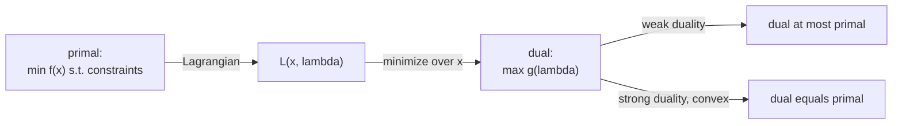

Every constrained minimization has a shadow problem, its **dual**, built from the
Lagrangian. The dual is always a concave maximization (even when the original is not
convex), it always lower-bounds the original, and for convex problems the two have the
same optimal value. This is the theory behind SVM solvers and the certificates that
prove a solution optimal.

## The primal and the Lagrangian

The **primal** problem, now with inequality constraints, is

$$
p^\star = \min_x f(x) \quad \text{s.t.} \quad g_i(x) \le 0,\ \ h_j(x) = 0.
$$

The **Lagrangian** attaches a multiplier to each constraint, with $\lambda_i \ge 0$
for inequalities and free $\nu_j$ for equalities:

$$
\mathcal{L}(x, \lambda, \nu) = f(x) + \sum_i \lambda_i g_i(x) + \sum_j \nu_j h_j(x).
$$

## The dual function

The **Lagrange dual function** minimizes the Lagrangian over $x$ for fixed
multipliers:

$$
\mathcal{D}(\lambda, \nu) = \min_x \mathcal{L}(x, \lambda, \nu).
$$

It is a pointwise minimum of functions that are **affine** in $(\lambda, \nu)$, and a
pointwise minimum of affine functions is **concave**. So $\mathcal{D}$ is concave
regardless of whether $f$ or the constraints are convex, which is why the dual is
always a well-behaved maximization.

## Weak duality

**Theorem.** For any $\lambda \ge 0$ and any $\nu$, $\mathcal{D}(\lambda, \nu) \le p^\star$<FN n="1" />.

*Proof.* Let $x$ be any feasible point for the primal, so $g_i(x) \le 0$ and
$h_j(x) = 0$. With $\lambda_i \ge 0$, the term $\sum_i \lambda_i g_i(x) \le 0$ and
$\sum_j \nu_j h_j(x) = 0$, hence

$$
\mathcal{L}(x, \lambda, \nu) = f(x) + \underbrace{\sum_i \lambda_i g_i(x)}_{\le 0} + \underbrace{\sum_j \nu_j h_j(x)}_{= 0} \le f(x).
$$

Minimizing the left side over all $x$ only decreases it, so
$\mathcal{D}(\lambda, \nu) = \min_x \mathcal{L} \le f(x)$ for every feasible $x$, and
in particular $\le p^\star$. $\qquad\blacksquare$

## The dual problem and the duality gap

The best (largest) lower bound is the **dual problem**:

$$
d^\star = \max_{\lambda \ge 0,\, \nu} \mathcal{D}(\lambda, \nu).
$$

Weak duality says $d^\star \le p^\star$ always. The difference
$p^\star - d^\star \ge 0$ is the **duality gap**. Any dual-feasible $(\lambda, \nu)$
produces a certified lower bound on the primal optimum, a way to bound how suboptimal
a candidate solution is.

## Strong duality

**Strong duality** holds when $d^\star = p^\star$ (zero gap). It is not automatic, but
for **convex** primal problems it holds under a mild condition.

**Slater's condition:** if the primal is convex and there exists a strictly feasible
point (some $x$ with $g_i(x) < 0$ for all inequality constraints), then strong duality
holds. Most convex problems met in practice (linear programs, convex QPs, SVMs)
satisfy Slater, so their dual solves the primal exactly<FN n="2" />. When strong duality holds,
the primal and dual solutions are linked by the KKT conditions of the next lesson.



## Check it on arrays

```python
import numpy as np

# Convex QP: min 0.5 x^T x s.t. a^T x >= 1  (i.e. g(x) = 1 - a^T x <= 0)
a = np.array([1.0, 2.0])

# Dual function: D(lam) = min_x 0.5 x^T x + lam (1 - a^T x), lam >= 0.
# Inner min at x = lam a, giving D(lam) = lam - 0.5 lam^2 ||a||^2.
# Maximize over lam >= 0: lam* = 1/||a||^2, d* = 1/(2||a||^2).
norm2 = a @ a
lam_star = 1.0 / norm2
d_star = lam_star - 0.5 * lam_star**2 * norm2
print("dual optimum d* =", round(d_star, 6))

# Primal optimum: closest point to origin on the half-space a^T x >= 1
# is x* = a / ||a||^2, with f = 0.5 / ||a||^2.
x_star = a / norm2
p_star = 0.5 * x_star @ x_star
print("primal optimum p* =", round(p_star, 6))
print("duality gap:", round(p_star - d_star, 8), " (zero -> strong duality)")

# Weak duality: any lam >= 0 gives a valid lower bound
for lam in [0.05, 0.1, 0.2, 0.5]:
    D = lam - 0.5 * lam**2 * norm2
    print(f"lam={lam}: D(lam)={D:.5f} <= p*={p_star:.5f}: {D <= p_star + 1e-12}")
```

The dual and primal optima coincide (zero gap, strong duality via Slater), and every
nonnegative multiplier yields a lower bound below the primal optimum.

## Exercises

**Exercise 1.** For the problem $\min_x \tfrac12 x^\top x$ subject to
$a^\top x \ge 1$ (so $g(x) = 1 - a^\top x \le 0$) with $a = (1, 2)$, derive the dual
function $\mathcal{D}(\lambda)$ in closed form and find $d^\star$.

<details>
<summary>Solution</summary>

**Step 1.** Write the Lagrangian for $\lambda \ge 0$:

$$
\mathcal{L}(x, \lambda) = \tfrac12 x^\top x + \lambda(1 - a^\top x).
$$

**Step 2.** Minimize over $x$. Setting $\nabla_x \mathcal{L} = x - \lambda a = 0$
gives the inner minimizer $x = \lambda a$.

**Step 3.** Substitute back, using $a^\top a = \lVert a\rVert^2$:

$$
\mathcal{D}(\lambda) = \tfrac12 \lambda^2 \lVert a\rVert^2 + \lambda\big(1 - \lambda\lVert a\rVert^2\big) = \lambda - \tfrac12 \lambda^2 \lVert a\rVert^2.
$$

**Step 4.** Maximize the concave $\mathcal{D}$ over $\lambda \ge 0$. The derivative
$1 - \lambda\lVert a\rVert^2 = 0$ gives $\lambda^\star = 1/\lVert a\rVert^2$, which is
nonnegative. With $\lVert a\rVert^2 = 1 + 4 = 5$, $\lambda^\star = 1/5$ and

$$
d^\star = \tfrac{1}{\lVert a\rVert^2} - \tfrac12 \cdot \tfrac{1}{\lVert a\rVert^4}\lVert a\rVert^2 = \tfrac{1}{2\lVert a\rVert^2} = \tfrac{1}{10} = 0.1.
$$

</details>

**Exercise 2.** Prove weak duality in the form: for the primal optimum $p^\star$ and
any dual-feasible $(\lambda, \nu)$ with $\lambda \ge 0$, the value
$\mathcal{D}(\lambda, \nu)$ is a lower bound on $f$ at every primal-feasible point.

<details>
<summary>Solution</summary>

**Step 1.** Let $x$ be primal-feasible, so $g_i(x) \le 0$ and $h_j(x) = 0$. Because
$\lambda_i \ge 0$ and $g_i(x) \le 0$, each product $\lambda_i g_i(x) \le 0$, and the
equality terms vanish: $\nu_j h_j(x) = 0$.

**Step 2.** Therefore

$$
\mathcal{L}(x, \lambda, \nu) = f(x) + \sum_i \lambda_i g_i(x) + \sum_j \nu_j h_j(x) \le f(x).
$$

**Step 3.** The dual function minimizes the Lagrangian over all $x$, so it is no
larger than this particular value:

$$
\mathcal{D}(\lambda, \nu) = \min_{x'} \mathcal{L}(x', \lambda, \nu) \le \mathcal{L}(x, \lambda, \nu) \le f(x).
$$

This holds for every primal-feasible $x$, so $\mathcal{D}(\lambda, \nu) \le p^\star$.

</details>

**Exercise 3 (code).** For a linear program $\min_x c^\top x$ subject to $Ax \ge b$,
the dual is $\max_{y \ge 0} b^\top y$ subject to $A^\top y = c$. Take
$c = (1, 1)$, $A = I_2$, $b = (2, 3)$. Solve the primal directly (the constraint
$x \ge b$ forces $x = b$ since $c > 0$), construct the dual point $y = c$, and
verify weak duality holds with zero gap.

<details>
<summary>Solution</summary>

```python
import numpy as np

c = np.array([1.0, 1.0])
A = np.eye(2)
b = np.array([2.0, 3.0])

# Primal: minimize c^T x s.t. x >= b. With c > 0, push x down to the bound.
x_star = b.copy()
p_star = c @ x_star

# Dual: max b^T y s.t. A^T y = c, y >= 0. Here A^T = I so y = c, and c >= 0.
y = np.linalg.solve(A.T, c)
assert np.all(y >= 0)            # dual feasibility
d_star = b @ y

assert np.isclose(p_star, d_star)   # zero duality gap
print("p* =", p_star, " d* =", d_star, " gap =", p_star - d_star)
```

The primal optimum $p^\star = 5$ and the dual optimum $d^\star = b^\top c = 5$
coincide, so the duality gap is zero, as strong duality predicts for a feasible LP.

</details>

The next lesson collects the optimality conditions linking primal and dual: the KKT
conditions.

<Footnotes>
  <FNItem n="1">**Boyd, S., & Vandenberghe, L.** (2004). *Convex Optimization*, §5.1-5.2. Cambridge University Press. The Lagrange dual function and weak duality.</FNItem>
  <FNItem n="2">**Bertsekas, D. P.** (1999). *Nonlinear Programming* (2nd ed.), §5.3. Athena Scientific. Strong duality and the Slater constraint qualification.</FNItem>
</Footnotes>
