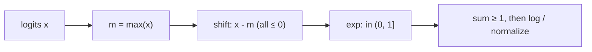

The math from A2 is exact on paper and treacherous in floating point. Every
cross-entropy and KL involves $\log \sum_i e^{x_i}$, which overflows the instant
a single logit gets large. A one-line algebraic fix makes it safe, and a little
floating-point fluency explains the precision choices behind modern training.

## Overflow and underflow

A float stores a sign, an exponent, and a mantissa. The exponent sets the
**range**, the mantissa sets the **precision**. Three formats matter:

| Format | bits (s/e/m) | max value | rel. precision |
|---|---|---|---|
| fp32 | 1 / 8 / 23 | $3.4\times10^{38}$ | $6\times10^{-8}$ |
| fp16 | 1 / 5 / 10 | $65504$ | $10^{-3}$ |
| bf16 | 1 / 8 / 7 | $3.4\times10^{38}$ | $8\times10^{-3}$ |

In fp32, $e^x$ overflows past $x \approx 88.7$; in fp16, past $x \approx 11$. A
logit of $20$ — an ordinary confident prediction — already overflows fp16 if you
exponentiate it naively.

## The log-sum-exp trick

To compute $L(x) = \log \sum_i e^{x_i}$ safely, factor out the largest term.
With $m = \max_i x_i$:

$$ \log \sum_i e^{x_i} = m + \log \sum_i e^{x_i - m}. $$

Every shifted exponent $x_i - m \le 0$, so each $e^{x_i - m} \in (0, 1]$ — no
overflow — and at least one term equals $1$, so the inner sum is $\ge 1$ and the
outer log is well defined. The only large number, $m$, is added back outside the
log where it stays in the safe linear regime. The same shift gives the stable
softmax, using its shift-invariance $\operatorname{softmax}(x + c\mathbf{1}) = \operatorname{softmax}(x)$:

$$ \operatorname{softmax}(x)_i = \frac{e^{x_i - m}}{\sum_j e^{x_j - m}}. $$



## Watch it overflow, then survive

Naive softmax on large logits produces `inf/inf = nan`; the shifted version
returns the correct distribution. The two agree on small logits and diverge
exactly where the naive one breaks.

```python
import numpy as np

def softmax_naive(x):
    e = np.exp(x)
    return e / e.sum()

def softmax_stable(x):
    z = x - x.max()
    e = np.exp(z)
    return e / e.sum()

small = np.array([0.0, 1.0, 2.0])
big   = np.array([1000.0, 1001.0, 1002.0])

print("small, naive :", softmax_naive(small).round(4))
print("small, stable:", softmax_stable(small).round(4))
print("big,   naive :", softmax_naive(big))     # nan: exp(1002) overflows
print("big,   stable:", softmax_stable(big).round(4))  # same shape as small
```

The big and small inputs differ only by an additive constant, so by
shift-invariance their softmax must be identical — which the stable version
confirms and the naive one destroys.

## Why bf16 trains and fp16 needs help

fp16 has a generous mantissa but only 5 exponent bits, so its range is narrow:
gradients during pre-training span roughly $10^{-10}$ to $10^{1}$, which fp16
cannot hold without **loss scaling** (multiply the loss by a large $S$ before
backward, divide gradients by $S$ after). bf16 keeps fp32's 8 exponent bits and
sacrifices mantissa instead — noisier per number, but the optimizer averages
that noise away, and the wide range means no scaling tricks. Mixed-precision
training keeps an fp32 master copy of the weights, computes forward/backward in
bf16, and accumulates the loss and optimizer state in fp32. This is the standard
recipe behind roughly 2× throughput at the same final accuracy, and it connects
directly to the training-systems work in pillar D.
