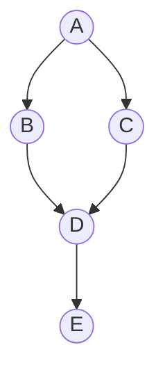

ML rests on a layer of plain computer science: the cost of a lookup, the
recurrence of a divide-and-conquer routine, the structure that answers "have I
seen this before" in constant space. This page is the cost model and the core
toolbox, kept tight.

## The cost model

Big-O describes how runtime grows with input size $n$, ignoring constants. The
ladder worth memorizing, fastest to slowest:

$$ O(1) \subset O(\log n) \subset O(n) \subset O(n\log n) \subset O(n^2) \subset O(2^n). $$

Two refinements matter. **Amortized** analysis averages cost over a sequence:
appending to a dynamic array is $O(n)$ on the rare resize but $O(1)$ amortized,
because resizes double capacity and so happen geometrically rarely.
**Divide-and-conquer** recurrences $T(n) = a\,T(n/b) + f(n)$ are read off by the
**Master theorem**: comparing $f(n)$ against $n^{\log_b a}$ decides the bound.
Merge sort, $T(n) = 2T(n/2) + O(n)$, gives $O(n\log n)$.

## Core structures

- **Arrays / dynamic arrays** — $O(1)$ index, $O(1)$ amortized append, $O(n)$
  insert in the middle. Contiguous memory, cache-friendly; what numpy is under
  the hood.
- **Hash maps** — $O(1)$ average insert/lookup, the backbone of feature stores,
  embedding tables, and deduplication.
- **Trees / heaps** — balanced trees give $O(\log n)$ ordered operations; a
  binary heap gives $O(\log n)$ push/pop with $O(1)$ peek, which is what a
  priority queue (and Dijkstra) runs on.

## Paradigms

- **Divide & conquer** splits, recurses, combines (merge sort, FFT).
- **Dynamic programming** caches overlapping subproblems (edit distance, Viterbi
  in pillar F, beam-search bookkeeping in pillar E).
- **Greedy** takes the locally best move and is correct only when a matroid-like
  structure guarantees it (Huffman coding, MST).

## Graph algorithms

Graphs model dependencies, similarity, and connectivity. **BFS** explores level
by level and finds shortest paths in unweighted graphs; **DFS** goes deep and
underpins topological sort and cycle detection. **Dijkstra** generalizes BFS to
non-negative weights using a heap; **MST** algorithms (Kruskal, Prim) find the
cheapest connecting tree.



BFS from `A` visits `A`, then `{B, C}`, then `D`, then `E` — and the level at
which a node is first reached is its shortest-path distance from `A`.

## Probabilistic structures

When exact counting is too expensive, trade a little accuracy for a lot of
space. A **Bloom filter** answers set membership with no false negatives and a
tunable false-positive rate, in a fixed bit array — used to skip disk lookups
and to dedup web-scale corpora before LLM training. **HyperLogLog** estimates
the number of distinct items in kilobytes regardless of cardinality. Both are
the kind of structure that turns an intractable data-pipeline step into a cheap
one.

## Run it: binary search and BFS

Binary search halves the range each step, so it visits $O(\log n)$ elements; BFS
on a small graph recovers the level structure above.

```python
def binary_search(arr, target):
    lo, hi = 0, len(arr) - 1
    steps = 0
    while lo <= hi:
        steps += 1
        mid = (lo + hi) // 2
        if arr[mid] == target:
            return mid, steps
        if arr[mid] < target:
            lo = mid + 1
        else:
            hi = mid - 1
    return -1, steps

arr = list(range(1, 1_000_001))          # one million sorted ints
idx, steps = binary_search(arr, 987654)
print(f"found at index {idx} in {steps} steps  (log2(1e6) ~ {20})")
```

```python
from collections import deque

graph = {"A": ["B", "C"], "B": ["D"], "C": ["D"], "D": ["E"], "E": []}

def bfs_levels(graph, start):
    dist = {start: 0}
    q = deque([start])
    while q:
        node = q.popleft()
        for nb in graph[node]:
            if nb not in dist:
                dist[nb] = dist[node] + 1
                q.append(nb)
    return dist

print(bfs_levels(graph, "A"))   # shortest-path distance (in hops) from A
```

The binary search touches ~20 elements out of a million — the gap between
$O(n)$ and $O(\log n)$ made concrete — and the BFS distances match the levels in
the diagram above.
