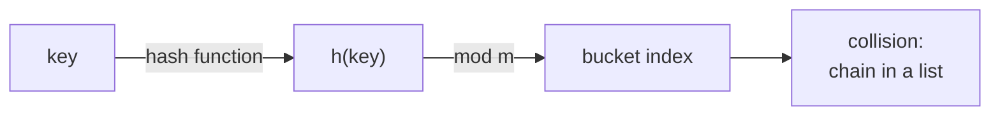

The two data structures behind nearly every program are the **dynamic array**
(Python's `list`, C++'s `vector`) and the **hash map** (`dict`, `unordered_map`)<FN n="1" />.
Both promise constant-time operations under realistic assumptions; both have failure
modes when those assumptions break<FN n="2" />. Understanding the internals is what lets you
recognize the failure modes when they happen.

## Dynamic arrays

A dynamic array stores elements in a contiguous block of memory. The basic operations
are:

- **Indexed access** `a[i]`: $O(1)$, a single pointer arithmetic.
- **Append** `a.append(x)`: amortized $O(1)$ via doubling (previous lesson).
- **Insert/delete at position $i$**: $O(n)$, every later element must shift.

Contiguity is the win and the cost. Cache prefetchers love sequential access of an
array; the CPU pipelines hundreds of elements ahead. The penalty for inserting in the
middle is the same contiguity: there is no empty slot to slide into without moving
everyone after it.

## Hash maps

A **hash map** stores key-value pairs and answers "what is the value for this key?"
in average $O(1)$. The keys can be anything hashable (strings, tuples, custom
objects). The structure has three pieces:

1. A **hash function** $h: \text{keys} \to \mathbb{Z}$ that maps every key to an
   integer.
2. An array of $m$ **buckets**, indexed by $h(\text{key}) \bmod m$.
3. A **collision-resolution** strategy when two keys land in the same bucket.

To insert or look up a key, compute $h(\text{key}) \bmod m$ and search within that
bucket. With a good hash function, keys spread roughly uniformly over buckets, and
each bucket holds $O(1)$ items on average.

## Collisions

Collisions are unavoidable: $n$ keys into $m$ buckets means some bucket holds at least
$\lceil n/m \rceil$ items. Two standard remedies:

- **Chaining.** Each bucket is a linked list (or small array) of the items that hash
  there. Insertion appends to the list; lookup scans it.
- **Open addressing.** Each bucket holds at most one item; on collision, probe a
  deterministic sequence of alternative slots ($h+1, h+2, \dots$ for linear probing).

In both cases, the average lookup time stays $O(1)$ as long as the **load factor**
$\alpha = n/m$ stays bounded (say below 0.75). The implementation **resizes** the
backing array (doubling $m$ and rehashing all keys) when $\alpha$ exceeds a threshold,
keeping the amortized cost per operation $O(1)$.

## When it goes wrong

Hash maps degrade to $O(n)$ per operation when:

- **The hash function clusters.** All keys hash to the same bucket, giving one giant
  list. The pathological case is an adversary choosing keys to collide, the basis of
  HashDoS attacks. Python's `hash()` randomizes its seed each interpreter start
  precisely to defeat this.
- **The load factor is too high.** Slow lookups even with a good hash, because
  buckets fill up.

The custom-hash trap: if you override `__hash__` on an object, a careless
implementation (always returning 0, or ignoring fields used in equality) destroys
$O(1)$ lookup. The invariant is that equal objects must hash to the same value.



## Check it on arrays

```python
# Hash map from scratch with chaining.
class HashMap:
    def __init__(self, capacity=8):
        self.capacity = capacity
        self.size = 0
        self.buckets = [[] for _ in range(capacity)]

    def _bucket(self, key):
        return self.buckets[hash(key) % self.capacity]

    def get(self, key, default=None):
        for k, v in self._bucket(key):
            if k == key: return v
        return default

    def set(self, key, value):
        b = self._bucket(key)
        for i, (k, _) in enumerate(b):
            if k == key: b[i] = (key, value); return
        b.append((key, value))
        self.size += 1
        if self.size > self.capacity * 0.75:        # load factor threshold
            self._rehash()

    def _rehash(self):
        old = [(k, v) for b in self.buckets for k, v in b]
        self.capacity *= 2
        self.buckets = [[] for _ in range(self.capacity)]
        self.size = 0
        for k, v in old: self.set(k, v)

# Insert lots of items, check distribution and lookups
h = HashMap()
for i in range(2000):
    h.set(f"key-{i}", i * i)
print("size:", h.size, "  capacity:", h.capacity)
print("lookup key-1234:", h.get("key-1234"))
bucket_sizes = [len(b) for b in h.buckets]
print(f"avg bucket: {sum(bucket_sizes)/len(bucket_sizes):.2f}, "
      f"max bucket: {max(bucket_sizes)}")

# Demonstrate degradation: every key collides via a bad hash.
class BadKey:
    def __init__(self, n): self.n = n
    def __hash__(self): return 0                    # always collide!
    def __eq__(self, other): return self.n == other.n

bad = HashMap()
for i in range(500): bad.set(BadKey(i), i)
loads = [len(b) for b in bad.buckets]
print(f"bad hash: one bucket has {max(loads)} entries, others have {min(loads)}")
print("lookup is now O(n) instead of O(1)")
```

The chained hash map keeps buckets small on average, the load-factor threshold
triggers resizing, and the deliberately bad hash collapses every key into one bucket,
showing how a poor hash destroys the constant-time guarantee.

## Exercises

**Exercise 1.** A hash map uses chaining with $m = 4$ buckets and the hash
$h(k) = k$, so a key $k$ lands in bucket $k \bmod 4$. Insert the keys
$3, 7, 10, 11, 14$ in that order. Show the contents of each bucket, the load
factor, and the worst-case lookup cost (longest chain).

<details>
<summary>Solution</summary>

**Step 1.** Compute each bucket index $k \bmod 4$: $3 \to 3$, $7 \to 3$,
$10 \to 2$, $11 \to 3$, $14 \to 2$.

**Step 2.** Drop the keys into their buckets, appending in insertion order:

- bucket 0: empty
- bucket 1: empty
- bucket 2: $[10, 14]$
- bucket 3: $[3, 7, 11]$

**Step 3.** The load factor is $\alpha = n/m = 5/4 = 1.25$. The longest chain is
bucket 3 with 3 entries, so a worst-case lookup scans 3 items: $O(\text{length of
the longest chain})$ here equals 3 comparisons.

</details>

**Exercise 2.** A program overrides `__hash__` to always return 0 while keeping a
correct `__eq__`. Argue that lookups stay correct but the time per operation
degrades to $O(n)$, and state which hash-map invariant is and is not violated.

<details>
<summary>Solution</summary>

**Step 1.** The required invariant is that equal objects hash to the same value.
A constant hash satisfies it trivially: if two objects are equal they both hash
to 0. So lookups remain correct, since every key that could match is in the one
bucket being searched.

**Step 2.** The performance assumption (keys spread roughly uniformly over
buckets) is destroyed. With $h \equiv 0$, all $n$ keys land in bucket 0, forming
one chain of length $n$. A lookup must scan that whole chain, so each `get` and
`set` is $O(n)$.

**Step 3.** Resizing does not help: doubling $m$ and rehashing still sends every
key to bucket $0 \bmod m = 0$. The structure has collapsed to a linked list with
hash-map overhead. Correctness invariant holds; the uniform-spread assumption,
which the $O(1)$ bound rests on, does not.

</details>

**Exercise 3 (code).** Implement open-addressing with linear probing in a fixed
array of capacity $m = 8$ (no resizing). Insert keys $0, 8, 16$, which all hash
to slot $0 \bmod 8$, and confirm they occupy slots $0, 1, 2$ by probing forward.
Then verify a lookup finds each key.

<details>
<summary>Solution</summary>

```python
import numpy as np

m = 8
EMPTY = -1
slots = np.full(m, EMPTY)

def insert(key):
    i = key % m
    while slots[i] != EMPTY:        # linear probe to the next free slot
        i = (i + 1) % m
    slots[i] = key
    return i

def find(key):
    i = key % m
    while slots[i] != EMPTY:
        if slots[i] == key:
            return i
        i = (i + 1) % m
    return -1

placed = [insert(k) for k in (0, 8, 16)]
assert placed == [0, 1, 2]                     # all collided at 0, probed forward
assert [find(k) for k in (0, 8, 16)] == [0, 1, 2]
print("slots:", slots.tolist())
```

The three colliding keys cascade into the next free slots $0, 1, 2$, and each
later lookup re-walks the same probe sequence to land on its key.

</details>

The next lesson covers the linear structures: linked lists, stacks, and queues.

<Footnotes>
  <FNItem n="1">**Sedgewick, R., & Wayne, K.** (2011). *Algorithms* (4th ed.). Addison-Wesley. Resizing arrays and hash tables (§1.3, §3.4).</FNItem>
  <FNItem n="2">**Knuth, D. E.** (1998). *The Art of Computer Programming, Vol. 3: Sorting and Searching* (2nd ed.). Addison-Wesley. Hashing and collision resolution (§6.4).</FNItem>
</Footnotes>
