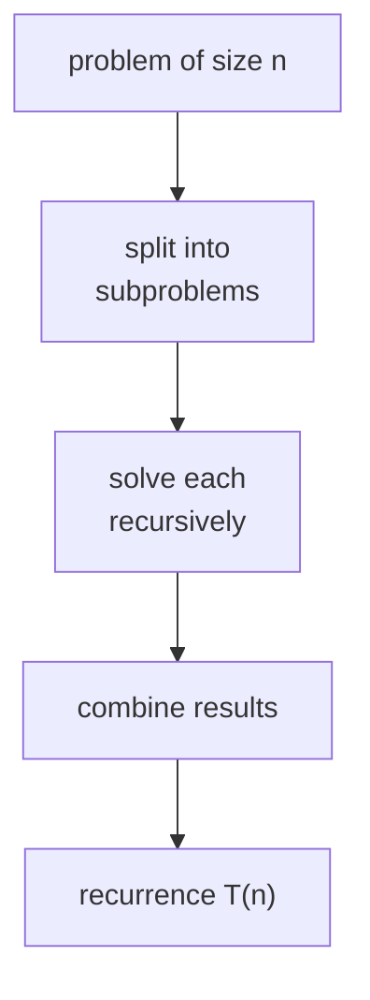

Merge sort, quicksort, FFT, and matrix multiplication share a common shape: split a
problem into smaller subproblems of the same kind, solve them recursively, combine
the results<FN n="1" />. The running time obeys a **recurrence** with a fixed form, and the
**master theorem** reads off its closed-form solution<FN n="2" />.

## The divide-and-conquer template

A divide-and-conquer algorithm has three steps at each level of recursion:

1. **Divide** the problem of size $n$ into $a$ subproblems, each of size $n/b$.
2. **Conquer** by solving each subproblem recursively.
3. **Combine** the results in $O(f(n))$ work.

The running-time recurrence is

$$
T(n) = a\, T(n/b) + f(n).
$$

Merge sort fits with $a = 2$, $b = 2$, $f(n) = n$ (merging). Binary search has
$a = 1$, $b = 2$, $f(n) = O(1)$.

## The master theorem

Compare the per-level combine cost $f(n)$ to the **branching cost**
$n^{\log_b a}$, the number of leaves in the recursion tree as a function of $n$. The
behavior splits into three cases.

**Case 1 (leaves dominate).** If $f(n) = O(n^{\log_b a - \varepsilon})$ for some
$\varepsilon > 0$, then

$$
T(n) = \Theta(n^{\log_b a}).
$$

The work is concentrated at the leaves of the recursion tree.

**Case 2 (balanced).** If $f(n) = \Theta(n^{\log_b a})$, every level does the same
total work and there are $\log_b n$ levels:

$$
T(n) = \Theta(n^{\log_b a} \log n).
$$

Merge sort sits here: $a = b = 2$ gives $n^{\log_2 2} = n$, matching $f(n) = n$, so
$T(n) = \Theta(n \log n)$.

**Case 3 (root dominates).** If $f(n) = \Omega(n^{\log_b a + \varepsilon})$ for some
$\varepsilon > 0$ (and a regularity condition $a f(n/b) \le c f(n)$ for some
$c < 1$ and large $n$):

$$
T(n) = \Theta(f(n)).
$$

The work at the root dwarfs everything below.

## Where the formula comes from

Imagine the **recursion tree**. The root has cost $f(n)$. It has $a$ children, each
of cost $f(n/b)$. The next level has $a^2$ nodes of cost $f(n/b^2)$. At depth $k$,
there are $a^k$ nodes of cost $f(n/b^k)$. The tree has depth $\log_b n$, with $a^{\log_b n} = n^{\log_b a}$
leaves.

Summing the costs by level:

$$
T(n) = \sum_{k=0}^{\log_b n} a^k f(n/b^k).
$$

When $f$ grows slowly (case 1), the sum is dominated by the leaf level. When $f$
matches the branching exactly (case 2), every level contributes the same and there
are $\log_b n$ of them. When $f$ grows fast (case 3), the root dominates and the rest
is a geometric series with declining terms. The three cases are the three ways this
sum can behave.

## Worked examples

- **Merge sort:** $T(n) = 2 T(n/2) + n$, case 2 with $\log_2 2 = 1$: $\Theta(n \log n)$.
- **Binary search:** $T(n) = T(n/2) + 1$, case 2 with $\log_2 1 = 0$: $\Theta(\log n)$.
- **Strassen's matrix multiplication:** $T(n) = 7 T(n/2) + n^2$, case 1 with
  $\log_2 7 \approx 2.807$: $\Theta(n^{\log_2 7})$, beating naive $O(n^3)$.
- **Karatsuba multiplication:** $T(n) = 3 T(n/2) + n$, case 1 with $\log_2 3 \approx 1.585$:
  $\Theta(n^{\log_2 3})$.



## Check it on arrays

```python
import time

# Merge sort timed across input sizes: the ratio t(2n)/t(n) should approach 2,
# matching T(n) = n log n where the dominant factor doubles plus a tiny log term.
def merge_sort(a):
    if len(a) <= 1: return a
    m = len(a) // 2
    L, R = merge_sort(a[:m]), merge_sort(a[m:])
    out, i, j = [], 0, 0
    while i < len(L) and j < len(R):
        if L[i] <= R[j]: out.append(L[i]); i += 1
        else:            out.append(R[j]); j += 1
    out.extend(L[i:]); out.extend(R[j:])
    return out

import random
rng = random.Random(0)
sizes = [2**k for k in range(10, 16)]
times = []
for n in sizes:
    data = [rng.randint(0, n) for _ in range(n)]
    t0 = time.perf_counter()
    merge_sort(data)
    times.append(time.perf_counter() - t0)
for k, (n, t) in enumerate(zip(sizes, times)):
    ratio = (times[k] / times[k-1]) if k > 0 else float("nan")
    print(f"n={n:>6}: t={t:.4f}s   t(n)/t(n/2) = {ratio:.2f}  (n log n predicts 2*(log(2n)/log(n)))")

# Karatsuba multiplication (integer): T(n) = 3T(n/2) + O(n) -> n^{log2 3}
def karatsuba(x, y):
    if x < 1 << 16 or y < 1 << 16: return x * y
    n = max(x.bit_length(), y.bit_length())
    half = n // 2
    high_x, low_x = x >> half, x & ((1 << half) - 1)
    high_y, low_y = y >> half, y & ((1 << half) - 1)
    z2 = karatsuba(high_x, high_y)
    z0 = karatsuba(low_x, low_y)
    z1 = karatsuba(high_x + low_x, high_y + low_y) - z2 - z0
    return (z2 << (2 * half)) + (z1 << half) + z0

a = (1 << 1000) - 1; b = (1 << 1000) + 1
print("karatsuba matches *:", karatsuba(a, b) == a * b)
```

The merge-sort time ratios approach 2 as predicted by case 2 of the master theorem,
and Karatsuba matches Python's built-in big-integer multiplication.

## Exercises

**Exercise 1.** Solve $T(n) = 4\,T(n/2) + n$ with the master theorem. Identify
$a$, $b$, $f(n)$, the branching exponent $\log_b a$, the case, and the closed form.

<details>
<summary>Solution</summary>

**Step 1.** Read off the recurrence: $a = 4$ subproblems, each of size $n/b$ with
$b = 2$, and combine cost $f(n) = n$.

**Step 2.** Compute the branching exponent: $\log_b a = \log_2 4 = 2$, so the leaf
count grows like $n^2$.

**Step 3.** Compare $f(n) = n = n^1$ to $n^{\log_b a} = n^2$. Since
$n^1 = O(n^{2 - \varepsilon})$ for any $\varepsilon \le 1$, the leaves dominate:
this is case 1.

**Step 4.** Case 1 gives $T(n) = \Theta(n^{\log_b a}) = \Theta(n^2)$.

</details>

**Exercise 2.** Derive the cost of $T(n) = 2\,T(n/2) + n$ (merge sort) directly by
summing the recursion tree, without quoting the master theorem, and confirm it
equals $\Theta(n \log n)$.

<details>
<summary>Solution</summary>

**Step 1.** At depth $k$ there are $2^k$ nodes, each of size $n/2^k$, each costing
$f(n/2^k) = n/2^k$. The total work at level $k$ is $2^k \cdot (n/2^k) = n$,
independent of $k$.

**Step 2.** The tree has depth $\log_2 n$ (halving from $n$ down to size 1), so
there are $\log_2 n + 1$ levels, each contributing $n$:

$$
T(n) = \sum_{k=0}^{\log_2 n} n = n\,(\log_2 n + 1).
$$

**Step 3.** Dropping the constant and lower-order term, $T(n) = \Theta(n \log n)$.
Every level doing equal work is the signature of case 2.

</details>

**Exercise 3 (code).** Empirically estimate the branching exponent of Karatsuba.
Count the number of recursive base-case multiplications Karatsuba performs on two
$n$-bit integers for $n = 2^k$, and check the count grows like $3^{k}$ (the
$\log_2 3$ exponent in disguise, since $3^k = (2^k)^{\log_2 3} = n^{\log_2 3}$).

<details>
<summary>Solution</summary>

```python
import numpy as np

calls = 0
def karatsuba(x, y, base_bits):
    global calls
    if x.bit_length() <= base_bits or y.bit_length() <= base_bits:
        calls += 1
        return x * y
    half = max(x.bit_length(), y.bit_length()) // 2
    hx, lx = x >> half, x & ((1 << half) - 1)
    hy, ly = y >> half, y & ((1 << half) - 1)
    z2 = karatsuba(hx, hy, base_bits)
    z0 = karatsuba(lx, ly, base_bits)
    z1 = karatsuba(hx + lx, hy + ly, base_bits) - z2 - z0
    return (z2 << (2 * half)) + (z1 << half) + z0

counts = []
for k in range(2, 8):                       # n = 2^k bits, split down to 1-bit base
    calls = 0
    x = (1 << (2**k)) - 1                    # all-ones n-bit number
    karatsuba(x, x, 1)
    counts.append(calls)

ratios = [counts[i] / counts[i-1] for i in range(1, len(counts))]
# Each doubling of n triples the base-case count: three subproblems per level.
assert all(2.6 <= r <= 3.4 for r in ratios)
print("base-case counts:", counts)
print("successive ratios:", [round(r, 2) for r in ratios])
```

Each doubling of the bit length roughly triples the number of base multiplies, the
three-way branching that produces the $n^{\log_2 3}$ runtime rather than $n^2$.

</details>

The next lesson moves to a different combinatorial pattern: dynamic programming.

<Footnotes>
  <FNItem n="1">**Cormen, T. H., Leiserson, C. E., Rivest, R. L., & Stein, C.** (2009). *Introduction to Algorithms* (3rd ed.). MIT Press. The divide-and-conquer paradigm (Ch. 4).</FNItem>
  <FNItem n="2">**Cormen, T. H., Leiserson, C. E., Rivest, R. L., & Stein, C.** (2009). *Introduction to Algorithms* (3rd ed.). MIT Press. The master method for solving recurrences (§4.5).</FNItem>
</Footnotes>
