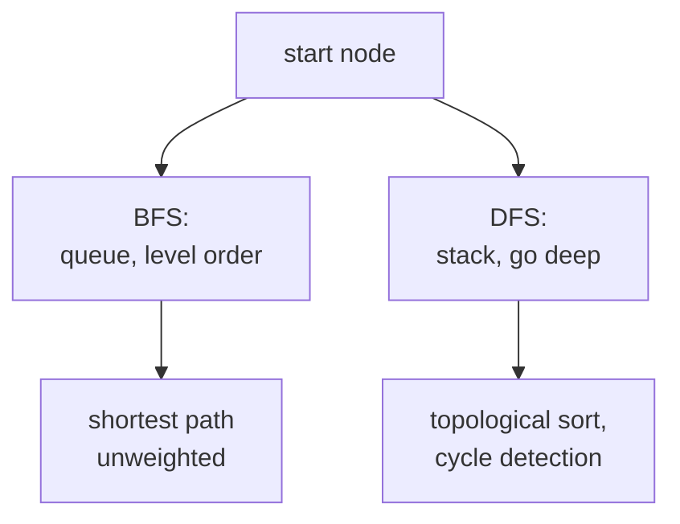

A graph is a set of nodes connected by edges, and most network problems (web crawling,
shortest paths, dependency analysis) reduce to walking it systematically.
**Breadth-first search** explores nearest-first; **depth-first search** dives along
one branch as far as possible<FN n="1" />. Most other graph algorithms are variants of these two
traversals<FN n="2" />.

## Representations

A graph with $V$ vertices and $E$ edges can be stored two ways:

- **Adjacency list.** A dictionary mapping each vertex to the list of its neighbors.
  Memory: $O(V + E)$. Iterating a vertex's neighbors costs $O(\text{degree})$. The
  default for sparse graphs.
- **Adjacency matrix.** A $V \times V$ matrix $A$ with $A_{ij} = 1$ if there is an
  edge $i \to j$. Memory: $O(V^2)$. Constant-time edge lookup, but most entries are
  zero for sparse graphs. Useful when $E = \Theta(V^2)$ or when you need fast
  edge-existence tests.

Real graphs are usually sparse ($E \ll V^2$), so adjacency lists are the standard.

## Breadth-first search

**BFS** visits all vertices at distance 1 from the start, then all at distance 2,
and so on. A FIFO queue holds vertices waiting to be visited:

1. Mark the start as visited; enqueue it.
2. While the queue is nonempty: dequeue a vertex; enqueue every unvisited neighbor,
   marking it visited.

Each vertex is enqueued and dequeued once ($O(V)$); each edge is examined once
($O(E)$). Total: $O(V + E)$, linear in the graph size.

BFS computes **shortest-path lengths in unweighted graphs** as a side effect:
recording the depth at which each vertex is enqueued gives its distance from the
start. It also finds the connected components by running once per unvisited vertex.

## Depth-first search

**DFS** uses a LIFO stack (or recursion) instead of a queue:

1. Mark the current vertex as visited.
2. For each unvisited neighbor, recurse on it.

DFS produces a **DFS tree** of the parts of the graph it reaches, and classifies the
remaining edges as **tree**, **back**, **forward**, or **cross** edges. The presence
of a back edge in a DFS of a directed graph proves the graph has a cycle.

DFS is also $O(V + E)$ and is the basis for:

- **Topological sort** on a DAG (sort vertices so all edges go forward).
- **Cycle detection.**
- **Strongly connected components** (Tarjan's and Kosaraju's algorithms).

## Choosing BFS vs DFS

- For **shortest path in an unweighted graph**, BFS.
- For **all-paths exploration, cycle detection, topological order**, DFS.
- For **memory** on a graph with much wider levels than depth, DFS uses less; the
  opposite favors BFS.

The algorithms cover the same vertices and edges; they differ in the order and the
auxiliary structures.



## Check it on arrays

```python
from collections import deque, defaultdict

# Adjacency list for a small directed graph.
graph = {
    "A": ["B", "C"],
    "B": ["D"],
    "C": ["D", "E"],
    "D": ["F"],
    "E": ["F"],
    "F": [],
}

def bfs(g, start):
    visited, order, dist, q = {start}, [], {start: 0}, deque([start])
    while q:
        u = q.popleft()
        order.append(u)
        for v in g[u]:
            if v not in visited:
                visited.add(v); dist[v] = dist[u] + 1
                q.append(v)
    return order, dist

order, dist = bfs(graph, "A")
print("BFS order:", order)
print("BFS distances from A:", dist)

def dfs(g, start):
    visited, order = set(), []
    def go(u):
        visited.add(u); order.append(u)
        for v in g[u]:
            if v not in visited: go(v)
    go(start)
    return order

print("DFS order:", dfs(graph, "A"))

# Topological sort via DFS post-order on a DAG
def topo_sort(g):
    visited, stack = set(), []
    def go(u):
        visited.add(u)
        for v in g[u]:
            if v not in visited: go(v)
        stack.append(u)                     # post-order: finished -> push
    for u in g:
        if u not in visited: go(u)
    return list(reversed(stack))

print("topological order:", topo_sort(graph))

# Cycle detection via DFS in a directed graph: a back edge -> cycle
def has_cycle(g):
    visiting, done = set(), set()
    def go(u):
        visiting.add(u)
        for v in g.get(u, []):
            if v in visiting:  return True              # back edge
            if v in done:      continue
            if go(v):          return True
        visiting.discard(u); done.add(u)
        return False
    return any(go(u) for u in g if u not in done)

print("DAG cycle?", has_cycle(graph))                   # False
cyclic = {"X": ["Y"], "Y": ["Z"], "Z": ["X"]}
print("triangle cycle?", has_cycle(cyclic))             # True
```

BFS produces level-order vertices and shortest-path distances, DFS produces a
depth-first walk and a topological sort, and the cycle detector flags a back edge in
the triangle graph.

## Exercises

**Exercise 1.** Run BFS by hand from vertex A on the lesson's graph
($A \to B, C$; $B \to D$; $C \to D, E$; $D \to F$; $E \to F$; $F$ has no edges),
breaking ties by visiting neighbors in listed order. Give the visit order and the
BFS distance of every vertex from A.

<details>
<summary>Solution</summary>

**Step 1.** Start: visit A at distance 0, enqueue its neighbors B, C.

**Step 2.** Dequeue B (distance 1), enqueue D. Dequeue C (distance 1), enqueue E
(D already queued, skip the duplicate from C).

**Step 3.** Dequeue D (distance 2), enqueue F. Dequeue E (distance 2), F already
queued. Dequeue F (distance 3).

Visit order: A, B, C, D, E, F. Distances: A 0, B 1, C 1, D 2, E 2, F 3. The
distance is the BFS level at which each vertex is first reached.

</details>

**Exercise 2.** Prove that during a DFS of a directed graph, finding an edge
$u \to v$ where $v$ is currently on the recursion stack (a "back edge") implies the
graph contains a cycle. Then explain why no back edge can appear in a DFS of a DAG.

<details>
<summary>Solution</summary>

**Step 1.** Say DFS is exploring $u$ and encounters $u \to v$ with $v$ still on the
recursion stack. Being on the stack means $v$ was entered before $u$ and has not
yet finished, so there is an active path of tree edges from $v$ down to $u$:
$v \rightsquigarrow u$.

**Step 2.** The edge $u \to v$ closes that path into a cycle
$v \rightsquigarrow u \to v$. So a back edge witnesses a directed cycle.

**Step 3.** A DAG is acyclic by definition, so no such cycle exists, hence no back
edge can occur. Every edge in a DFS of a DAG points to a vertex either not yet
discovered (tree edge) or already finished (forward or cross edge), never to one
still on the stack. This is exactly why DFS cycle detection is a correct
acyclicity test.

</details>

**Exercise 3 (code).** BFS computes shortest-path lengths in an *unweighted*
graph. Build a small grid graph (each cell connected to its 4-neighbors), run BFS
from one corner, and assert the distance to the opposite corner of an $r \times c$
grid equals the Manhattan distance $(r-1) + (c-1)$.

<details>
<summary>Solution</summary>

```python
import numpy as np
from collections import deque

r, c = 4, 5
def neighbors(cell):
    i, j = cell
    for di, dj in ((1, 0), (-1, 0), (0, 1), (0, -1)):
        ni, nj = i + di, j + dj
        if 0 <= ni < r and 0 <= nj < c:
            yield (ni, nj)

def bfs_dist(start, goal):
    dist = {start: 0}
    q = deque([start])
    while q:
        u = q.popleft()
        for v in neighbors(u):
            if v not in dist:
                dist[v] = dist[u] + 1
                q.append(v)
    return dist[goal]

d = bfs_dist((0, 0), (r - 1, c - 1))
assert d == (r - 1) + (c - 1)               # Manhattan distance on an open grid
print("BFS distance corner to corner:", d)
```

On an obstacle-free grid every shortest path takes $(r-1)$ vertical and $(c-1)$
horizontal steps, so BFS recovers the Manhattan distance, confirming it finds
shortest paths when all edges have equal weight.

</details>

The next lesson generalizes BFS to weighted edges with Dijkstra's algorithm.

<Footnotes>
  <FNItem n="1">**Cormen, T. H., Leiserson, C. E., Rivest, R. L., & Stein, C.** (2009). *Introduction to Algorithms* (3rd ed.). MIT Press. Breadth-first and depth-first search (§22.2, §22.3).</FNItem>
  <FNItem n="2">**Sedgewick, R., & Wayne, K.** (2011). *Algorithms* (4th ed.). Addison-Wesley. Graph representations and search (§4.1, §4.2).</FNItem>
</Footnotes>
