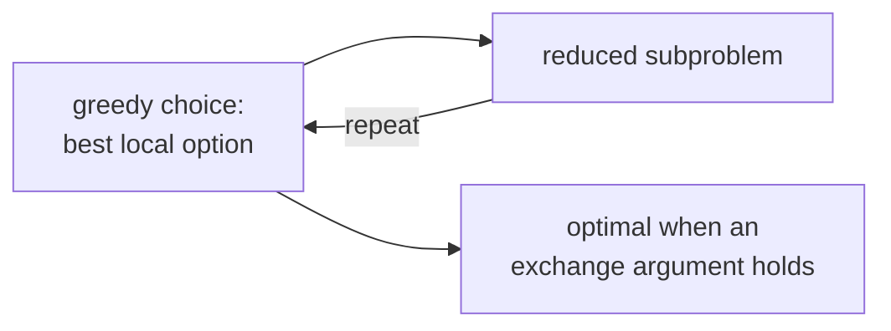

A **greedy** algorithm builds a solution one piece at a time, always taking the
locally optimal choice with no backtracking<FN n="1" />. When this works, it is much simpler and
faster than dynamic programming. When it does not work, it can confidently produce
arbitrarily bad answers. The line between the two is the **exchange argument**, the
standard proof that greedy is optimal for a given problem<FN n="2" />.

## The pattern

A greedy algorithm:

1. Defines a **selection criterion** at each step (smallest weight, earliest finish,
   largest ratio).
2. Picks the locally best choice and commits to it.
3. Reduces to a smaller subproblem on what remains.

The seductive simplicity is the same shape that makes greedy go wrong: a locally
optimal choice can lock you out of a globally better solution. Proving the strategy
is correct is essential, not optional.

## Activity selection: greedy works

Given $n$ activities each with start time $s_i$ and finish time $f_i$, pick the
**largest non-overlapping subset**. The greedy: sort by finish time and take the next
activity that starts after the last chosen one finished.

**Theorem (exchange).** The greedy choice is contained in some optimal solution.

*Proof.* Let $g$ be the activity with the earliest finish time, and let $A$ be any
optimal solution. If $g \in A$ we are done. Otherwise let $a \in A$ be the activity
that finishes first. By the greedy criterion, $f_g \le f_a$, so $g$ ends no later
than $a$. Replace $a$ in $A$ with $g$: the new set $A' = (A \setminus \{a\}) \cup \{g\}$
has the same size as $A$, and $g$ does not overlap any of $A$'s other activities
(they all start after $a$'s end, hence after $g$'s end). So $A'$ is also optimal and
contains the greedy choice. $\qquad\blacksquare$

By induction on the remaining problem, the full greedy solution is optimal. The
running time is $O(n \log n)$, dominated by the sort.

## Counterexample: 0/1 knapsack is not greedy

The 0/1 knapsack problem (pick a subset of items with maximum total value subject to
a weight budget) does **not** admit a value-per-weight greedy. Consider weights
$[1, 5, 5]$, values $[10, 30, 30]$, budget 10. Value-per-weight ratios are
$10, 6, 6$. Greedy takes item 1 (value 10, weight 1) then item 2 (value 30, weight
6 total) for a total value of 40. The optimum takes items 2 and 3, weight 10, value
60. The greedy lock-in cost half the answer.

(The *fractional* knapsack, where items can be split, is solved by the same greedy,
because the exchange argument goes through. The combinatorial 0/1 version needs DP.)

## Huffman coding: a less obvious greedy

Building an optimal prefix-free code from a frequency table: repeatedly merge the two
lowest-frequency symbols into a tree node and re-insert it into the frequency
priority queue. The resulting **Huffman tree** is provably an optimal prefix code,
again by an exchange argument: any optimal tree can be rearranged so the two
lowest-frequency symbols are siblings at the deepest level without increasing the
weighted code length.

## How to know

Two checks before committing to a greedy:

1. **Try an exchange.** Can the locally optimal choice be exchanged into any
   solution without making it worse? If yes, greedy is plausible. If no, find a
   counterexample.
2. **Try matroid theory or the cut/cycle property.** For optimization on weighted
   graphs and matroids (e.g. MSTs), there are general theorems guaranteeing greedy
   optimality.

If neither holds, fall back to DP.



## Check it on arrays

```python
# Activity selection: greedy is optimal.
def activity_select(intervals):
    intervals = sorted(intervals, key=lambda x: x[1])     # by finish time
    chosen, last_finish = [], -float("inf")
    for s, f in intervals:
        if s >= last_finish:
            chosen.append((s, f))
            last_finish = f
    return chosen

acts = [(1, 4), (3, 5), (0, 6), (5, 7), (3, 9), (5, 9),
        (6, 10), (8, 11), (8, 12), (2, 14), (12, 16)]
opt = activity_select(acts)
print("activities chosen:", opt, " count:", len(opt))

# 0/1 knapsack greedy gives a wrong answer
items = [(1, 10), (5, 30), (5, 30)]                       # (weight, value)
budget = 10
def greedy_knapsack(items, budget):
    items = sorted(items, key=lambda x: -x[1] / x[0])     # by value/weight
    val, weight = 0, 0
    for w, v in items:
        if weight + w <= budget:
            weight += w; val += v
    return val
print("0/1 greedy value:", greedy_knapsack(items, budget))   # 40 (suboptimal)

def dp_knapsack(items, budget):
    K = [[0] * (budget + 1) for _ in range(len(items) + 1)]
    for i, (w, v) in enumerate(items, 1):
        for c in range(budget + 1):
            K[i][c] = K[i-1][c]
            if w <= c: K[i][c] = max(K[i][c], K[i-1][c-w] + v)
    return K[-1][-1]
print("DP optimum:        ", dp_knapsack(items, budget))     # 60
```

Activity selection's greedy yields a maximal non-overlapping schedule, while the
knapsack greedy is provably wrong on the example, fixed by DP.

## Exercises

**Exercise 1.** Run the earliest-finish-time greedy on the activities
$(1,3), (2,5), (4,7), (1,8), (5,9), (8,10)$ given as (start, finish). Show the
chosen set and its size.

<details>
<summary>Solution</summary>

**Step 1.** Sort by finish time:
$(1,3), (2,5), (4,7), (1,8), (5,9), (8,10)$. It is already sorted.

**Step 2.** Take $(1,3)$; last finish $= 3$. Next activity starting at or after 3:
$(4,7)$ qualifies (skip $(2,5)$, starts at 2 < 3). Take $(4,7)$; last finish $= 7$.

**Step 3.** Skip $(1,8)$ (starts at 1) and $(5,9)$ (starts at 5 < 7). Take
$(8,10)$ (starts at $8 \ge 7$); last finish $= 10$.

Chosen set: $(1,3), (4,7), (8,10)$, of size 3. No non-overlapping schedule is
larger, since these three already tile the time line tightly.

</details>

**Exercise 2.** Construct a coin-change instance where the greedy "take the largest
coin that fits" fails to use the fewest coins, and show the optimal count. Then
state the property a coin system needs for greedy to be correct.

<details>
<summary>Solution</summary>

**Step 1.** Use denominations $\{1, 3, 4\}$ and target amount 6. Greedy takes the
largest coin $\le 6$, which is 4, leaving 2; then 1 and 1. That is three coins:
$4 + 1 + 1$.

**Step 2.** The optimum is two coins: $3 + 3 = 6$. Greedy's lock-in on the 4 forced
an extra coin, so it is not optimal here.

**Step 3.** Greedy coin change is optimal only for *canonical* coin systems (such
as $\{1, 5, 10, 25\}$), where for every amount the greedy choice is contained in
some optimal solution, the same exchange-argument condition the lesson states. The
system $\{1, 3, 4\}$ is not canonical, so greedy can fail and DP is needed.

</details>

**Exercise 3 (code).** Verify the lesson's claim that fractional knapsack *is*
solved by the value-per-weight greedy. Implement fractional knapsack (items may be
split) and compare against the 0/1 DP optimum on weights $[1, 5, 5]$, values
$[10, 30, 30]$, budget 10: the fractional optimum should be at least the 0/1
optimum of 60.

<details>
<summary>Solution</summary>

```python
import numpy as np

weights = [1, 5, 5]
values  = [10, 30, 30]
budget  = 10

def fractional(weights, values, budget):
    order = sorted(range(len(weights)),
                   key=lambda k: values[k] / weights[k], reverse=True)
    total, cap = 0.0, budget
    for k in order:
        take = min(weights[k], cap)        # take whole item or the remaining cap
        total += values[k] * take / weights[k]
        cap -= take
        if cap == 0:
            break
    return total

def dp_01(weights, values, budget):
    K = np.zeros(budget + 1, dtype=int)
    for w, v in zip(weights, values):
        for c in range(budget, w - 1, -1):
            K[c] = max(K[c], K[c - w] + v)
    return int(K[budget])

frac = fractional(weights, values, budget)
opt01 = dp_01(weights, values, budget)
assert frac >= opt01                       # fractional relaxation is an upper bound
print("fractional:", frac, " 0/1 DP optimum:", opt01)
```

The fractional greedy fills the budget with the best value-per-weight items (here
reaching value 64 by taking the weight-1 item, all of one weight-5 item, and
four-fifths of the other), which upper-bounds the 0/1 optimum of 60, confirming the
relaxation is solved correctly by greedy while the integral version is not.

</details>

The next lesson introduces graphs and the two traversals every graph algorithm
builds on.

<Footnotes>
  <FNItem n="1">**Cormen, T. H., Leiserson, C. E., Rivest, R. L., & Stein, C.** (2009). *Introduction to Algorithms* (3rd ed.). MIT Press. Greedy algorithms and the greedy-choice property (Ch. 16).</FNItem>
  <FNItem n="2">**Cormen, T. H., Leiserson, C. E., Rivest, R. L., & Stein, C.** (2009). *Introduction to Algorithms* (3rd ed.). MIT Press. Activity selection and the exchange argument (§16.1, §16.2).</FNItem>
</Footnotes>
