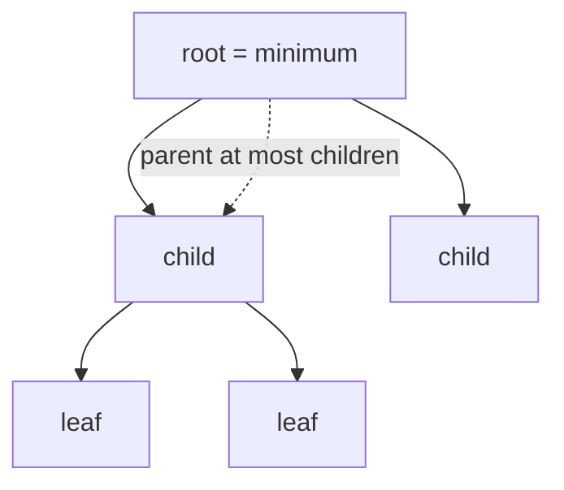

A binary search tree keeps elements in full sorted order, which is more than you need
if all you want is the minimum (or maximum). A **heap** maintains only a partial
order, enough to find the extreme in $O(1)$ and remove it in $O(\log n)$<FN n="1" />. It is the
underlying data structure of priority queues, of Dijkstra's algorithm, and of
heapsort<FN n="2" />.

## The heap property

A **min-heap** is a complete binary tree (every level full except possibly the last,
which is filled left to right) where every parent is $\le$ its children. The minimum
sits at the root. A **max-heap** is the mirror: every parent $\ge$ its children. The
heap property is *local* (parent versus children only), and weaker than the BST
property, but it is exactly what is needed for extreme-element access.

## Array layout

Heaps are stored in a flat array, not as pointer-linked nodes, because the
completeness condition makes the tree position of every node a function of its index.
For a 0-indexed heap, node $i$ has

$$
\text{parent}(i) = \left\lfloor \frac{i-1}{2} \right\rfloor, \quad \text{left}(i) = 2i + 1, \quad \text{right}(i) = 2i + 2.
$$

The array layout has the same cache-locality advantages as any dynamic array. The
tree structure is implicit in the indexing.

## Sift up and sift down

Two restoring operations keep the heap property after a change at one position:

**Sift up.** After inserting at the end, the new element may be smaller than its
parent. Swap it with the parent while it violates the heap property; repeat. Each
swap moves one level up, so the cost is $O(\log n)$.

**Sift down.** After replacing the root (for a pop) with the last element, the root
may be larger than its children. Swap it with its smaller child while it violates the
property; repeat. Cost is $O(\log n)$.

## Operations

- **Peek minimum:** read `heap[0]`, $O(1)$.
- **Insert:** append at the end, sift up. $O(\log n)$.
- **Pop minimum:** swap root with the last element, shrink the array, sift down the
  new root. $O(\log n)$.

## Building a heap

Given an unsorted array of $n$ items, calling `insert` $n$ times costs $O(n \log n)$.
**Heapify** is faster: start from the last non-leaf and sift down each node up to the
root. The total work telescopes to $O(n)$, because most nodes are near the leaves
where sift down is cheap, and only a few near the root require $\log n$ work. So an
array becomes a heap in linear time.

## Heapsort

Heapify the array in $O(n)$, then repeatedly swap the root (the current minimum)
with the last element and sift down on the reduced heap. Each pop is $O(\log n)$, so
total work is $O(n \log n)$. Heapsort is in-place (no auxiliary array) and
worst-case $O(n \log n)$, which is what makes it interesting compared to quicksort.



## Check it on arrays

```python
class MinHeap:
    def __init__(self): self.h = []
    def __len__(self): return len(self.h)
    def peek(self): return self.h[0]

    def push(self, x):
        self.h.append(x)
        i = len(self.h) - 1
        while i > 0:
            p = (i - 1) // 2
            if self.h[p] <= self.h[i]: break
            self.h[p], self.h[i] = self.h[i], self.h[p]
            i = p

    def pop(self):
        last = self.h.pop()
        if not self.h: return last
        top, self.h[0] = self.h[0], last
        i, n = 0, len(self.h)
        while True:
            l, r = 2 * i + 1, 2 * i + 2
            small = i
            if l < n and self.h[l] < self.h[small]: small = l
            if r < n and self.h[r] < self.h[small]: small = r
            if small == i: break
            self.h[i], self.h[small] = self.h[small], self.h[i]
            i = small
        return top

import random
rng = random.Random(0)
data = [rng.randint(0, 1000) for _ in range(20)]

# Use the heap as a priority queue
h = MinHeap()
for x in data: h.push(x)
ordered = [h.pop() for _ in range(len(data))]
print("priority-queue popping yields sorted order:", ordered == sorted(data))

# Heapsort (in-place via the same operations)
def heapsort(a):
    h = MinHeap(); h.h = a[:]                          # treat as array, build via push
    # Linear-time heapify: sift down from last non-leaf
    n = len(h.h)
    for i in range(n // 2 - 1, -1, -1):
        # inline sift down on h
        j = i
        while True:
            l, r = 2 * j + 1, 2 * j + 2; s = j
            if l < n and h.h[l] < h.h[s]: s = l
            if r < n and h.h[r] < h.h[s]: s = r
            if s == j: break
            h.h[j], h.h[s] = h.h[s], h.h[j]; j = s
    return [h.pop() for _ in range(n)]

print("heapsort matches sorted():", heapsort(data) == sorted(data))

# Standard library uses heapq under the hood
import heapq
heap = list(data); heapq.heapify(heap)                 # O(n)
print("heapq peek:", heap[0], " min:", min(data))
```

Popping from the heap yields the sorted order, heapsort matches `sorted()`, and
`heapq.heapify` confirms the linear-time build. The next lesson examines comparison-
based sorting more carefully, including the lower bound that makes $n \log n$ the
limit of what is possible.

<Footnotes>
  <FNItem n="1">**Cormen, T. H., Leiserson, C. E., Rivest, R. L., & Stein, C.** (2009). *Introduction to Algorithms* (3rd ed.). MIT Press. Binary heaps, heapify, and heap operations (§6.1, §6.2, §6.3).</FNItem>
  <FNItem n="2">**Cormen, T. H., Leiserson, C. E., Rivest, R. L., & Stein, C.** (2009). *Introduction to Algorithms* (3rd ed.). MIT Press. Heapsort and priority queues (§6.4, §6.5).</FNItem>
</Footnotes>
