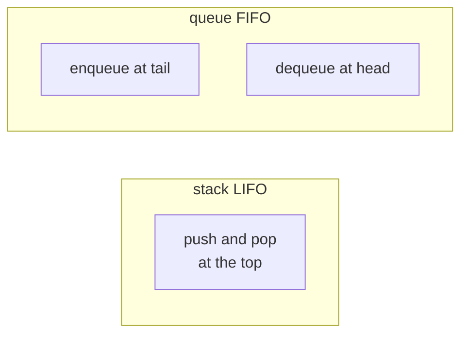

Stacks and queues are the two most basic access patterns for a sequence: last-in
first-out and first-in first-out<FN n="1" />. Either can be built on a dynamic array or a linked
list<FN n="2" />. The tradeoff between the two layouts is the deepest fact in this lesson, and it
governs nearly every "use an array or a list?" decision.

## Linked lists

A **singly linked list** is a chain of **nodes**, each holding a value and a pointer
to the next node. The list itself is a pointer to the head:

```
head -> [v0 | *] -> [v1 | *] -> [v2 | *] -> None
```

Basic operations and their costs:

- **Prepend** (at the head): $O(1)$. Allocate a node, point it at the old head, make
  it the new head.
- **Append** (at the tail): $O(n)$ without a tail pointer, $O(1)$ with one.
- **Indexed access** `list[i]`: $O(n)$. There is no random access; you must walk from
  the head.
- **Insert/delete at a known node**: $O(1)$ given a pointer to the predecessor.

A **doubly linked list** adds a `prev` pointer to each node, making deletions at a
known node $O(1)$ from either direction at the cost of an extra pointer per node.

## Array versus linked: the real tradeoff

| Operation         | Dynamic array | Linked list |
|-------------------|---------------|-------------|
| Append at end     | $O(1)$ amortized | $O(1)$ with tail pointer |
| Prepend at start  | $O(n)$ (shift) | $O(1)$ |
| Random access     | $O(1)$        | $O(n)$ |
| Cache locality    | High          | Low |
| Memory overhead   | None per item | 1-2 pointers per item |

The unfair advantage of arrays is **cache locality**: adjacent elements live in
adjacent memory, so iterating an array prefetches the next element for free. Linked
lists scatter nodes through memory, every traversal is a cache miss, and even
$O(n)$ array operations often beat $O(n)$ linked-list operations by 10x or more in
constant factors. The rule of thumb: prefer arrays unless you specifically need cheap
insertion in the middle and you have the predecessor pointer already.

## Stacks: LIFO

A **stack** supports `push` (add to top) and `pop` (remove from top). A dynamic array
implements both as operations on the end, in amortized $O(1)$. A linked list
implements them at the head, in $O(1)$. The stack pattern shows up in expression
evaluation, function calls (the call stack), and depth-first search.

## Queues: FIFO

A **queue** supports `enqueue` (add to back) and `dequeue` (remove from front). A
naive dynamic array gives $O(n)$ dequeue because every element shifts; a linked
list with head and tail pointers gives $O(1)$ both ways. The standard
array-friendly fix is a **circular buffer**: store the data in a fixed array with
head and tail indices that wrap around, growing only when the buffer fills. Python's
`collections.deque` is implemented this way.



## Check it on arrays

```python
# Singly linked list with a tail pointer.
class Node:
    __slots__ = ("val", "next")
    def __init__(self, val, nxt=None): self.val = val; self.next = nxt

class LinkedList:
    def __init__(self): self.head = self.tail = None; self.size = 0
    def prepend(self, x):
        self.head = Node(x, self.head)
        if self.tail is None: self.tail = self.head
        self.size += 1
    def append(self, x):
        n = Node(x)
        if self.tail is None: self.head = self.tail = n
        else: self.tail.next = n; self.tail = n
        self.size += 1
    def to_list(self):
        out, n = [], self.head
        while n: out.append(n.val); n = n.next
        return out

L = LinkedList()
for i in [1, 2, 3]: L.append(i)
for i in [0, -1]:    L.prepend(i)
print("linked list:", L.to_list())                  # [-1, 0, 1, 2, 3]

# Stack on top of a Python list: O(1) push/pop at the end
stack = []
for x in [1, 2, 3]: stack.append(x)
print("pop:", stack.pop(), stack.pop(), stack.pop())   # 3, 2, 1

# Queue using deque: O(1) on both ends, unlike list.pop(0) which is O(n)
from collections import deque
q = deque()
for x in [1, 2, 3]: q.append(x)
print("dequeue:", q.popleft(), q.popleft(), q.popleft())   # 1, 2, 3

# Demonstrate the array prepend penalty: O(n) per insert vs O(1) for linked
import time
N = 50_000
t0 = time.perf_counter()
arr = []
for i in range(N): arr.insert(0, i)                  # array prepend: shifts everything
print(f"array prepends x{N}: {time.perf_counter() - t0:.3f}s")

t0 = time.perf_counter()
LL = LinkedList()
for i in range(N): LL.prepend(i)                     # linked prepend: O(1)
print(f"linked prepends x{N}: {time.perf_counter() - t0:.3f}s")
```

Prepending to an array is dramatically slower than to a linked list because every
existing element shifts; the linked list's per-node allocation is cheap by
comparison.

## Exercises

**Exercise 1.** A singly linked list of $n$ nodes has only a `head` pointer (no
`tail`). State the worst-case cost of `prepend`, `append`, and indexed access
`list[i]`, and justify each in one sentence.

<details>
<summary>Solution</summary>

**Step 1.** `prepend` is $O(1)$: allocate a node, point its `next` at the old
head, and reassign `head`. No traversal is needed.

**Step 2.** `append` is $O(n)$: with no `tail` pointer, reaching the last node
means walking the whole chain from the head, which is $n$ link follows.

**Step 3.** Indexed access `list[i]` is $O(n)$: a linked list has no random
access, so reaching position $i$ requires $i$ link follows from the head, which
is $O(n)$ in the worst case ($i = n - 1$).

</details>

**Exercise 2.** A queue is built on a dynamic array where `enqueue` appends at
the end and `dequeue` removes from index 0 by shifting every remaining element
left. Show that performing $n$ `dequeue` operations on a queue of size $n$ costs
$O(n^2)$ total, and name the structure that fixes it.

<details>
<summary>Solution</summary>

**Step 1.** A `dequeue` that removes index 0 must move the other elements down by
one slot. With $k$ elements remaining, that shift touches $k - 1$ elements, so it
costs $\Theta(k)$.

**Step 2.** Dequeuing all $n$ elements one by one shifts $n - 1$, then $n - 2$,
down to $0$ elements. The total is

$$
\sum_{k=1}^{n} (k - 1) = \frac{n(n-1)}{2} = \Theta(n^2).
$$

**Step 3.** A circular buffer fixes it: head and tail indices wrap around a fixed
array, so each `dequeue` is $O(1)$ (advance the head index) and the $n$ removals
cost $O(n)$ total. Python's `collections.deque` uses this idea.

</details>

**Exercise 3 (code).** A singly linked list cannot be walked backwards. Write a
function that reverses one in place by re-pointing each node's `next`, in $O(n)$
time and $O(1)$ extra space, then assert it produces the reversed value sequence.

<details>
<summary>Solution</summary>

The trick is to carry three pointers (`prev`, `cur`, `nxt`) and flip one link per
step, so the reversal touches each node once with no auxiliary array.

```python
class Node:
    __slots__ = ("val", "next")
    def __init__(self, val, nxt=None): self.val = val; self.next = nxt

def build(values):
    head = None
    for v in reversed(values):
        head = Node(v, head)
    return head

def to_list(head):
    out = []
    while head: out.append(head.val); head = head.next
    return out

def reverse(head):
    prev = None
    cur = head
    while cur is not None:
        nxt = cur.next          # save the rest of the list
        cur.next = prev         # flip this link
        prev = cur              # advance prev and cur
        cur = nxt
    return prev                 # new head is the old tail

head = build([1, 2, 3, 4, 5])
rev = reverse(head)
assert to_list(rev) == [5, 4, 3, 2, 1]
print(to_list(rev))
```

</details>

The next lesson moves from linear to hierarchical structures with binary search
trees.

<Footnotes>
  <FNItem n="1">**Cormen, T. H., Leiserson, C. E., Rivest, R. L., & Stein, C.** (2009). *Introduction to Algorithms* (3rd ed.). MIT Press. Stacks, queues, and linked lists (§10.1, §10.2).</FNItem>
  <FNItem n="2">**Sedgewick, R., & Wayne, K.** (2011). *Algorithms* (4th ed.). Addison-Wesley. Bags, queues, stacks, and linked-list implementations (§1.3).</FNItem>
</Footnotes>
