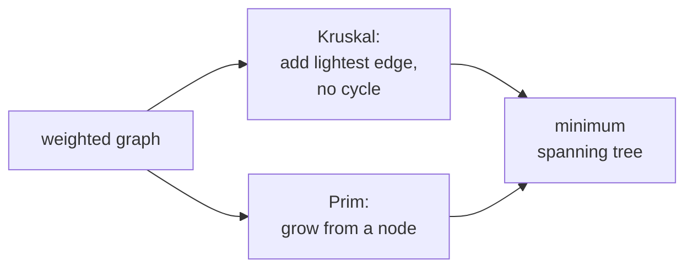

A **spanning tree** of a connected graph is a subgraph that includes every vertex and
just enough edges to keep it connected (exactly $V - 1$ for a graph with $V$
vertices, and no cycles). The **minimum spanning tree (MST)** is the spanning tree of
smallest total edge weight. It is the cheapest way to wire up a network, build a
hierarchy, or cluster points. Two greedy algorithms find it; both are proved correct
by the **cut property**.

## Spanning trees

For a connected undirected weighted graph with $V$ vertices and $E$ edges, any
spanning tree has exactly $V - 1$ edges and no cycles, and connects every vertex.
There are usually many spanning trees; the MST is the one minimizing the sum of edge
weights. If edge weights are distinct, the MST is unique; with ties, multiple MSTs
may share the same total weight.

## The cut property

A **cut** $(S, V \setminus S)$ partitions the vertices into two nonempty sets. A
**crossing edge** has one endpoint in each part.

**Cut property.** For any cut, the minimum-weight crossing edge belongs to every MST.

*Proof.* Suppose an MST $T$ does not contain the minimum-weight crossing edge $e$.
Adding $e$ to $T$ creates a unique cycle, since $T$ has $V - 1$ edges and is acyclic.
That cycle must contain at least one other crossing edge $e'$ (it leaves $S$ at some
point and returns, requiring two crossings). Because $e$ is the lightest crossing
edge, $w(e) \le w(e')$. Replacing $e'$ with $e$ keeps the structure connected and
acyclic (same number of edges, the cycle broken), and the total weight does not
increase. So $T \setminus \{e'\} \cup \{e\}$ is also a spanning tree of weight no
greater than $T$, hence also an MST, and it contains $e$. $\qquad\blacksquare$

Both algorithms below are different ways of repeatedly applying the cut property.

## Kruskal's algorithm

Build the MST edge by edge, smallest first:

1. Sort all edges by weight.
2. Iterate through them in order; add an edge if and only if it does not create a
   cycle.

The cycle check uses a **union-find** (disjoint-set) data structure: each vertex
starts in its own set, and an edge $(u, v)$ creates a cycle iff $u$ and $v$ are
already in the same set. Union-find with path compression and union by rank supports
both operations in nearly constant amortized time, and Kruskal's running time is
$O(E \log E)$, dominated by the sort. Each edge added is the lightest in the cut
separating its component from everything else, so the cut property applies.

## Prim's algorithm

Grow a single tree from a starting vertex:

1. Start with one vertex in the tree.
2. Repeatedly add the **lightest edge** crossing from the tree to a vertex outside,
   using a min-priority queue.

This is Dijkstra's algorithm with "edge weight" replacing "distance from source". The
running time is $O((V + E)\log V)$ with a binary heap. The cut between the current
tree and the rest of the graph is recomputed implicitly at each step, and the lightest
crossing edge gets added.

## Choosing between them

Kruskal is conceptually simpler (sort and union-find) and works well when edges are
already sorted or sorting is cheap, especially on sparse graphs. Prim shines on
dense graphs (with a Fibonacci heap it runs in $O(E + V \log V)$) and naturally
extends to greedy network-growing applications.



## Check it on arrays

```python
# Union-Find with path compression and union by rank.
class UF:
    def __init__(self, n):
        self.parent = list(range(n))
        self.rank   = [0] * n
    def find(self, x):
        while self.parent[x] != x:
            self.parent[x] = self.parent[self.parent[x]]    # path compression
            x = self.parent[x]
        return x
    def union(self, x, y):
        rx, ry = self.find(x), self.find(y)
        if rx == ry: return False
        if self.rank[rx] < self.rank[ry]: rx, ry = ry, rx
        self.parent[ry] = rx
        if self.rank[rx] == self.rank[ry]: self.rank[rx] += 1
        return True

def kruskal(n, edges):
    """edges: list of (weight, u, v)."""
    uf = UF(n)
    mst, cost = [], 0
    for w, u, v in sorted(edges):
        if uf.union(u, v):
            mst.append((u, v, w)); cost += w
            if len(mst) == n - 1: break
    return mst, cost

# Sample graph (vertices 0..5)
edges = [
    (4, 0, 1), (8, 0, 7),
    (8, 1, 2), (11, 1, 7),
    (7, 2, 3), (4, 2, 5), (2, 2, 8),
    (9, 3, 4), (14, 3, 5),
    (10, 4, 5),
    (2, 5, 6),
    (1, 6, 7), (6, 6, 8),
    (7, 7, 8),
]
n = 9
mst, cost = kruskal(n, edges)
print("Kruskal MST cost:", cost)
print("MST edges:", mst)

# Prim's algorithm using a priority queue
import heapq
def prim(n, adj, start=0):
    in_tree = [False] * n
    pq = [(0, start, -1)]                                  # (weight, vertex, parent)
    mst, cost = [], 0
    while pq and len(mst) < n - 1:
        w, u, p = heapq.heappop(pq)
        if in_tree[u]: continue
        in_tree[u] = True
        if p != -1:
            mst.append((p, u, w)); cost += w
        for v, wv in adj[u]:
            if not in_tree[v]: heapq.heappush(pq, (wv, v, u))
    return mst, cost

adj = {i: [] for i in range(n)}
for w, u, v in edges:
    adj[u].append((v, w)); adj[v].append((u, w))           # undirected
mst_p, cost_p = prim(n, adj)
print("Prim MST cost:   ", cost_p)
print("equal totals:", cost == cost_p)
```

Both algorithms find spanning trees of the same total weight, the cut property
guaranteeing they reach the same optimal cost. The final A5 lesson trades exactness
for memory: probabilistic data structures.
