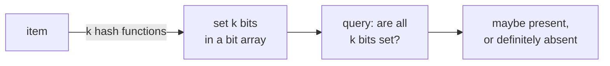

Storing a set of $n$ items exactly takes $\Omega(n)$ bits in the worst case. If you
only need approximate answers (member or not? how many distinct items?), you can do
much better. **Bloom filters**<FN n="1" /> and **HyperLogLog**<FN n="2" /> are the two probabilistic
structures every system engineer reaches for: tiny memory, a known controllable error
rate, and zero per-element bookkeeping.

## Bloom filters: approximate membership

A **Bloom filter** answers "have you seen this item?" with two possible verdicts:
**"probably yes"** or **"definitely no"**. False positives are possible; false
negatives are impossible. The structure is a bit array of size $m$, all zero
initially, and $k$ independent hash functions.

**Insert** $x$: for each hash $h_i$, set bit $h_i(x) \bmod m$ to 1.
**Query** $x$: return "yes" if all $k$ bits $h_i(x) \bmod m$ are 1, else "no".

A "yes" can be wrong if those bits happen to all be set by other items; a "no" is
always correct because inserting $x$ would have set those exact bits.

## The false-positive rate

After $n$ inserts into $m$ bits using $k$ hash functions, the probability a given bit
is still 0 is approximately

$$
\left(1 - \frac{1}{m}\right)^{kn} \approx e^{-kn/m}.
$$

A query's false-positive rate (all $k$ randomly chosen bits set) is then

$$
p_{\text{fp}} \approx \left(1 - e^{-kn/m}\right)^k.
$$

Minimizing over $k$ for fixed $n, m$ gives $k = (m/n)\ln 2$, at which the bits are
half ones and half zeros, and

$$
p_{\text{fp}} \approx (0.5)^k = (0.6185)^{m/n}.
$$

So with 10 bits per item ($m/n = 10$), the false-positive rate is about 0.8%, no
matter how many items there are. The size scales with the *log* of the target error
rate, not the number of items: orders of magnitude smaller than storing the set.

## HyperLogLog: cardinality estimation

A **HyperLogLog (HLL)** estimates the number of distinct items in a stream using a
tiny fixed amount of memory (say 12 KB) for arbitrarily many items, with about 2%
relative error.

The trick: for each item $x$, compute a hash $h(x)$ as a binary string. Bucket items
by the first $b$ bits, giving $m = 2^b$ buckets. Within each bucket, track the
**maximum number of leading zeros** seen in the rest of the hash. The intuition: out
of $n$ random binary strings, the maximum leading-zero count is roughly $\log_2 n$
(seeing $k$ leading zeros has probability $2^{-k}$, so once you have seen $n$ items
you expect a max around $\log_2 n$). Distinct counts beyond duplicates are what drive
that maximum up; duplicates do not increase it.

The HLL estimator is a harmonic mean across the $m$ buckets, with a small
bias-correction constant:

$$
\hat n = \alpha_m\, m^2 \,\Big/\sum_{i=1}^m 2^{-M_i},
$$

where $M_i$ is the max leading-zero count in bucket $i$. The relative standard error
is about $1.04/\sqrt m$, so 1024 buckets give about 3% error using only 1024 small
counters.

## Where these structures fit

- **Bloom filter:** cache existence checks (avoid expensive disk lookups for keys
  certainly absent), URL deduplication in crawlers, malware signature checks.
- **HyperLogLog:** unique-visitor counts in analytics, distinct-IP counts in network
  monitoring, anywhere exact counts cost more than approximate ones.

Both pay a constant memory cost regardless of stream length, the property that makes
them indispensable at scale.



## Check it on arrays

```python
import math, hashlib

# Bloom filter with k hash functions derived from two SHA hashes
class BloomFilter:
    def __init__(self, m, k):
        self.m = m; self.k = k
        self.bits = bytearray(m // 8 + 1)
    def _hashes(self, x):
        d = hashlib.sha256(str(x).encode()).digest()
        h1 = int.from_bytes(d[:8], "big")
        h2 = int.from_bytes(d[8:16], "big")
        return [(h1 + i * h2) % self.m for i in range(self.k)]
    def _set(self, idx): self.bits[idx // 8] |= 1 << (idx % 8)
    def _get(self, idx): return (self.bits[idx // 8] >> (idx % 8)) & 1
    def add(self, x):
        for h in self._hashes(x): self._set(h)
    def __contains__(self, x):
        return all(self._get(h) for h in self._hashes(x))

n = 10_000
m_per_n = 10
m = m_per_n * n
k = max(1, int(round(m_per_n * math.log(2))))
bf = BloomFilter(m, k)
present = [f"item-{i}" for i in range(n)]
absent  = [f"miss-{i}" for i in range(n)]
for x in present: bf.add(x)

fn = sum(1 for x in present if x not in bf)              # false negatives
fp = sum(1 for x in absent  if x in bf)                  # false positives
print(f"false negatives: {fn} (should be 0)")
print(f"false positives: {fp}/{n} = {fp/n:.4f}  predicted ~ {(0.6185)**m_per_n:.4f}")

# HyperLogLog
class HLL:
    def __init__(self, b=12):
        self.b = b; self.m = 1 << b
        self.M = [0] * self.m
        self.alpha = 0.7213 / (1 + 1.079 / self.m)        # bias constant for m >= 128
    def add(self, x):
        h = int.from_bytes(hashlib.sha256(str(x).encode()).digest()[:8], "big")
        j = h >> (64 - self.b)
        w = (h << self.b) & ((1 << 64) - 1) | (1 << (self.b - 1))  # ensure nonzero
        # Leading zeros + 1 of w in 64 - b bits
        lz = 1
        bits_left = 64 - self.b
        for k in range(bits_left - 1, -1, -1):
            if (h >> k) & 1: break
            lz += 1
        self.M[j] = max(self.M[j], lz)
    def count(self):
        Z = sum(2.0**(-m) for m in self.M)
        E = self.alpha * self.m * self.m / Z
        return E

hll = HLL(b=12)                                           # m = 4096 buckets
truth = 200_000
for i in range(truth):
    hll.add(f"x-{i}")
    hll.add(f"x-{i}")                                     # duplicates do not change M
est = hll.count()
print(f"HLL estimate: {est:.0f}  truth: {truth}  rel error {abs(est-truth)/truth:.3f}")
```

The Bloom filter has zero false negatives and a false-positive rate within
prediction, and HyperLogLog estimates 200,000 distinct items within a few percent
using a few kilobytes.

## Exercises

**Exercise 1.** You want a Bloom filter holding $n = 10^6$ items with a target
false-positive rate of $1\%$. Using $p_{\text{fp}} \approx (0.6185)^{m/n}$,
estimate the bits per item $m/n$ and the total size $m$ in megabytes.

<details>
<summary>Solution</summary>

**Step 1.** Set $(0.6185)^{m/n} = 0.01$ and solve for $m/n$. Take logs:

$$
\frac{m}{n} = \frac{\ln 0.01}{\ln 0.6185} = \frac{-4.605}{-0.4805} \approx 9.58.
$$

So about 9.6 bits per item, which rounds up to 10 in practice (the rule of thumb
"10 bits per item gives about 1%").

**Step 2.** Total bits $m = (m/n)\cdot n \approx 9.58 \times 10^6 \approx 9.6$
million bits. Dividing by $8 \times 10^6$ bits per megabyte gives about
$1.2$ MB, far below the cost of storing $10^6$ full items.

</details>

**Exercise 2.** Explain why a Bloom filter can never produce a false negative,
while it can produce a false positive. Frame it in terms of which bits an insert
sets and what a query reads.

<details>
<summary>Solution</summary>

**Step 1.** Inserting $x$ sets every one of the $k$ bits at positions
$h_i(x) \bmod m$ to 1, and bits are never cleared. So after $x$ is inserted, all
$k$ of its bits are permanently 1.

**Step 2.** A query for $x$ returns "yes" only if all $k$ of those same positions
read 1. Since the insert guaranteed they are 1 and nothing resets them, a genuine
member always reads "yes". A false negative (a present item reading "no") is
therefore impossible.

**Step 3.** A false positive happens when $x$ was never inserted, yet all $k$ of
its bit positions were set by other items' inserts. With many items sharing one
bit array, that collision has nonzero probability, which is exactly the
$p_{\text{fp}}$ the lesson computes. The asymmetry comes from bits only ever moving
from 0 to 1: it can fabricate membership but never erase it.

</details>

**Exercise 3 (code).** Empirically check the Bloom false-positive formula. Build a
filter with $m/n = 8$ bits per item and the optimal $k = (m/n)\ln 2$, insert $n$
items, query $n$ never-inserted items, and assert the measured rate is close to
$(0.6185)^{8}$.

<details>
<summary>Solution</summary>

The measured rate fluctuates around the predicted $(0.6185)^{8} \approx 0.0214$,
so the assertion uses a tolerance band rather than exact equality.

```python
import math, hashlib

class BloomFilter:
    def __init__(self, m, k):
        self.m = m; self.k = k
        self.bits = bytearray(m // 8 + 1)
    def _hashes(self, x):
        d = hashlib.sha256(str(x).encode()).digest()
        h1 = int.from_bytes(d[:8], "big")
        h2 = int.from_bytes(d[8:16], "big")
        return [(h1 + i * h2) % self.m for i in range(self.k)]
    def add(self, x):
        for h in self._hashes(x):
            self.bits[h // 8] |= 1 << (h % 8)
    def __contains__(self, x):
        return all((self.bits[h // 8] >> (h % 8)) & 1 for h in self._hashes(x))

n = 20_000
m_per_n = 8
m = m_per_n * n
k = max(1, round(m_per_n * math.log(2)))
bf = BloomFilter(m, k)
for i in range(n): bf.add(f"item-{i}")

fp = sum(1 for i in range(n) if f"miss-{i}" in bf)
rate = fp / n
predicted = 0.6185 ** m_per_n
assert abs(rate - predicted) < 0.01      # within 1 percentage point
print(round(rate, 4), round(predicted, 4))
```

</details>

This closes the A5 data-structures track and pillar A as a whole: the next pillar
(C, on calculus and analysis) builds on this foundation.

<Footnotes>
  <FNItem n="1">**Bloom, B. H.** (1970). "Space/time trade-offs in hash coding with allowable errors". *Communications of the ACM*, 13(7), 422-426. [doi:10.1145/362686.362692](https://doi.org/10.1145/362686.362692)</FNItem>
  <FNItem n="2">**Flajolet, P., Fusy, É., Gandouet, O., & Meunier, F.** (2007). "HyperLogLog: the analysis of a near-optimal cardinality estimation algorithm". *Conference on Analysis of Algorithms (AofA)*, 137-156.</FNItem>
</Footnotes>
