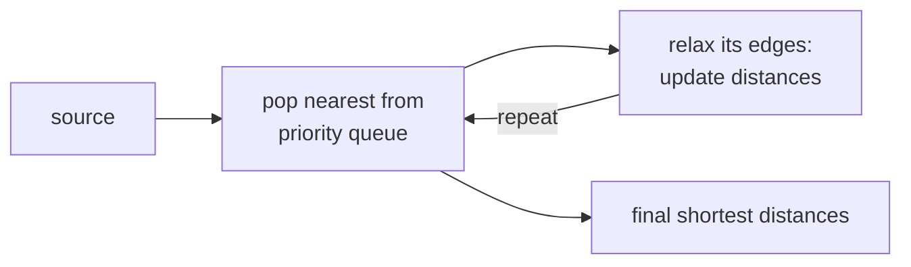

BFS gives shortest paths when every edge counts as one step. With edge weights, the
straightforward generalization is **Dijkstra's algorithm**: extend BFS to use a
priority queue ordered by total path cost<FN n="1" />. It runs in $O((V + E)\log V)$ with a
binary heap, dominates routing and pathfinding code, and has one critical
prerequisite: every edge weight must be nonnegative<FN n="2" />.

## The problem

Given a weighted directed graph with weights $w(u, v) \ge 0$ on each edge, a source
$s$, and (optionally) a target $t$, find the **minimum-weight path** from $s$ to
every other vertex. The weight of a path is the sum of its edge weights. The
shortest-path tree records, at each vertex, the predecessor on the optimal path back
to $s$.

## Dijkstra's algorithm

Maintain a **tentative distance** $d[v]$ for each vertex, initialized to $0$ for $s$
and $+\infty$ for everyone else. A min-priority queue stores pairs $(d, v)$.

1. Pop the vertex $u$ with the smallest tentative distance.
2. If $u$ is already settled, skip. Otherwise mark it settled with the popped
   distance.
3. **Relax** each outgoing edge: for $(u, v)$ with weight $w$, if $d[u] + w < d[v]$,
   set $d[v] = d[u] + w$ and push $(d[v], v)$ on the queue.

Each vertex is settled at most once, with each edge causing at most one push and one
pop, so the total operations on the heap are $O(V + E)$, each costing $O(\log V)$:
total time $O((V + E)\log V)$.

## Why it works (the greedy invariant)

**Theorem.** When vertex $u$ is popped from the priority queue, $d[u]$ is the true
shortest-path distance from $s$ to $u$.

*Proof.* Suppose not: let $u$ be the first vertex for which $d[u]$ is wrong at pop
time, and let $P$ be a true shortest path $s = v_0 \to v_1 \to \cdots \to v_k = u$.
Let $v_i$ be the first vertex on $P$ that was not yet settled when $u$ was popped.
Its predecessor $v_{i-1}$ was settled with its correct distance (it was popped before
$u$, by the choice of $u$ as the first failure). Relaxing $(v_{i-1}, v_i)$ at that
time set $d[v_i] \le d[v_{i-1}] + w(v_{i-1}, v_i)$, which equals the true distance
to $v_i$. Because all weights are nonnegative, $\text{dist}(s, v_i) \le \text{dist}(s, u)$,
so $v_i$ should have been popped before $u$, contradiction. $\qquad\blacksquare$

The proof breaks if any weight is negative: the inequality $\text{dist}(s, v_i) \le \text{dist}(s, u)$
no longer holds, because adding a negative-weight edge later could undercut the
distance through $u$.

## Where Dijkstra fails

- **Negative edges.** Use **Bellman-Ford**: it relaxes every edge $V - 1$ times in
  $O(V \cdot E)$, handling negative weights and detecting negative cycles.
- **All-pairs shortest paths.** Run Dijkstra from every vertex ($O(V \cdot (V+E)\log V)$),
  or use **Floyd-Warshall** ($O(V^3)$, simpler and competitive when the graph is
  dense).
- **Single-target with a heuristic.** **A\*** is Dijkstra with an admissible
  heuristic that biases the search toward the target; with a good heuristic it
  examines far fewer vertices.



## Check it on arrays

```python
import heapq

def dijkstra(graph, source):
    # graph: dict u -> list of (v, weight)
    dist = {u: float("inf") for u in graph}
    dist[source] = 0
    parent = {u: None for u in graph}
    pq = [(0, source)]                                   # (distance, vertex)
    settled = set()
    while pq:
        d, u = heapq.heappop(pq)
        if u in settled: continue
        settled.add(u)
        for v, w in graph[u]:
            if d + w < dist[v]:
                dist[v] = d + w
                parent[v] = u
                heapq.heappush(pq, (dist[v], v))
    return dist, parent

# Weighted directed graph
g = {
    "A": [("B", 4), ("C", 2)],
    "B": [("C", 5), ("D", 10)],
    "C": [("E", 3)],
    "D": [("F", 11)],
    "E": [("D", 4), ("F", 8)],
    "F": [],
}

dist, parent = dijkstra(g, "A")
print("distances from A:", dist)

# Reconstruct a path: A to F
def path(parent, target):
    out = []
    while target is not None:
        out.append(target); target = parent[target]
    return list(reversed(out))

print("path A -> F:", path(parent, "F"))

# Negative-edge failure: Dijkstra settles B too early and never revisits D.
# Edges: A->B(1), A->C(2), C->B(-5), B->D(3).
# True shortest A->D: A->C->B->D = 2 - 5 + 3 = 0. Dijkstra reports 4.
g_neg = {
    "A": [("B", 1), ("C", 2)],
    "B": [("D", 3)],
    "C": [("B", -5)],
    "D": [],
}
dist_neg, _ = dijkstra(g_neg, "A")
print("Dijkstra dist[D] =", dist_neg["D"], "  true shortest = 0 via A->C->B->D")
```

Dijkstra reports the correct distances and reconstructs the path on the
nonnegative graph, and silently returns the wrong answer on the negative-edge
example, illustrating the precondition. The next lesson finds the cheapest tree that
connects every vertex: the minimum spanning tree.

<Footnotes>
  <FNItem n="1">**Dijkstra, E. W.** (1959). "A note on two problems in connexion with graphs". *Numerische Mathematik*, 1, 269-271. [doi:10.1007/BF01386390](https://doi.org/10.1007/BF01386390)</FNItem>
  <FNItem n="2">**Cormen, T. H., Leiserson, C. E., Rivest, R. L., & Stein, C.** (2009). *Introduction to Algorithms* (3rd ed.). MIT Press. Single-source shortest paths and the nonnegativity precondition (§24.3).</FNItem>
</Footnotes>
