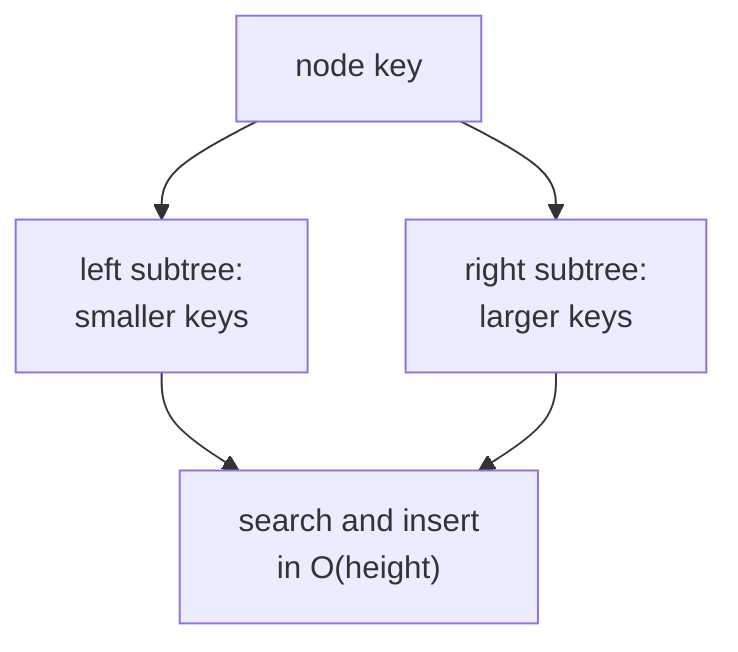

Hash maps give $O(1)$ unordered lookup but cannot answer "what is the smallest key
greater than $x$?" A **binary search tree (BST)** keeps elements in order so that
search, insert, and *successor* all run in $O(\log n)$, provided the tree stays
balanced<FN n="1" />. The catch is in the proviso: without balancing, a BST can degenerate to a
linked list. Self-balancing variants (AVL, red-black) restore the guarantee<FN ns="2, 3" />.

## The BST property

A **binary search tree** is a binary tree where every node satisfies:

- all keys in its left subtree are **strictly less** than its key,
- all keys in its right subtree are **strictly greater**.

This recursive structure makes ordered operations natural. Searching for a key
follows the comparison at each node: go left if the target is smaller, right if
larger, stop on equality. The path traverses at most one node per level, so search
costs $O(\text{height})$.

## Operations

**Search.** Start at the root, descend by comparison until the key is found or `None`
is reached. $O(\text{height})$.

**Insert.** Search for the key; when the search ends at a `None`, attach a new node
there. The BST property is preserved by construction. $O(\text{height})$.

**Delete.** Three cases for the deleted node:

1. **Leaf:** detach it.
2. **One child:** replace it with that child.
3. **Two children:** find its **in-order successor** (the minimum of the right
   subtree), copy the successor's key into the node, then delete the successor
   (which has at most one child, reducing to case 1 or 2).

**In-order traversal** visits left subtree, node, right subtree, yielding keys in
sorted order in $O(n)$. Range queries follow the same template.

## Why balance matters

A BST built by inserting `1, 2, 3, 4, 5` in order produces a right-leaning chain of
height $n$, on which all operations cost $O(n)$. The whole point of the structure
collapses. The height in the **worst case is $\Theta(n)$**; in the **best case** (a
fully balanced tree) it is $\Theta(\log n)$.

A **self-balancing BST** maintains height $O(\log n)$ after every operation, by
applying rotations: local rearrangements that preserve the BST property while
reducing height. The most common are:

- **AVL trees** keep the height difference of left and right subtrees at most 1 at
  every node, giving the tightest balance at the cost of more rotations.
- **Red-black trees** allow a looser invariant (no two consecutive red nodes on any
  root-to-leaf path, equal black depths), trading slight worst-case height for fewer
  rotations on average. They are the standard for `std::map` and language-level
  ordered maps.

The $O(\log n)$ guarantee for ordered operations is what BSTs buy.

## Rotations

A **left rotation** at node $x$ (with right child $y$) makes $y$ the new root and
$x$ the new left child of $y$. The BST property is preserved because everything in
$y$'s former left subtree is greater than $x$ (so it becomes $x$'s right subtree) and
less than $y$ (so it sits on the correct side). A right rotation is the mirror.
Self-balancing trees use one or two rotations per insert/delete to restore balance.



## Check it on arrays

```python
class BSTNode:
    __slots__ = ("key", "left", "right")
    def __init__(self, key): self.key = key; self.left = self.right = None

def insert(root, key):
    if root is None: return BSTNode(key)
    if key < root.key:  root.left  = insert(root.left, key)
    elif key > root.key: root.right = insert(root.right, key)
    return root

def search(root, key):
    while root is not None and root.key != key:
        root = root.left if key < root.key else root.right
    return root

def in_order(root):
    if root is None: return []
    return in_order(root.left) + [root.key] + in_order(root.right)

def height(root):
    if root is None: return 0
    return 1 + max(height(root.left), height(root.right))

import random
rng = random.Random(0)
# Balanced insertion order: random permutation -> expected height O(log n)
keys_random = list(range(2**10))
rng.shuffle(keys_random)
root_rand = None
for k in keys_random: root_rand = insert(root_rand, k)
print(f"random insert: n={2**10}, height={height(root_rand)}, log2(n)={10}")

# Pathological insertion order: already sorted -> height = n
root_bad = None
for k in range(64): root_bad = insert(root_bad, k)
print(f"sorted insert: n=64, height={height(root_bad)} (degenerate chain)")

# Range query via in-order: keys between 100 and 110
keys_sorted = in_order(root_rand)
print("range query [100, 110]:", [k for k in keys_sorted if 100 <= k <= 110])

# Successor of a key: leftmost node of right subtree
def successor(root, key):
    node = search(root, key)
    if node is None or node.right is None: return None
    cur = node.right
    while cur.left: cur = cur.left
    return cur.key
print("successor of 500 in random tree:", successor(root_rand, 500))
```

The randomly built BST has height close to $\log_2 n$, while the sorted-insertion
tree degenerates into a chain of height $n$.

## Exercises

**Exercise 1.** Insert the keys `5, 3, 8, 1, 4, 7, 9` in that order into an empty
BST. Draw the resulting tree, give its height, and list the in-order traversal.

<details>
<summary>Solution</summary>

**Step 1.** Each key descends by comparison from the root and attaches at the
first empty slot. `5` is the root. `3` is less than 5, so it goes left. `8` is
greater, so it goes right. `1` is less than 5 then less than 3, so it is 3's left
child. `4` is less than 5 then greater than 3, so it is 3's right child. `7` is
greater than 5 then less than 8, so it is 8's left child. `9` is greater than 5
then greater than 8, so it is 8's right child.

```
        5
      /   \
     3     8
    / \   / \
   1   4 7   9
```

**Step 2.** The height (counting edges on the longest root-to-leaf path, or nodes
minus one level) is 2: the root at level 0, then 3 and 8, then the four leaves.
Counting levels of nodes, the tree has 3 levels.

**Step 3.** In-order traversal visits left subtree, node, right subtree, yielding
keys in sorted order: `1, 3, 4, 5, 7, 8, 9`.

</details>

**Exercise 2.** Prove that an in-order traversal of any BST visits the keys in
strictly increasing order.

<details>
<summary>Solution</summary>

**Step 1.** Argue by structural induction on the tree. Base case: an empty tree
emits the empty sequence, which is trivially sorted.

**Step 2.** Inductive step: take a node with key $x$, left subtree $L$, and right
subtree $R$. By the inductive hypothesis, in-order traversal of $L$ emits its keys
in increasing order, and likewise for $R$. In-order on the whole tree emits
(traversal of $L$), then $x$, then (traversal of $R$).

**Step 3.** The BST property says every key in $L$ is strictly less than $x$ and
every key in $R$ is strictly greater than $x$. So the concatenation places all of
$L$'s keys (sorted, all $< x$) before $x$, and all of $R$'s keys (sorted, all
$> x$) after $x$. The result is sorted across the boundaries as well as within
each piece, completing the induction.

</details>

**Exercise 3 (code).** Without modifying the tree, write a function that checks
whether a binary tree satisfies the BST property, by passing down the allowed open
interval $(\text{lo}, \text{hi})$ for each node's key. Assert it accepts a valid
tree and rejects one with a single misplaced key.

<details>
<summary>Solution</summary>

A node-by-node check of "left child smaller, right child larger" is not enough: a
key can be larger than its parent yet violate a grandparent's bound. Carrying the
allowed interval down the recursion catches exactly those cases.

```python
class N:
    __slots__ = ("key", "left", "right")
    def __init__(self, key, left=None, right=None):
        self.key = key; self.left = left; self.right = right

def is_bst(node, lo=float("-inf"), hi=float("inf")):
    if node is None:
        return True
    if not (lo < node.key < hi):           # key must lie in the open interval
        return False
    return (is_bst(node.left, lo, node.key) and
            is_bst(node.right, node.key, hi))

valid = N(5, N(3, N(1), N(4)), N(8, N(7), N(9)))
# 6 sits below 8 (its parent) but is wrongly in the left subtree of root 5,
# so it must be < 5; the interval check rejects it.
invalid = N(5, N(3, N(1), N(6)), N(8))

assert is_bst(valid) is True
assert is_bst(invalid) is False
print(is_bst(valid), is_bst(invalid))
```

</details>

The next lesson moves from ordered structures to a partially ordered one optimized
for fast extremes: the heap.

<Footnotes>
  <FNItem n="1">**Cormen, T. H., Leiserson, C. E., Rivest, R. L., & Stein, C.** (2009). *Introduction to Algorithms* (3rd ed.). MIT Press. Binary search trees and red-black trees (Ch. 12, 13).</FNItem>
  <FNItem n="2">**Sedgewick, R., & Wayne, K.** (2011). *Algorithms* (4th ed.). Addison-Wesley. Binary search trees and balanced (red-black) search trees (§3.2, §3.3).</FNItem>
  <FNItem n="3">**Knuth, D. E.** (1998). *The Art of Computer Programming, Vol. 3: Sorting and Searching* (2nd ed.). Addison-Wesley. Tree search and balanced trees (§6.2).</FNItem>
</Footnotes>
