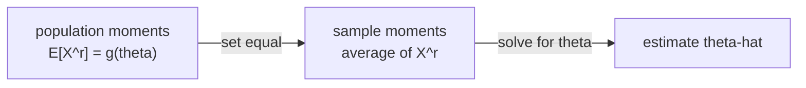

Maximum likelihood requires you to write down a likelihood function and optimize it,
which is analytically tractable only for certain families. The **method of moments**
(MoM) is a simpler strategy: set population moments equal to their sample counterparts
and solve for the parameters. No optimization is required.

## The method

Let $X_1, \ldots, X_n$ be i.i.d. from a distribution with $k$ unknown parameters
$\theta_1, \ldots, \theta_k$. The $r$-th population moment is:

$$
\mu_r(\theta) = E_\theta[X^r].
$$

The corresponding sample moment is:

$$
\hat\mu_r = \frac{1}{n} \sum_{i=1}^n X_i^r.
$$

The MoM estimator solves the system:

$$
\mu_1(\theta) = \hat\mu_1, \quad \mu_2(\theta) = \hat\mu_2, \quad \ldots, \quad \mu_k(\theta) = \hat\mu_k.
$$
<FN n="1" />

One equation per parameter. This system is often algebraically soluble.

## Example: Gamma distribution

The Gamma distribution $\mathrm{Gamma}(\alpha, \beta)$ with shape $\alpha$ and rate
$\beta$ has:

$$
E[X] = \frac{\alpha}{\beta}, \qquad \mathrm{Var}(X) = \frac{\alpha}{\beta^2}.
$$

Since $\mathrm{Var}(X) = E[X^2] - (E[X])^2$, the second moment is
$E[X^2] = \mathrm{Var}(X) + (E[X])^2 = \frac{\alpha}{\beta^2} + \frac{\alpha^2}{\beta^2}$.

Setting $\mu_1 = \hat\mu_1$ and $\hat\sigma^2 = \hat\mu_2 - \hat\mu_1^2$ (the sample
variance), solving gives:

$$
\hat\alpha = \frac{\hat\mu_1^2}{\hat\sigma^2}, \qquad \hat\beta = \frac{\hat\mu_1}{\hat\sigma^2}.
$$

These are explicit formulas: no iteration needed.

**MLE for the Gamma** requires numerically solving $\log\hat\alpha - \psi(\hat\alpha)
= \log\hat\mu_1 - \widehat{\log X}$, where $\psi$ is the digamma function. The MoM
estimate is not as efficient as MLE, but it is immediate.

## Asymptotic properties

MoM estimators are generally **consistent**: as $n \to \infty$, $\hat\mu_r \to \mu_r$
almost surely by the strong law of large numbers. By the continuous mapping theorem,
$\hat\theta \to \theta$<FN n="2" />.

They are also **asymptotically normal**. If $g$ maps sample moments to the estimator,
the delta method gives:

$$
\sqrt{n}(\hat\theta - \theta) \xrightarrow{d} \mathcal{N}(0, \nabla g(\mu)^\top \Sigma \nabla g(\mu)),
$$

where $\Sigma$ is the covariance matrix of the sample moment vector. This is typically
larger than the Cramér-Rao bound, so MoM is generally less efficient than MLE
(covered in the next lesson on estimator properties).

## When to use MoM

MoM is the right choice when:
- the MLE is intractable (no closed form, difficult optimization),
- a quick estimate for initialization is needed,
- the model is misspecified and moment matching has a clear target interpretation.



## Implementation

```python-static
import numpy as np
from scipy.special import digamma
from scipy.optimize import brentq

rng = np.random.default_rng(0)
alpha_true, beta_true = 3.0, 2.0
n = 500
data = rng.gamma(shape=alpha_true, scale=1.0/beta_true, size=n)

# Method of moments
mu1  = data.mean()
var_ = data.var(ddof=1)
alpha_mom = mu1**2 / var_
beta_mom  = mu1 / var_
print(f"MoM  alpha={alpha_mom:.3f}, beta={beta_mom:.3f}")

# MLE (Newton's method on the digamma equation)
log_mean  = np.log(mu1)
mean_log  = np.log(data).mean()
f = lambda a: np.log(a) - digamma(a) - (log_mean - mean_log)
alpha_mle = brentq(f, 1e-6, 1e4)
beta_mle  = alpha_mle / mu1
print(f"MLE  alpha={alpha_mle:.3f}, beta={beta_mle:.3f}")
print(f"True alpha={alpha_true},    beta={beta_true}")
```

Both estimators are close to the truth at $n=500$; MLE is slightly more accurate
on average because it extracts more information from the data (uses the full
likelihood, not just two moments).

The next lesson on bias, consistency, and efficiency formalizes exactly what
"more accurate on average" means.

<Footnotes>
  <FNItem n="1">**Casella, G., & Berger, R. L.** (2002). *Statistical Inference* (2nd ed.). Duxbury. The method of moments and the Gamma example (§7.2).</FNItem>
  <FNItem n="2">**Lehmann, E. L., & Casella, G.** (1998). *Theory of Point Estimation* (2nd ed.). Springer. Consistency and asymptotic normality of moment estimators via the delta method.</FNItem>
</Footnotes>
