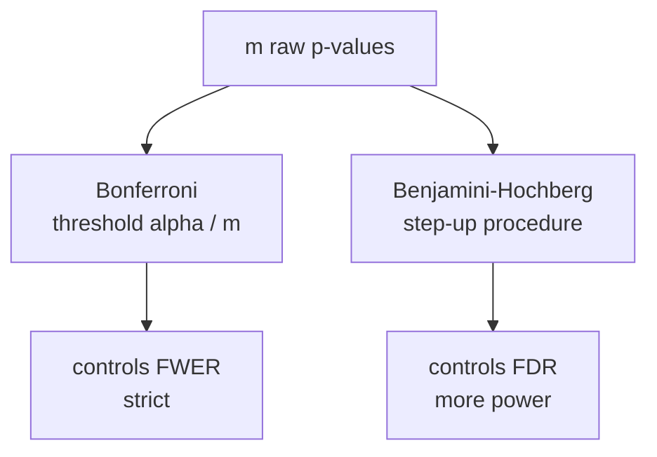

You test $m$ null hypotheses simultaneously, each at level $\alpha = 0.05$. If all
$m$ nulls are true and the tests are independent, the probability of at least one
false rejection is $1 - (1-\alpha)^m$. For $m = 100$ that is $1 - 0.95^{100} \approx 0.994$.
The individual error rate is no longer the right thing to control.

## Two error rates

**Family-wise error rate (FWER):** the probability of at least one false rejection.
$$
\mathrm{FWER} = P(\text{at least one true null rejected}).
$$

**False discovery rate (FDR):** the expected proportion of rejections that are false.
$$
\mathrm{FDR} = E\!\left[\frac{V}{R \vee 1}\right],
$$
where $V$ = false rejections, $R$ = total rejections, and $R \vee 1 = \max(R, 1)$
avoids dividing by zero.

FWER is conservative: even one false positive is penalized. FDR is more lenient: it
tolerates a controlled fraction of false positives, suitable for exploratory studies
where many discoveries are expected.

## Bonferroni correction (FWER)

To control FWER at level $\alpha$, reject hypothesis $i$ when $p_i < \alpha/m$.

**Proof.** By the union bound:
$$
\mathrm{FWER} = P\!\left(\bigcup_{i \in H_0} \{p_i < \alpha/m\}\right) \le \sum_{i \in H_0} P(p_i < \alpha/m) \le m_0 \cdot \frac{\alpha}{m} \le \alpha,
$$
where $m_0 \le m$ is the number of true nulls.

Bonferroni requires no distributional assumptions or independence between tests.
Its cost: power decreases as $m$ grows because the threshold $\alpha/m$ shrinks.

## Holm's step-down procedure

Sort p-values $p_{(1)} \le p_{(2)} \le \cdots \le p_{(m)}$. Reject $H_{(i)}$ for
all $i \le k^*$, where $k^*$ is the largest $k$ such that $p_{(j)} < \alpha/(m-j+1)$
for all $j \le k$. Holm's controls FWER at $\alpha$ and is uniformly more powerful
than Bonferroni.

## Benjamini-Hochberg (FDR)

Sort p-values $p_{(1)} \le \cdots \le p_{(m)}$.

**Step-up procedure:** find the largest $k$ such that:
$$
p_{(k)} \le \frac{k}{m} \alpha.
$$
Reject all $H_{(1)}, \ldots, H_{(k)}$.

**Theorem (Benjamini and Hochberg, 1995).** For independent tests,
$\mathrm{FDR} \le \frac{m_0}{m} \alpha \le \alpha$.

BH is more powerful than Bonferroni when $m$ is large and many alternatives are
true, because it only needs the top-ranked p-values to beat a less stringent
threshold.



## Implementation

```python-static
import numpy as np
from scipy import stats

rng = np.random.default_rng(42)
m = 100
n_true_effects = 20  # 20 alternatives, 80 true nulls

# Simulate p-values: 80 from null N(0,1), 20 from N(2,1) (shifted)
z_null = rng.normal(0, 1, m - n_true_effects)
z_alt  = rng.normal(2, 1, n_true_effects)
z_all  = np.concatenate([z_null, z_alt])
true_null = np.array([True]*(m - n_true_effects) + [False]*n_true_effects)
p_vals = 2 * (1 - stats.norm.cdf(np.abs(z_all)))

alpha = 0.05

# Bonferroni
reject_bonf = p_vals < alpha / m

# Benjamini-Hochberg
order = np.argsort(p_vals)
ranked_p = p_vals[order]
thresholds = (np.arange(1, m+1) / m) * alpha
bh_cutoff = np.where(ranked_p <= thresholds)[0]
reject_bh = np.zeros(m, dtype=bool)
if len(bh_cutoff) > 0:
    reject_bh[order[:bh_cutoff[-1]+1]] = True

def metrics(reject, true_null):
    tp = (~true_null & reject).sum()
    fp = (true_null & reject).sum()
    fn = (~true_null & ~reject).sum()
    fdr = fp / max(reject.sum(), 1)
    power = tp / n_true_effects
    return tp, fp, fn, fdr, power

tp_b, fp_b, fn_b, fdr_b, pow_b = metrics(reject_bonf, true_null)
tp_h, fp_h, fn_h, fdr_h, pow_h = metrics(reject_bh,   true_null)
print(f"           TP  FP  FN   FDR    Power")
print(f"Bonferroni {tp_b:2d}  {fp_b:2d}  {fn_b:2d}  {fdr_b:.3f}  {pow_b:.3f}")
print(f"BH         {tp_h:2d}  {fp_h:2d}  {fn_h:2d}  {fdr_h:.3f}  {pow_h:.3f}")
```

BH rejects more true alternatives at the cost of a small number of extra false
positives, while Bonferroni keeps FP near zero but misses more discoveries.

With frequentist inference covered, B2 moves to the Bayesian perspective: starting
from a prior and updating to a posterior via Bayes' rule.
