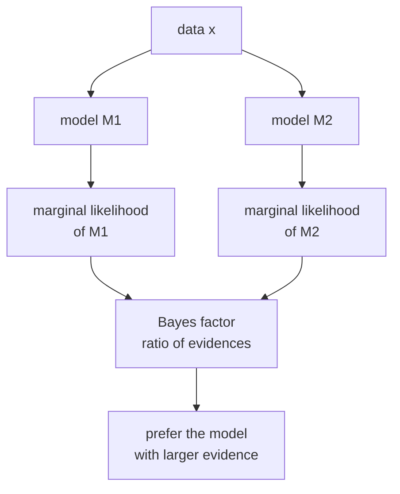

Frequentist model selection uses p-values or information criteria (AIC, BIC).
Bayesian model comparison uses the **marginal likelihood**, the probability of the
data under a model with the parameters integrated out. Models with higher marginal
likelihood are preferred, and the ratio of two marginal likelihoods is the **Bayes factor**.

## Marginal likelihood

For model $\mathcal{M}$ with parameters $\theta$ and prior $p(\theta \mid \mathcal{M})$:

$$
p(x \mid \mathcal{M}) = \int p(x \mid \theta, \mathcal{M})\, p(\theta \mid \mathcal{M})\, d\theta.
$$

This is the normalizing constant from Bayes' rule, now treated as a score for
the model. It rewards models that predict the data well on average over the prior,
penalizing models with diffuse priors that assign low probability to the truth<FN n="1" />.

## The Bayes factor

For two competing models $\mathcal{M}_1$ and $\mathcal{M}_2$ with equal prior
model probabilities:

$$
\mathrm{BF}_{12} = \frac{p(x \mid \mathcal{M}_1)}{p(x \mid \mathcal{M}_2)}.
$$

A Bayes factor of 10 means the data are 10 times more likely under $\mathcal{M}_1$.
Jeffreys' scale (1961) gives rough guidelines: $\mathrm{BF} > 100$ is decisive,
$10$-$100$ is strong, $3$-$10$ is substantial, $1$-$3$ is anecdotal<FN n="2" />.

The **posterior odds** for $\mathcal{M}_1$ are:

$$
\frac{p(\mathcal{M}_1 \mid x)}{p(\mathcal{M}_2 \mid x)} = \mathrm{BF}_{12} \cdot \frac{p(\mathcal{M}_1)}{p(\mathcal{M}_2)}.
$$

## Beta-Binomial example

$H_0$: fair coin ($\theta = 0.5$ fixed). $H_1$: $\theta \sim \mathrm{Beta}(1,1)$
(uniform prior). Observed $k$ heads in $n$ flips.

**Under $H_0$:**

$$
p(k \mid H_0) = \binom{n}{k} (0.5)^n.
$$

**Under $H_1$:**

$$
p(k \mid H_1) = \int_0^1 \binom{n}{k}\theta^k(1-\theta)^{n-k}\, d\theta = \binom{n}{k} B(k+1, n-k+1) = \frac{1}{n+1}.
$$

The marginal likelihood under the uniform prior is $1/(n+1)$ for any $k$ (the uniform
distribution over $\{0, 1, \ldots, n\}$).

$$
\mathrm{BF}_{10} = \frac{1/(n+1)}{(0.5)^n \binom{n}{k}}.
$$

For $n=10$, $k=8$: $\mathrm{BF}_{10} = \frac{1/11}{(0.5)^{10}\binom{10}{8}} \approx 2.07$.
Slight evidence for a biased coin, but far from decisive.

## Automatic Occam's razor

The marginal likelihood implements a built-in complexity penalty: a more complex model
has a more diffuse prior and assigns lower probability to any specific data pattern,
even if it can fit the data well with the right $\theta$. This is sometimes called the
**Bayesian Occam's razor**: complex models must earn their complexity by substantially
outpredicting simpler models<FN n="3" />.

## Comparison to p-values

| | Bayes factor | p-value |
|---|---|---|
| Measures | evidence for $H_1$ over $H_0$ | surprise under $H_0$ alone |
| Depends on prior | yes | no |
| Supports $H_0$ | yes ($\mathrm{BF} < 1$) | no (p-value cannot confirm $H_0$) |
| Continuous update | yes | not directly |

A p-value of 0.05 does not mean $H_0$ is unlikely; it means the data would occur
5% of the time if $H_0$ were true. The Bayes factor compares two hypotheses
directly and can quantify evidence in either direction.



## Implementation

```python-static
import numpy as np
from scipy.special import gammaln, comb
from scipy.stats import binom

def log_marginal_H0(n, k):
    """Fixed theta=0.5."""
    return np.log(comb(n, k, exact=True)) + n * np.log(0.5)

def log_marginal_H1_uniform(n, k):
    """Uniform Beta(1,1) prior: marginal = 1/(n+1)."""
    return -np.log(n + 1)

def log_bayes_factor(n, k):
    return log_marginal_H1_uniform(n, k) - log_marginal_H0(n, k)

for n, k in [(10, 8), (20, 15), (50, 35), (100, 65)]:
    lbf = log_bayes_factor(n, k)
    print(f"n={n:3d}, k={k:3d}: log(BF_10)={lbf:.2f}, BF={np.exp(lbf):.2f}")

# p-value for the same data (two-sided)
for n, k in [(10, 8), (20, 15), (50, 35), (100, 65)]:
    p = 2 * min(binom.cdf(k, n, 0.5), 1 - binom.cdf(k-1, n, 0.5))
    print(f"n={n:3d}, k={k:3d}: p-value={p:.4f}")
```

At $n=100, k=65$, the p-value is very small (strong rejection of $H_0$) and the
Bayes factor is also large, but they measure different things: the p-value gives
the tail probability under $H_0$; the Bayes factor gives the relative evidence.

B3 turns from inference to computation: the bootstrap and permutation tests let
you estimate sampling distributions without knowing them analytically.

<Footnotes>
  <FNItem n="1">**MacKay, D. J. C.** (2003). *Information Theory, Inference, and Learning Algorithms.* Cambridge University Press. Ch. 28 derives the evidence and the Occam factor.</FNItem>
  <FNItem n="2">**Kass, R. E., & Raftery, A. E.** (1995). "Bayes factors". *Journal of the American Statistical Association*, 90(430), 773-795. ([doi:10.1080/01621459.1995.10476572](https://doi.org/10.1080/01621459.1995.10476572)).</FNItem>
  <FNItem n="3">**Bishop, C. M.** (2006). *Pattern Recognition and Machine Learning.* Springer. §3.4 explains the Bayesian Occam's razor through model evidence.</FNItem>
</Footnotes>
