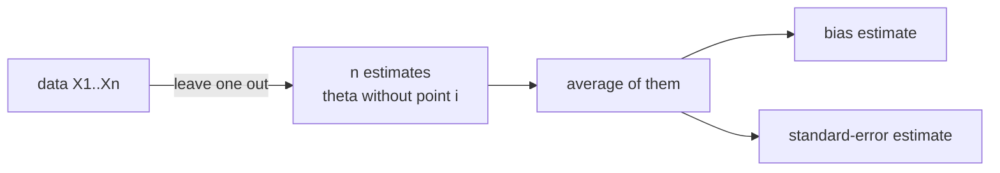

The bootstrap uses $B$ random resamples. The **jackknife** is deterministic: it
removes one observation at a time and recomputes the statistic $n$ times. Despite
being older and simpler, the jackknife gives consistent bias and variance estimates
for smooth statistics, and its connection to the bootstrap clarifies when each
approach is appropriate.

## The jackknife estimator

Let $\hat\theta = T(X_1, \ldots, X_n)$. The $i$-th jackknife replicate is computed
by leaving out observation $i$:

$$
\hat\theta_{(-i)} = T(X_1, \ldots, X_{i-1}, X_{i+1}, \ldots, X_n).
$$

The jackknife mean is $\bar\theta_{(\cdot)} = \frac{1}{n}\sum_{i=1}^n \hat\theta_{(-i)}$.

**Jackknife bias estimate:**

$$
\widehat{\mathrm{Bias}}_{\mathrm{JK}} = (n-1)\left(\bar\theta_{(\cdot)} - \hat\theta\right).
$$

**Bias-corrected estimator:**

$$
\hat\theta_{\mathrm{BC}} = \hat\theta - \widehat{\mathrm{Bias}}_{\mathrm{JK}} = n\hat\theta - (n-1)\bar\theta_{(\cdot)}.
$$

**Jackknife standard error:**

$$
\widehat{\mathrm{SE}}_{\mathrm{JK}} = \sqrt{\frac{n-1}{n}\sum_{i=1}^n \left(\hat\theta_{(-i)} - \bar\theta_{(\cdot)}\right)^2}.
$$

The factor $(n-1)/n$ corrects for the reduced sample size of each replicate.

## Why the factor $(n-1)$?

Each leave-one-out sample has $n-1$ observations. The variance between replicates
is spread across $n-1$ slots rather than $n$, so the standard error formula inflates
by $\sqrt{n-1}$ rather than $\sqrt{n}$.

More formally, for the sample mean: $\hat\theta_{(-i)} = \frac{n\bar X_n - X_i}{n-1}$,
so $\bar\theta_{(\cdot)} = \bar X_n$ (the bias estimate is zero, as expected for the
unbiased sample mean), and:

$$
\widehat{\mathrm{SE}}_{\mathrm{JK}} = \frac{s}{\sqrt{n}},
$$

which is exactly the standard error of the mean.

## Connection to the bootstrap

The jackknife is the **linearization** of the bootstrap. For any statistic with a
smooth influence function $\varphi_i = \hat\theta_{(-i)} - \hat\theta$, the jackknife
and bootstrap give asymptotically equivalent variance estimates. The bootstrap is
preferable for non-smooth statistics (the median, quantiles, the maximum) where the
jackknife can fail.

## When does the jackknife fail?

The jackknife is inconsistent for the median and other non-smooth statistics because
removing one point can shift a quantile by a discrete jump, making the linear
approximation inaccurate. The bootstrap handles these cases correctly.



## Implementation

```python
import numpy as np

rng = np.random.default_rng(0)
n = 50
data = rng.exponential(scale=2.0, size=n)

def stat(x):
    return x.mean()  # try also: np.median(x), x.std()

theta_hat = stat(data)

# Jackknife replicates
jk = np.array([stat(np.delete(data, i)) for i in range(n)])
jk_mean = jk.mean()
jk_bias = (n - 1) * (jk_mean - theta_hat)
jk_se   = np.sqrt((n - 1) / n * ((jk - jk_mean)**2).sum())

# Bootstrap for comparison
B = 5000
boot = np.array([stat(rng.choice(data, n, replace=True)) for _ in range(B)])
boot_se = boot.std()

print(f"theta_hat: {theta_hat:.4f}")
print(f"JK bias estimate: {jk_bias:.5f}  (true bias ~ 0 for mean)")
print(f"JK SE:   {jk_se:.4f}")
print(f"Boot SE: {boot_se:.4f}")
print(f"Analytic SE (sigma/sqrt(n)): {data.std(ddof=1)/np.sqrt(n):.4f}")
```

For the mean, all three SE estimates agree closely. The jackknife required $n=50$
function evaluations; the bootstrap required $B=5000$.

The next lesson covers permutation tests, which use resampling to build exact
p-values without distributional assumptions.
