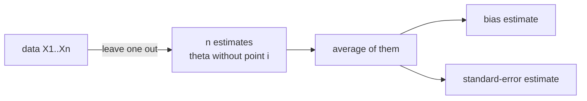

The bootstrap uses $B$ random resamples. The **jackknife** is deterministic: it
removes one observation at a time and recomputes the statistic $n$ times<FN n="1" />. Despite
being older and simpler, the jackknife gives consistent bias and variance estimates
for smooth statistics, and its connection to the bootstrap clarifies when each
approach is appropriate.

## The jackknife estimator

Let $\hat\theta = T(X_1, \ldots, X_n)$. The $i$-th jackknife replicate is computed
by leaving out observation $i$:

$$
\hat\theta_{(-i)} = T(X_1, \ldots, X_{i-1}, X_{i+1}, \ldots, X_n).
$$

The jackknife mean is $\bar\theta_{(\cdot)} = \frac{1}{n}\sum_{i=1}^n \hat\theta_{(-i)}$.

**Jackknife bias estimate:**

$$
\widehat{\mathrm{Bias}}_{\mathrm{JK}} = (n-1)\left(\bar\theta_{(\cdot)} - \hat\theta\right).
$$

**Bias-corrected estimator:**

$$
\hat\theta_{\mathrm{BC}} = \hat\theta - \widehat{\mathrm{Bias}}_{\mathrm{JK}} = n\hat\theta - (n-1)\bar\theta_{(\cdot)}.
$$

**Jackknife standard error:**

$$
\widehat{\mathrm{SE}}_{\mathrm{JK}} = \sqrt{\frac{n-1}{n}\sum_{i=1}^n \left(\hat\theta_{(-i)} - \bar\theta_{(\cdot)}\right)^2}.
$$

The factor $(n-1)/n$ corrects for the reduced sample size of each replicate.

## Why the factor $(n-1)$?

Each leave-one-out sample has $n-1$ observations. The variance between replicates
is spread across $n-1$ slots rather than $n$, so the standard error formula inflates
by $\sqrt{n-1}$ rather than $\sqrt{n}$.

More formally, for the sample mean: $\hat\theta_{(-i)} = \frac{n\bar X_n - X_i}{n-1}$,
so $\bar\theta_{(\cdot)} = \bar X_n$ (the bias estimate is zero, as expected for the
unbiased sample mean), and:

$$
\widehat{\mathrm{SE}}_{\mathrm{JK}} = \frac{s}{\sqrt{n}},
$$

which is exactly the standard error of the mean.

## Connection to the bootstrap

The jackknife is the **linearization** of the bootstrap. For any statistic with a
smooth influence function $\varphi_i = \hat\theta_{(-i)} - \hat\theta$, the jackknife
and bootstrap give asymptotically equivalent variance estimates<FN n="2" />. The bootstrap is
preferable for non-smooth statistics (the median, quantiles, the maximum) where the
jackknife can fail.

## When does the jackknife fail?

The jackknife is inconsistent for the median and other non-smooth statistics because
removing one point can shift a quantile by a discrete jump, making the linear
approximation inaccurate. The bootstrap handles these cases correctly.



## Implementation

```python
import numpy as np

rng = np.random.default_rng(0)
n = 50
data = rng.exponential(scale=2.0, size=n)

def stat(x):
    return x.mean()  # try also: np.median(x), x.std()

theta_hat = stat(data)

# Jackknife replicates
jk = np.array([stat(np.delete(data, i)) for i in range(n)])
jk_mean = jk.mean()
jk_bias = (n - 1) * (jk_mean - theta_hat)
jk_se   = np.sqrt((n - 1) / n * ((jk - jk_mean)**2).sum())

# Bootstrap for comparison
B = 5000
boot = np.array([stat(rng.choice(data, n, replace=True)) for _ in range(B)])
boot_se = boot.std()

print(f"theta_hat: {theta_hat:.4f}")
print(f"JK bias estimate: {jk_bias:.5f}  (true bias ~ 0 for mean)")
print(f"JK SE:   {jk_se:.4f}")
print(f"Boot SE: {boot_se:.4f}")
print(f"Analytic SE (sigma/sqrt(n)): {data.std(ddof=1)/np.sqrt(n):.4f}")
```

For the mean, all three SE estimates agree closely. The jackknife required $n=50$
function evaluations; the bootstrap required $B=5000$.

## Exercises

**Exercise 1.** For the sample mean $\hat\theta = \bar X_n$, show that the
leave-one-out replicate is $\hat\theta_{(-i)} = \frac{n\bar X_n - X_i}{n-1}$ and use
it to prove the jackknife bias estimate is exactly zero.

<details>
<summary>Solution</summary>

**Step 1.** Leaving out $X_i$ removes one term from the sum of the remaining $n-1$
points:

$$
\hat\theta_{(-i)} = \frac{1}{n-1}\sum_{j \ne i} X_j = \frac{1}{n-1}\left(\sum_{j=1}^n X_j - X_i\right) = \frac{n\bar X_n - X_i}{n-1}.
$$

**Step 2.** Average the replicates. The sum $\sum_i (n\bar X_n - X_i) = n^2 \bar X_n - n\bar X_n = n(n-1)\bar X_n$, so

$$
\bar\theta_{(\cdot)} = \frac{1}{n}\sum_{i=1}^n \frac{n\bar X_n - X_i}{n-1} = \frac{n(n-1)\bar X_n}{n(n-1)} = \bar X_n = \hat\theta.
$$

**Step 3.** The bias estimate is $(n-1)(\bar\theta_{(\cdot)} - \hat\theta) = (n-1) \cdot 0 = 0$.
The jackknife reports no bias, matching the fact that $\bar X_n$ is unbiased for the
population mean.

</details>

**Exercise 2.** The jackknife standard error is
$\widehat{\mathrm{SE}}_{\mathrm{JK}} = \sqrt{\frac{n-1}{n}\sum_i (\hat\theta_{(-i)} - \bar\theta_{(\cdot)})^2}$.
Using the replicate from Exercise 1, prove this reduces to $s/\sqrt{n}$ for the mean,
where $s^2 = \frac{1}{n-1}\sum_i (X_i - \bar X_n)^2$.

<details>
<summary>Solution</summary>

**Step 1.** Subtract the replicate mean. From Exercise 1, $\bar\theta_{(\cdot)} = \bar X_n$, so

$$
\hat\theta_{(-i)} - \bar\theta_{(\cdot)} = \frac{n\bar X_n - X_i}{n-1} - \bar X_n = \frac{n\bar X_n - X_i - (n-1)\bar X_n}{n-1} = \frac{\bar X_n - X_i}{n-1}.
$$

**Step 2.** Square and sum:

$$
\sum_{i=1}^n \left(\hat\theta_{(-i)} - \bar\theta_{(\cdot)}\right)^2 = \frac{1}{(n-1)^2}\sum_{i=1}^n (X_i - \bar X_n)^2 = \frac{(n-1)s^2}{(n-1)^2} = \frac{s^2}{n-1}.
$$

**Step 3.** Insert into the formula:

$$
\widehat{\mathrm{SE}}_{\mathrm{JK}} = \sqrt{\frac{n-1}{n} \cdot \frac{s^2}{n-1}} = \sqrt{\frac{s^2}{n}} = \frac{s}{\sqrt{n}},
$$

the textbook standard error of the mean. The $(n-1)/n$ factor is what cancels the
$1/(n-1)$ spreading from the leave-one-out denominator.

</details>

**Exercise 3 (code).** The lesson states the jackknife is inconsistent for the
median. Demonstrate it: over several seeds, compare the jackknife SE against the
bootstrap SE ($B = 5000$) for both the mean and the median on $n = 50$ exponential
draws. Show the mean ratios cluster tightly near $1$ while the median ratios scatter
widely, so the jackknife tracks the bootstrap for the smooth statistic but not the
non-smooth one.

<details>
<summary>Solution</summary>

```python
import numpy as np

n, B = 50, 5000

def jk_se(x, stat):
    rep = np.array([stat(np.delete(x, i)) for i in range(len(x))])
    return np.sqrt((len(x) - 1) / len(x) * ((rep - rep.mean())**2).sum())

def boot_se(x, stat, rng):
    return np.array([stat(rng.choice(x, len(x), replace=True)) for _ in range(B)]).std()

ratios_mean, ratios_med = [], []
for seed in range(8):
    rng = np.random.default_rng(seed)
    data = rng.exponential(scale=2.0, size=n)
    ratios_mean.append(jk_se(data, np.mean) / boot_se(data, np.mean, rng))
    ratios_med.append(jk_se(data, np.median) / boot_se(data, np.median, rng))

ratios_mean, ratios_med = np.array(ratios_mean), np.array(ratios_med)

# Mean: jackknife and bootstrap agree, ratio spread is tiny
assert ratios_mean.std() < 0.05
assert np.all(np.abs(ratios_mean - 1) < 0.1)
# Median: the jackknife is unreliable, ratios scatter far more widely
assert ratios_med.std() > 5 * ratios_mean.std()
print(round(ratios_mean.std(), 3), round(ratios_med.std(), 3))
```

The mean ratios stay within a few percent of $1$ because both methods linearize the
smooth statistic identically. The median ratios swing from well below to well above
$1$ across seeds: deleting one point either leaves the median fixed or jumps it to a
neighbor, so the leave-one-out replicates do not capture the median's true sampling
spread.

</details>

The next lesson covers permutation tests, which use resampling to build exact
p-values without distributional assumptions.

<Footnotes>
  <FNItem n="1">**Efron, B.** (1979). "Bootstrap methods: another look at the jackknife". *The Annals of Statistics*, 7(1), 1-26. Frames the jackknife alongside the bootstrap ([doi:10.1214/aos/1176344552](https://doi.org/10.1214/aos/1176344552)).</FNItem>
  <FNItem n="2">**Efron, B., & Tibshirani, R. J.** (1993). *An Introduction to the Bootstrap.* Chapman & Hall/CRC. Treats the jackknife as the linearization of the bootstrap.</FNItem>
</Footnotes>
