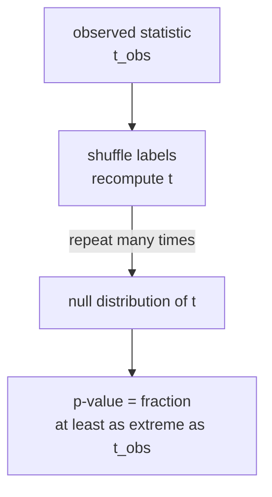

The t-test's p-value assumes the data are normally distributed. When that assumption
is doubtful or the sample is small, a **permutation test** builds the null distribution
directly by permuting the observed data, making no distributional assumption at all.
For the two-sample problem, the permutation p-value is exact under exchangeability<FN n="1" />.

## The setup

Two groups $A$ (size $n_A$) and $B$ (size $n_B$) are observed. The null hypothesis
is that group labels are exchangeable: every assignment of $n_A + n_B$ units to the
two groups is equally likely under $H_0$.

Under $H_0$, permuting the combined labels gives equally likely datasets.

## The algorithm

1. Compute the observed test statistic $t_{\mathrm{obs}}$ (e.g., difference in means:
   $\bar X_A - \bar X_B$).
2. Repeat $P$ times:
   a. Randomly permute the combined labels.
   b. Compute $t^{(p)}$ from the permuted assignment.
3. The two-sided p-value is:
   $$
   \hat p = \frac{1 + \#\{p : |t^{(p)}| \ge |t_{\mathrm{obs}}|\}}{P + 1}.
   $$
   The $+1$ in numerator and denominator corresponds to including the observed
   dataset itself.

For $n_A + n_B \le 20$, all $\binom{n_A + n_B}{n_A}$ permutations can be enumerated
exactly. For larger samples, $P = 10000$ random permutations gives an accurate
approximation.

## Connection to the t-test

The permutation test and the two-sample t-test test the same null (exchangeability
of labels) using the same or equivalent statistics. When the normality assumption
holds, both have the same power. When the data are skewed or heavy-tailed, the
permutation test has more accurate Type I error control.

The permutation test is also valid for any statistic: the median difference,
the maximum, the Kolmogorov-Smirnov statistic, a custom metric.

## Rank tests and the Wilcoxon statistic

The **Mann-Whitney-Wilcoxon** test is the permutation test applied to the rank
statistic $U = \sum_{i \in A, j \in B} \mathbf{1}[X_i > X_j]$. Because ranks have
a known null distribution, the Wilcoxon test has a closed-form p-value (from the
Wilcoxon table) even without explicit permutation<FN n="2" />. It tests whether a randomly
drawn observation from $A$ tends to exceed one from $B$.



## Implementation

```python-static
import numpy as np
from scipy import stats

rng = np.random.default_rng(0)

n_A, n_B = 30, 30
mu_A, mu_B = 5.0, 6.0   # true difference = 1
group_A = rng.normal(mu_A, 2.0, n_A)
group_B = rng.normal(mu_B, 2.5, n_B)
combined = np.concatenate([group_A, group_B])

t_obs = group_A.mean() - group_B.mean()

# Permutation test
P = 10_000
count = 0
for _ in range(P):
    perm = rng.permutation(combined)
    t_perm = perm[:n_A].mean() - perm[n_A:].mean()
    count += abs(t_perm) >= abs(t_obs)
p_perm = (count + 1) / (P + 1)

# Compare to t-test
t_stat, p_ttest = stats.ttest_ind(group_A, group_B, equal_var=False)

# Mann-Whitney-Wilcoxon
u_stat, p_mww = stats.mannwhitneyu(group_A, group_B, alternative='two-sided')

print(f"Observed diff: {t_obs:.4f}")
print(f"Permutation p: {p_perm:.4f}")
print(f"Welch t-test p:{p_ttest:.4f}")
print(f"MWW test p:    {p_mww:.4f}")

# Type I error check (null case: mu_A = mu_B)
perm_type1 = 0
for _ in range(1000):
    a = rng.normal(5, 2, n_A)
    b = rng.normal(5, 2, n_B)
    c = np.concatenate([a, b])
    obs = a.mean() - b.mean()
    cnt = sum(abs((p := rng.permutation(c))[:n_A].mean() - p[n_A:].mean()) >= abs(obs)
              for _ in range(199))
    perm_type1 += (cnt + 1) / 200 < 0.05
print(f"Permutation Type I error: {perm_type1/1000:.3f}  (target 0.05)")
```

All three tests give similar p-values under normality. The permutation test has
exact Type I error control by construction.

## Exercises

**Exercise 1.** Two groups have sizes $n_A = 2$ and $n_B = 2$, with observed values
$A = \{1, 2\}$ and $B = \{5, 6\}$. Using the difference in means $\bar X_A - \bar X_B$
as the statistic, enumerate all $\binom{4}{2} = 6$ label assignments and compute the
exact two-sided permutation p-value.

<details>
<summary>Solution</summary>

**Step 1.** The observed statistic is $\bar X_A - \bar X_B = 1.5 - 5.5 = -4$, so
$|t_{\mathrm{obs}}| = 4$.

**Step 2.** List every way to choose which two of $\{1, 2, 5, 6\}$ are labeled $A$,
and compute the group-mean difference for each:

- $\{1,2\}$ vs $\{5,6\}$: $1.5 - 5.5 = -4$
- $\{1,5\}$ vs $\{2,6\}$: $3 - 4 = -1$
- $\{1,6\}$ vs $\{2,5\}$: $3.5 - 3.5 = 0$
- $\{2,5\}$ vs $\{1,6\}$: $3.5 - 3.5 = 0$
- $\{2,6\}$ vs $\{1,5\}$: $4 - 3 = 1$
- $\{5,6\}$ vs $\{1,2\}$: $5.5 - 1.5 = 4$

**Step 3.** Count the permutations with $|t^{(p)}| \ge 4$: the first and last, so two
of the six. Using the lesson's $+1$ convention with full enumeration, every listed
assignment is a valid permutation including the observed one, so

$$
\hat p = \frac{\#\{p : |t^{(p)}| \ge 4\}}{6} = \frac{2}{6} = \frac{1}{3} \approx 0.333.
$$

With only four points, the most extreme possible separation still cannot beat
$p = 1/3$: small samples bound how significant a permutation test can be.

</details>

**Exercise 2.** Explain why the permutation p-value uses the $+1$ correction
$\hat p = \frac{1 + \#\{p : |t^{(p)}| \ge |t_{\mathrm{obs}}|\}}{P + 1}$ for the random
(sampled) version, and show this guarantees $\hat p > 0$ and that the test never
reports an impossibly small p-value.

<details>
<summary>Solution</summary>

**Step 1.** Under $H_0$ the observed labeling is itself one of the equally likely
assignments. The $+1$ in both numerator and denominator counts $t_{\mathrm{obs}}$
among the reference set, so the test treats the observed data as one draw from the
null alongside the $P$ random permutations.

**Step 2.** Because $|t_{\mathrm{obs}}| \ge |t_{\mathrm{obs}}|$ always holds, the
observed dataset always contributes to the numerator count. The smallest possible
value is therefore

$$
\hat p = \frac{1 + 0}{P + 1} = \frac{1}{P + 1} > 0,
$$

reached when no random permutation is as extreme as the observation.

**Step 3.** Without the $+1$, a value of $0$ would be possible, claiming infinite
evidence from a finite resample. The correction also makes $\hat p$ a valid p-value:
under $H_0$, $\Pr(\hat p \le \alpha) \le \alpha$ for the discrete grid of attainable
values, so Type I error is controlled at the nominal level.

</details>

**Exercise 3 (code).** Implement the two-sample permutation test in pure numpy (no
scipy). With `np.random.default_rng(0)`, generate two normal groups with a true mean
gap of $1.5$ and confirm the permutation p-value is small; then confirm that under the
null (equal means) the p-value is not small. Use the difference in means as the
statistic.

<details>
<summary>Solution</summary>

```python
import numpy as np

def perm_pvalue(a, b, rng, P=10_000):
    combined = np.concatenate([a, b])
    n_a = len(a)
    t_obs = a.mean() - b.mean()
    count = 0
    for _ in range(P):
        perm = rng.permutation(combined)
        t = perm[:n_a].mean() - perm[n_a:].mean()
        count += abs(t) >= abs(t_obs)
    return (count + 1) / (P + 1)

rng = np.random.default_rng(0)
n_a = n_b = 40

# Alternative: a real 1.5 mean gap should be detected
a = rng.normal(5.0, 2.0, n_a)
b = rng.normal(6.5, 2.0, n_b)
p_alt = perm_pvalue(a, b, rng)

# Null: equal means, the test should not flag a difference
a0 = rng.normal(5.0, 2.0, n_a)
b0 = rng.normal(5.0, 2.0, n_b)
p_null = perm_pvalue(a0, b0, rng)

assert p_alt < 0.05          # real effect detected
assert p_null > 0.05         # no false alarm here
assert 1 / 10_001 <= p_alt   # +1 correction floors the p-value above 0
print(round(p_alt, 4), round(p_null, 4))
```

The seeded run yields a tiny p-value for the genuine $1.5$ gap and a large one when
the groups share a mean, with both bounded below by $1/(P+1)$ from the $+1$
correction.

</details>

The next lesson turns to model evaluation: cross-validation, which uses
leave-out resampling to estimate prediction error.

<Footnotes>
  <FNItem n="1">**Good, P.** (2005). *Permutation, Parametric, and Bootstrap Tests of Hypotheses* (3rd ed.). Springer. Exactness of permutation p-values under exchangeability.</FNItem>
  <FNItem n="2">**Wasserman, L.** (2004). *All of Statistics.* Springer. Permutation tests and rank statistics ([doi:10.1007/978-0-387-21736-9](https://doi.org/10.1007/978-0-387-21736-9)).</FNItem>
</Footnotes>
