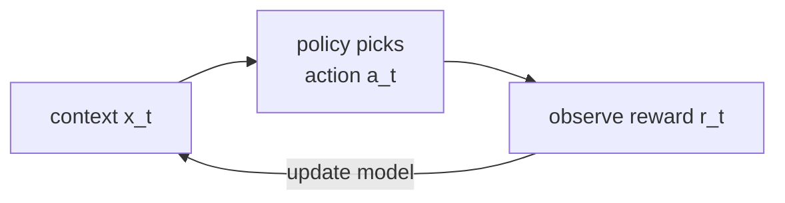

In a multi-armed bandit, the payoff distribution of each arm is fixed. In practice,
the right action depends on the current **context**: a recommendation algorithm should
show a different article to a user interested in sports vs. technology. A
**contextual bandit** observes a context vector $\mathbf{x}_t$ before choosing an arm,
and the expected reward depends on both the arm and the context.

## The contextual bandit

At each round $t$:
1. Observe context $\mathbf{x}_t \in \mathbb{R}^d$.
2. Choose arm $A_t \in \{1, \ldots, K\}$.
3. Observe reward $R_t$.

The expected reward is $E[R_t \mid \mathbf{x}_t, A_t = k] = f_k(\mathbf{x}_t)$.
The goal is to minimize regret against the policy that selects the best arm for
each context.

## LinUCB (linear UCB)

**LinUCB** (Li et al., 2010) assumes the reward is linear in the context<FN n="1" />:

$$
E[R_t \mid \mathbf{x}_t, A_t = k] = \mathbf{x}_t^\top \boldsymbol{\theta}_k,
$$

where $\boldsymbol{\theta}_k \in \mathbb{R}^d$ is an arm-specific parameter vector.

At each round, arm $k$ has been pulled with contexts $\mathbf{X}_k$ (rows) and
rewards $\mathbf{r}_k$. The ridge regression estimate is:

$$
\hat{\boldsymbol{\theta}}_k = (A_k)^{-1} \mathbf{X}_k^\top \mathbf{r}_k,
\quad A_k = \mathbf{X}_k^\top \mathbf{X}_k + \lambda I.
$$

The uncertainty in the mean prediction at $\mathbf{x}_t$ is:

$$
\mathrm{Var}[\mathbf{x}_t^\top \hat{\boldsymbol{\theta}}_k] = \mathbf{x}_t^\top A_k^{-1} \mathbf{x}_t.
$$

LinUCB selects the arm with the highest upper confidence bound:

$$
A_t = \arg\max_k \left(\mathbf{x}_t^\top \hat{\boldsymbol{\theta}}_k + \alpha \sqrt{\mathbf{x}_t^\top A_k^{-1} \mathbf{x}_t}\right),
$$

where $\alpha > 0$ controls the exploration bonus.

**Regret bound.** Under mild assumptions, LinUCB achieves
$\mathcal{R}_T = O(d\sqrt{T\ln^3(KT/\delta)})$ with probability $1-\delta$.
The $\sqrt{T}$ rate (vs. $\ln T$ for fixed-mean bandits) reflects the harder
learning problem when the parameters must be estimated from context-dependent data<FN n="2" />.



## Implementation

```python
import numpy as np

rng = np.random.default_rng(0)
K, d, T = 3, 4, 2000
theta_true = rng.normal(0, 1, (K, d))
alpha = 1.0
lam   = 1.0

# LinUCB per-arm state
A_inv = [np.eye(d) / lam for _ in range(K)]   # (lambda*I)^{-1} initially
b     = [np.zeros(d) for _ in range(K)]        # X^T r accumulator

def predict(k, x):
    th = A_inv[k] @ b[k]
    ucb = x @ th + alpha * np.sqrt(x @ A_inv[k] @ x)
    return ucb, th

total_reward = 0
best_reward  = 0
for t in range(T):
    x = rng.normal(0, 1, d)
    x /= np.linalg.norm(x) + 1e-9        # unit context
    best_k = max(range(K), key=lambda k: x @ theta_true[k])
    best_reward += x @ theta_true[best_k]

    ucbs = [predict(k, x)[0] for k in range(K)]
    chosen = int(np.argmax(ucbs))
    reward = x @ theta_true[chosen] + rng.normal(0, 0.1)
    total_reward += reward

    # Rank-1 update (Sherman-Morrison)
    Ainv = A_inv[chosen]
    Ax   = Ainv @ x
    A_inv[chosen] = Ainv - np.outer(Ax, Ax) / (1 + x @ Ax)
    b[chosen] += x * reward

regret = best_reward - total_reward
print(f"LinUCB total regret at T={T}: {regret:.2f}")
print(f"Mean regret per round: {regret/T:.4f}")

# Compare to random policy
rnd_reward = sum(
    rng.normal(0, 1, d) @ theta_true[rng.integers(K)]
    for _ in range(T)
)
# Best minus random regret
```

The Sherman-Morrison update avoids the $O(d^3)$ matrix inversion at each step,
reducing per-step cost to $O(d^2)$.

## Exercises

**Exercise 1.** LinUCB scores each arm as
$\mathbf{x}_t^\top \hat{\boldsymbol{\theta}}_k + \alpha\sqrt{\mathbf{x}_t^\top A_k^{-1} \mathbf{x}_t}$.
Describe how the chosen arm changes as $\alpha$ moves from $0$ to a large value, and
relate the two extremes to pure exploitation and pure exploration.

<details>
<summary>Solution</summary>

**Step 1.** At $\alpha = 0$ the bonus vanishes and the rule reduces to
$\arg\max_k \mathbf{x}_t^\top \hat{\boldsymbol{\theta}}_k$, the greedy choice that
trusts the current ridge estimate. This is pure exploitation: an arm with a bad
early estimate may never be tried again.

**Step 2.** As $\alpha \to \infty$ the bonus term
$\alpha\sqrt{\mathbf{x}_t^\top A_k^{-1}\mathbf{x}_t}$ dominates, and selection is
driven by the largest predictive variance. Arms whose parameters are least known for
this context win, regardless of their estimated reward. This is pure exploration.

**Step 3.** A finite $\alpha$ interpolates: it picks the arm whose optimistic reward
estimate, mean plus a confidence-scaled uncertainty, is highest. Larger $\alpha$
explores longer before committing, the contextual analogue of the $\sqrt{2\ln t/n_k}$
bonus in UCB1.

</details>

**Exercise 2.** The LinUCB regret rate is $O(d\sqrt{T})$, whereas fixed-mean bandits
achieve $O(\ln T)$. Explain why introducing a $d$-dimensional context makes the
problem fundamentally harder, and why the regret carries a factor of $d$.

<details>
<summary>Solution</summary>

**Step 1.** In a fixed-mean bandit each arm has one scalar mean $\mu_k$ to estimate.
After $n_k$ pulls the estimate error shrinks like $1/\sqrt{n_k}$, and the optimism
argument gives $O(\ln T)$ total regret.

**Step 2.** With context, each arm has a $d$-dimensional parameter
$\boldsymbol{\theta}_k$. The reward at a new context $\mathbf{x}_t$ depends on a
direction in parameter space that may be poorly estimated even after many pulls, if
those pulls explored other directions. There is no single mean that, once known,
settles the arm.

**Step 3.** The confidence width $\sqrt{\mathbf{x}_t^\top A_k^{-1}\mathbf{x}_t}$
shrinks only along directions the contexts have spanned. Covering $d$ directions
costs roughly $d$ times the exploration, and the accumulated uncertainty over $T$
rounds grows like $\sqrt{T}$ rather than $\ln T$. The product gives the
$O(d\sqrt{T})$ rate.

</details>

**Exercise 3 (code).** The implementation uses a Sherman-Morrison rank-1 update.
First verify it against a direct inverse on a random rank-1 update. Then run LinUCB
for $T = 3000$ rounds and confirm the per-round regret in the last $500$ rounds is a
small fraction of the first $500$, the signature of learning.

<details>
<summary>Solution</summary>

```python
import numpy as np

rng = np.random.default_rng(0)
d = 4

# Sherman-Morrison matches the direct inverse after a rank-1 bump
A = np.eye(d)
x = rng.normal(0, 1, d)
A_inv = np.linalg.inv(A)
Ax = A_inv @ x
inv_sm = A_inv - np.outer(Ax, Ax) / (1 + x @ Ax)
assert np.allclose(inv_sm, np.linalg.inv(A + np.outer(x, x)))

K, T, alpha, lam = 3, 3000, 1.0, 1.0
theta_true = rng.normal(0, 1, (K, d))
A_inv = [np.eye(d) / lam for _ in range(K)]
b = [np.zeros(d) for _ in range(K)]
inst = np.zeros(T)
for t in range(T):
    x = rng.normal(0, 1, d)
    x /= np.linalg.norm(x) + 1e-9
    best = max(x @ theta_true[k] for k in range(K))
    ucbs = [x @ (A_inv[k] @ b[k]) + alpha * np.sqrt(x @ A_inv[k] @ x)
            for k in range(K)]
    ch = int(np.argmax(ucbs))
    reward = x @ theta_true[ch] + rng.normal(0, 0.1)
    inst[t] = best - x @ theta_true[ch]
    Ai = A_inv[ch]; Ax = Ai @ x
    A_inv[ch] = Ai - np.outer(Ax, Ax) / (1 + x @ Ax)
    b[ch] += x * reward

early, late = inst[:500].mean(), inst[-500:].mean()
assert late < 0.5 * early             # per-round regret collapses as it learns
print("early per-round regret:", round(early, 4),
      "late:", round(late, 5))
```

The early per-round regret is around $0.017$; by the final $500$ rounds it falls
below $0.001$, showing LinUCB has learned to pick the best arm for each context.

</details>

B5 moves from experimentation to the deeper question of causality: when does
an observed association reflect a real causal mechanism, and how can we estimate
the effect of an intervention we did not run?

<Footnotes>
  <FNItem n="1">**Li, L., Chu, W., Langford, J., & Schapire, R. E.** (2010). "A contextual-bandit approach to personalized news article recommendation". *WWW*. The paper introducing LinUCB ([doi:10.1145/1772690.1772758](https://doi.org/10.1145/1772690.1772758)).</FNItem>
  <FNItem n="2">**Lattimore, T., & Szepesvári, C.** (2020). *Bandit Algorithms.* Cambridge University Press. Linear bandits and the $\sqrt{T}$ regret analysis ([doi:10.1017/9781108571401](https://doi.org/10.1017/9781108571401)).</FNItem>
</Footnotes>
