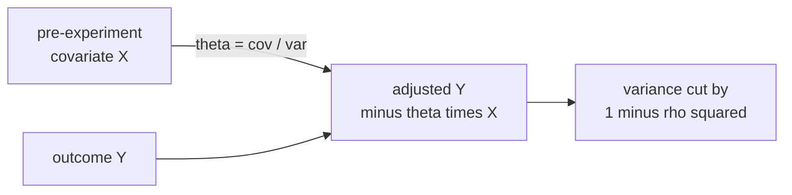

Most A/B tests waste statistical power because the outcome variable carries variance
that is unrelated to the treatment. A user's pre-experiment behavior (clicks last
week) predicts their post-experiment behavior (clicks this week) regardless of which
variant they see. **CUPED** (Controlled-experiment Using Pre-Experiment Data;
Deng et al., 2013) removes this predictable variance from the outcome, increasing
power without collecting more data<FN n="1" />.

## The idea

For each user $i$ in the experiment, let:

- $Y_i$: post-experiment outcome (clicks this week).
- $X_i$: pre-experiment covariate (clicks last week), observed before treatment assignment.
- $W_i \in \{0, 1\}$: treatment assignment (0 = control, 1 = treatment).

Because $X_i$ is observed before randomization, it is independent of $W_i$
(by design). The **CUPED-adjusted outcome** is:

$$
\tilde Y_i = Y_i - \theta (X_i - \bar X),
$$

where $\theta$ is chosen to minimize $\mathrm{Var}(\tilde Y_i)$.

## Optimal $\theta$

$$
\mathrm{Var}(\tilde Y_i) = \mathrm{Var}(Y_i) - 2\theta \mathrm{Cov}(Y_i, X_i) + \theta^2 \mathrm{Var}(X_i).
$$

Setting the derivative with respect to $\theta$ to zero:

$$
\theta^* = \frac{\mathrm{Cov}(Y, X)}{\mathrm{Var}(X)}.
$$

This is the OLS regression coefficient of $Y$ on $X$.

## Variance reduction

At the optimal $\theta^*$:

$$
\mathrm{Var}(\tilde Y) = \mathrm{Var}(Y)(1 - \rho^2),
$$

where $\rho = \mathrm{Corr}(Y, X)$ is the Pearson correlation. The variance
reduction factor is $1 - \rho^2$.

For $\rho = 0.7$ (a common value for pre/post experiment metrics): variance
is reduced by $\rho^2 = 49\%$ (leaving $51\%$ of the original), and the required
sample size drops to $51\%$ of the original (since required $n \propto \sigma^2$)<FN n="2" />.

## Unbiasedness

Since $E[X_i] = \bar X$ in a large experiment and $E[X_i \mid W_i] = E[X_i]$ by
randomization, the adjusted difference in means:

$$
(\bar{\tilde Y}_{\text{treat}} - \bar{\tilde Y}_{\text{ctrl}}) = (\bar Y_{\text{treat}} - \bar Y_{\text{ctrl}}) - \theta (\bar X_{\text{treat}} - \bar X_{\text{ctrl}}),
$$

has $E[\bar X_{\text{treat}} - \bar X_{\text{ctrl}}] = 0$, so CUPED does not change
the expected value of the treatment effect estimate.

## Multiple covariates

With a vector of covariates $\mathbf{X}_i$, use the multivariate OLS coefficient:
$\theta^* = \Sigma_{XX}^{-1} \Sigma_{XY}$, and the adjusted outcome is
$\tilde Y_i = Y_i - \theta^{*\top}(\mathbf{X}_i - \bar{\mathbf{X}})$.
The variance reduction is $1 - R^2$ where $R^2$ is from regressing $Y$ on $\mathbf{X}$.



## Implementation

```python-static
import numpy as np
from scipy import stats

rng = np.random.default_rng(0)
n = 500           # per group
delta = 0.5       # true treatment effect
rho   = 0.7       # pre/post correlation

# Simulate correlated pre/post data
# Y = delta*W + rho*X_std + noise, X ~ N(0,1)
X = rng.normal(0, 1, 2*n)
noise = rng.normal(0, np.sqrt(1 - rho**2), 2*n)
W = np.array([0]*n + [1]*n)
Y = delta * W + rho * X + noise

# Estimate theta on combined data (in practice: train on control or pre-experiment)
theta_hat = np.cov(Y, X)[0, 1] / np.var(X, ddof=1)
Y_adj = Y - theta_hat * (X - X.mean())

# Treatment effect estimates
ctrl_mask = W == 0
trt_mask  = W == 1

ate_raw = Y[trt_mask].mean() - Y[ctrl_mask].mean()
ate_adj = Y_adj[trt_mask].mean() - Y_adj[ctrl_mask].mean()

se_raw = np.sqrt(Y[trt_mask].var(ddof=1)/n + Y[ctrl_mask].var(ddof=1)/n)
se_adj = np.sqrt(Y_adj[trt_mask].var(ddof=1)/n + Y_adj[ctrl_mask].var(ddof=1)/n)

print(f"True ATE: {delta}")
print(f"Raw  ATE: {ate_raw:.4f}  SE={se_raw:.4f}")
print(f"Adj  ATE: {ate_adj:.4f}  SE={se_adj:.4f}")
print(f"Variance reduction: {1 - (se_adj/se_raw)**2:.3f}  (theoretical: {rho**2:.3f})")
```

The standard error of the adjusted estimator is about $\sqrt{1-\rho^2} \approx 0.71$
times the raw SE, matching the theoretical prediction.

## Exercises

**Exercise 1.** A pre/post metric has correlation $\rho = 0.6$. Compute the CUPED
variance reduction factor, and the factor by which the required sample size shrinks
relative to an unadjusted test at the same power.

<details>
<summary>Solution</summary>

**Step 1.** The adjusted variance is $\mathrm{Var}(\tilde Y) = \mathrm{Var}(Y)(1 - \rho^2)$,
so the remaining-variance fraction is

$$
1 - \rho^2 = 1 - 0.6^2 = 1 - 0.36 = 0.64.
$$

**Step 2.** Required sample size scales with the outcome variance, $n \propto \sigma^2$.
Replacing $\mathrm{Var}(Y)$ by $0.64\,\mathrm{Var}(Y)$ scales $n$ by the same factor,
so the adjusted test needs $64\%$ of the original sample. A moderate correlation of
$0.6$ already cuts the cost by more than a third.

</details>

**Exercise 2.** Derive the optimal $\theta^*$ that minimizes $\mathrm{Var}(\tilde Y)$,
and substitute it back to prove $\mathrm{Var}(\tilde Y) = \mathrm{Var}(Y)(1 - \rho^2)$.

<details>
<summary>Solution</summary>

**Step 1.** Start from the variance as a function of $\theta$:

$$
\mathrm{Var}(\tilde Y) = \mathrm{Var}(Y) - 2\theta\,\mathrm{Cov}(Y, X) + \theta^2 \mathrm{Var}(X).
$$

**Step 2.** Differentiate with respect to $\theta$ and set to zero:

$$
-2\,\mathrm{Cov}(Y, X) + 2\theta\,\mathrm{Var}(X) = 0
\implies \theta^* = \frac{\mathrm{Cov}(Y, X)}{\mathrm{Var}(X)}.
$$

**Step 3.** Substitute $\theta^*$ back. The cross term and the quadratic term
combine to $-\mathrm{Cov}(Y, X)^2 / \mathrm{Var}(X)$:

$$
\mathrm{Var}(\tilde Y) = \mathrm{Var}(Y) - \frac{\mathrm{Cov}(Y, X)^2}{\mathrm{Var}(X)}.
$$

**Step 4.** Factor out $\mathrm{Var}(Y)$ and use the definition of the Pearson
correlation $\rho^2 = \mathrm{Cov}(Y, X)^2 / (\mathrm{Var}(Y)\mathrm{Var}(X))$:

$$
\mathrm{Var}(\tilde Y) = \mathrm{Var}(Y)\left(1 - \frac{\mathrm{Cov}(Y, X)^2}{\mathrm{Var}(Y)\mathrm{Var}(X)}\right) = \mathrm{Var}(Y)(1 - \rho^2).
$$

</details>

**Exercise 3 (code).** Simulate correlated pre/post data with $\rho = 0.7$ and a true
effect $\delta = 0.5$. Estimate $\theta^*$, form the adjusted outcome, and confirm two
things: the within-arm variance drops by about $\rho^2$, and the adjusted
difference-in-means still recovers $\delta$ (CUPED is unbiased).

<details>
<summary>Solution</summary>

```python
import numpy as np

rng = np.random.default_rng(0)
n, delta, rho = 20_000, 0.5, 0.7
X = rng.normal(0, 1, 2 * n)
noise = rng.normal(0, np.sqrt(1 - rho**2), 2 * n)
W = np.array([0] * n + [1] * n)
Y = delta * W + rho * X + noise

theta = np.cov(Y, X)[0, 1] / np.var(X, ddof=1)
Y_adj = Y - theta * (X - X.mean())

# Within-arm variance isolates the noise CUPED removes (not the treatment shift)
red = 1 - Y_adj[W == 0].var(ddof=1) / Y[W == 0].var(ddof=1)
ate_adj = Y_adj[W == 1].mean() - Y_adj[W == 0].mean()

assert abs(red - rho**2) < 0.03       # variance reduction matches rho^2
assert abs(ate_adj - delta) < 0.05    # estimator stays unbiased
print("variance reduction:", round(red, 3), "adjusted ATE:", round(ate_adj, 3))
```

The control-arm variance falls by about $0.49$, matching $\rho^2$, while the adjusted
treatment-effect estimate stays at $0.50$.

</details>

The next lesson introduces multi-armed bandits, which replace the fixed-sample A/B
test with an adaptive design that allocates more traffic to better-performing arms
during the experiment.

<Footnotes>
  <FNItem n="1">**Deng, A., Xu, Y., Kohavi, R., & Walker, T.** (2013). "Improving the sensitivity of online controlled experiments by utilizing pre-experiment data". *WSDM*. The paper that introduced CUPED ([doi:10.1145/2433396.2433413](https://doi.org/10.1145/2433396.2433413)).</FNItem>
  <FNItem n="2">**Kohavi, R., Tang, D., & Xu, Y.** (2020). *Trustworthy Online Controlled Experiments.* Cambridge University Press. Variance reduction and CUPED in production experimentation ([doi:10.1017/9781108653985](https://doi.org/10.1017/9781108653985)).</FNItem>
</Footnotes>
