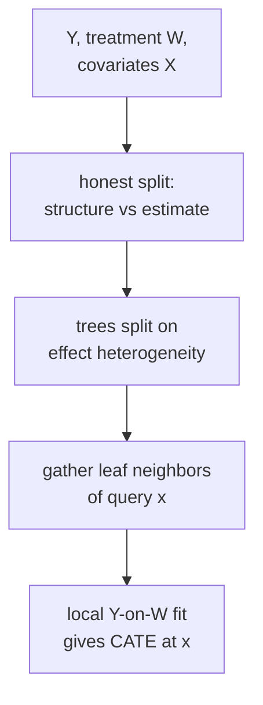

DML estimates a single average treatment effect $\theta$. In practice, the treatment
effect varies by individual: $\tau(x) = E[Y(1) - Y(0) \mid X = x]$, the
**conditional average treatment effect** (CATE). CATE estimation requires both
modeling the heterogeneity and avoiding overfitting to noise.

## Meta-learners

Meta-learners wrap any ML model to estimate CATE.

### T-learner (two-model learner)

Train separate outcome models for treated and control:

$$
\hat\mu_1(x) = E[Y \mid X=x, W=1], \quad \hat\mu_0(x) = E[Y \mid X=x, W=0].
$$

CATE estimate: $\hat\tau_T(x) = \hat\mu_1(x) - \hat\mu_0(x)$.

**Weakness.** Each model is trained on half the data. If treatments are rare,
$\hat\mu_1$ is poorly estimated.

### S-learner (single-model learner)

Train one model on the combined data with $W$ as a feature:

$$
\hat\mu(x, w) = E[Y \mid X=x, W=w].
$$

CATE estimate: $\hat\tau_S(x) = \hat\mu(x, 1) - \hat\mu(x, 0)$.

**Weakness.** Regularized models (trees, ridge) may shrink the treatment coefficient
toward zero, absorbing treatment variation into main effects.

### X-learner (cross-learner; Künzel et al., 2019)

Three steps:

1. Estimate $\hat\mu_0$ and $\hat\mu_1$ as in T-learner.
2. Impute individual effects:
   - Treated: $\tilde\tau_i = Y_i - \hat\mu_0(X_i)$ for $W_i = 1$.
   - Control: $\tilde\tau_j = \hat\mu_1(X_j) - Y_j$ for $W_j = 0$.
3. Fit regression models $\hat\tau_1$ on treated units (predict $\tilde\tau_i$ from $X_i$)
   and $\hat\tau_0$ on control units.
4. Combine: $\hat\tau_X(x) = e(x)\hat\tau_0(x) + (1-e(x))\hat\tau_1(x)$,
   where $e(x)$ is the propensity score.

The X-learner is more efficient when treated and control group sizes are unbalanced.

## Causal forests (Wager and Athey, 2018)

Random forests estimate means by averaging leaf values. **Causal forests** adapt
this to CATE by replacing the outcome in each leaf with the local treatment effect<FN n="1" />.

**Honest splitting.** A tree is **honest** if the data used to determine splits are
separate from the data used to estimate leaf values. This prevents the tree from
overfitting the treatment effect while searching for splits.

Specifically, half the sample (the *splitting sample*) is used to build the tree;
the other half (the *estimation sample*) is used to compute leaf means. The resulting
estimator is asymptotically normal, enabling valid confidence intervals for CATE<FN n="1" />.

**Algorithm sketch:**

1. Build a forest of honest trees on the outcome residuals $\tilde Y = Y - \hat\ell(X)$
   and treatment residuals $\tilde W = W - \hat m(X)$ (as in DML)<FN n="2" />.
2. For a query point $x$, collect its leaf neighbors in each tree.
3. CATE estimate: local weighted regression of $\tilde Y$ on $\tilde W$ using
   the forest's kernel weights.



## Implementation

```python-static
import numpy as np
from sklearn.ensemble import GradientBoostingRegressor, RandomForestRegressor
from sklearn.linear_model import LogisticRegression

rng = np.random.default_rng(0)
n = 2000

X = rng.normal(0, 1, (n, 5))
W = (0.3*X[:, 0] + rng.normal(0, 1, n) > 0).astype(float)
# True CATE: tau(x) = 1 + x[:,0]  (linear heterogeneity)
tau_true = 1 + X[:, 0]
Y0 = 0.5*X[:, 0] + rng.normal(0, 1, n)
Y1 = Y0 + tau_true
Y  = W * Y1 + (1 - W) * Y0

# T-learner
t1 = GradientBoostingRegressor(n_estimators=100, random_state=0)
t0 = GradientBoostingRegressor(n_estimators=100, random_state=0)
t1.fit(X[W==1], Y[W==1])
t0.fit(X[W==0], Y[W==0])
tau_T = t1.predict(X) - t0.predict(X)

# S-learner
from numpy import column_stack
Xw1 = column_stack([X, np.ones(n)])
Xw0 = column_stack([X, np.zeros(n)])
s_mod = GradientBoostingRegressor(n_estimators=100, random_state=0)
s_mod.fit(column_stack([X, W]), Y)
tau_S = s_mod.predict(Xw1) - s_mod.predict(Xw0)

# X-learner
imputed_treat = Y[W==1] - t0.predict(X[W==1])
imputed_ctrl  = t1.predict(X[W==0]) - Y[W==0]
x1 = GradientBoostingRegressor(n_estimators=100, random_state=0).fit(X[W==1], imputed_treat)
x0 = GradientBoostingRegressor(n_estimators=100, random_state=0).fit(X[W==0], imputed_ctrl)
e_hat = LogisticRegression().fit(X, W).predict_proba(X)[:, 1]
tau_X = e_hat * x0.predict(X) + (1 - e_hat) * x1.predict(X)

def rmse(est): return np.sqrt(((est - tau_true)**2).mean())
print(f"T-learner RMSE: {rmse(tau_T):.4f}")
print(f"S-learner RMSE: {rmse(tau_S):.4f}")
print(f"X-learner RMSE: {rmse(tau_X):.4f}")
```

The X-learner typically outperforms T and S when groups are imbalanced; the S-learner
often underestimates heterogeneity due to regularization.

## Exercises

**Exercise 1.** Write out the T-learner and S-learner CATE estimators for a linear
outcome model. Suppose the true outcome is
$Y = \beta_0 + \beta_1 x + (1 + 2x)\,W + \varepsilon$ so the true CATE is
$\tau(x) = 1 + 2x$. With unrestricted linear regressions, what does each learner
recover, and where could the S-learner's structural form lose the heterogeneity?

<details>
<summary>Solution</summary>

**Step 1 (T-learner).** Fit $\hat\mu_1(x) = a_1 + b_1 x$ on treated units and
$\hat\mu_0(x) = a_0 + b_0 x$ on controls. In population, $\mu_1(x) = \beta_0 + 1 +
(\beta_1 + 2)x$ and $\mu_0(x) = \beta_0 + \beta_1 x$, so
$\hat\tau_T(x) = (a_1 - a_0) + (b_1 - b_0)x \to 1 + 2x$: the T-learner recovers the
true CATE.

**Step 2 (S-learner, with interaction).** Fit
$\hat\mu(x, w) = \gamma_0 + \gamma_1 x + \gamma_2 w + \gamma_3 (xw)$. Then
$\hat\tau_S(x) = \gamma_2 + \gamma_3 x \to 1 + 2x$, also correct, because the
interaction term $xw$ is in the model.

**Step 3 (where S-learner fails).** If the S-learner omits the $xw$ interaction and
fits only $\gamma_0 + \gamma_1 x + \gamma_2 w$, the treatment effect collapses to
the constant $\gamma_2$, the average of $1 + 2x$ over the covariate distribution.
The $x$-dependence of the effect is absorbed into the main effect $\gamma_1 x$ or
lost, so the S-learner reports a flat CATE. Regularization that shrinks $w$-related
terms has the same effect even when the interaction is nominally present.

</details>

**Exercise 2.** Explain why honest splitting gives valid confidence intervals for
CATE that ordinary (non-honest) trees do not. Identify the specific bias that
reusing the same data for splitting and estimation introduces.

<details>
<summary>Solution</summary>

**Step 1.** A non-honest tree chooses splits to maximize the apparent treatment-
effect difference between child leaves, then estimates each leaf's effect on the
same data. The split was selected because that data happened to show a large
contrast, so the in-leaf estimate inherits the noise that drove the split.

**Step 2.** This is an optimistic, selection-induced bias: the leaf effects are
systematically more extreme than the truth, and their sampling distribution is not
centered at the leaf's true effect. Confidence intervals built from such estimates
undercover.

**Step 3.** Honest splitting separates the two roles. The splitting sample decides
the tree structure; the disjoint estimation sample, never consulted during
splitting, computes the leaf effects. Conditional on the structure, the estimation
sample is a fresh draw, so the leaf mean is unbiased for that leaf's effect and is
asymptotically normal. That normality is what licenses valid confidence intervals.

</details>

**Exercise 3 (code).** Implement a T-learner with plain numpy least-squares on a
linear-CATE SCM ($\tau(x) = 1 + 2x$), and an S-learner that omits the treatment
interaction. Using a fixed seed and $n = 4000$, show the T-learner's CATE RMSE is
small while the interaction-free S-learner returns a nearly flat CATE. Assert the
T-learner beats the S-learner.

<details>
<summary>Solution</summary>

```python
import numpy as np

rng = np.random.default_rng(0)
n = 4000

x = rng.normal(0, 1, n)
W = rng.integers(0, 2, n).astype(float)
tau = 1 + 2 * x                                  # true CATE
Y = 0.5 * x + tau * W + rng.normal(0, 0.5, n)

def ols(A, b):
    coef, *_ = np.linalg.lstsq(A, b, rcond=None)
    return coef

# T-learner: separate linear fits on treated and control
def design(xx):
    return np.column_stack([np.ones_like(xx), xx])
c1 = ols(design(x[W == 1]), Y[W == 1])
c0 = ols(design(x[W == 0]), Y[W == 0])
tau_T = (design(x) @ c1) - (design(x) @ c0)

# S-learner WITHOUT interaction: features [1, x, W]
Xs = np.column_stack([np.ones(n), x, W])
cs = ols(Xs, Y)
tau_S = np.full(n, cs[2])                         # effect = constant coeff on W

def rmse(est):
    return np.sqrt(np.mean((est - tau) ** 2))

rmse_T, rmse_S = rmse(tau_T), rmse(tau_S)
assert rmse_T < 0.1                               # T-learner tracks 1 + 2x
assert rmse_S > 1.0                               # flat S-learner misses the slope
assert rmse_T < rmse_S
print(round(rmse_T, 4), round(rmse_S, 4))
```

The interaction-free S-learner can only fit one number for the treatment effect,
so its CATE is flat and its RMSE is dominated by the missing $2x$ slope. The
T-learner, fitting treated and control separately, lets the effect vary with $x$
and recovers $1 + 2x$ up to estimation noise.

</details>

The next lesson connects causal reasoning to representation learning: when can
observational data identify causal structure in the latent representations of
neural networks?

<Footnotes>
  <FNItem n="1">**Wager, S., & Athey, S.** (2018). "Estimation and inference of heterogeneous treatment effects using random forests". *JASA*, 113(523), 1228-1242. Introduces honest splitting and proves asymptotic normality of the causal-forest CATE estimator ([doi:10.1080/01621459.2017.1319839](https://doi.org/10.1080/01621459.2017.1319839)).</FNItem>
  <FNItem n="2">**Chernozhukov, V., Chetverikov, D., Demirer, M., Duflo, E., Hansen, C., Newey, W., & Robins, J.** (2018). "Double/debiased machine learning for treatment and structural parameters". *The Econometrics Journal*, 21(1), C1-C68. Source of the outcome/treatment residualization used inside the forest ([doi:10.1111/ectj.12097](https://doi.org/10.1111/ectj.12097)).</FNItem>
</Footnotes>
