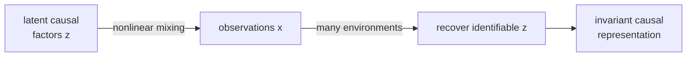

Deep learning models extract representations from data. But which representations
correspond to *causal factors* of variation? If a model learns the true causal
structure of the world, it should generalize under distribution shift in a way that
purely associational models do not. **Causal representation learning** formalizes
this idea and asks when causal structure can be recovered from data<FN n="1" />.

## The core problem

Standard representation learning finds $f$ such that $z = f(x)$ is useful for
downstream tasks. The learned $z$ may be arbitrarily entangled: it might mix
causal factors with their effects, or correlate features that happen to co-vary
in the training distribution.

Two causal problems this creates:

1. **Distribution shift.** Models trained on $P_{\text{train}}$ fail on $P_{\text{test}}$
   if the shift reflects a causal intervention not seen during training.
2. **Spurious correlations.** Associations that hold in training may break at test
   time (e.g., "grass is green" → "this is a cow" holds at farms but not in zoos).

## The principle of independent causal mechanisms

The **ICM principle** (Peters, Schölkopf et al.) states that causal generative
processes consist of autonomous mechanisms. Each mechanism $p(X_i \mid \mathrm{Pa}(X_i))$
can change independently of the others.

Two consequences:

- **Sparse interventions.** Natural interventions (policy changes, environmental
  shifts) typically change only one or a few mechanisms.
- **Invariance.** The mechanism $p(Y \mid \mathrm{causes}(Y))$ is stable across
  environments even when $p(\mathrm{causes}(Y))$ changes.

## Invariant risk minimization (IRM)

Standard ERM minimizes average loss across all training environments. **IRM**
(Arjovsky et al., 2019) seeks a representation $\Phi(x)$ such that the optimal
classifier on top of $\Phi$ is the *same* in all environments:

$$
\min_\Phi \sum_e \mathcal{R}_e(\Phi) \quad \text{s.t.} \quad \Phi \in \arg\min_w \mathcal{R}_e(w \circ \Phi) \; \forall e.
$$

Features that are causally invariant across environments satisfy the constraint;
spurious correlates do not.

**Practical relaxation (IRMv1):**

$$
\min_\Phi \sum_e \mathcal{R}_e(\Phi) + \lambda \left\|\nabla_{w \mid w=1} \mathcal{R}_e(w \circ \Phi)\right\|^2.
$$

The penalty forces $w = 1$ to be a stationary point in every environment, promoting
invariant features.

## Sparse mechanism shift

The **sparse mechanism shift (SMS)** hypothesis (Schölkopf et al., 2021):
when the distribution shifts from one environment to another, only a sparse subset
of causal mechanisms changes<FN n="1" />. This motivates:

1. **Causal discovery:** identify the SCM from multi-environment data by finding
   the sparsest set of mechanisms that differ across environments.
2. **Domain adaptation:** adapt only the changed mechanisms, reusing the rest.

## Nonlinear ICA and identifiability

Classical ICA (pillar F) recovers independent sources from linear mixtures but is
not identifiable for nonlinear mixtures. **Nonlinear ICA** (Hyvärinen and Morioka;
Khemakhem et al., iVAE) shows that with auxiliary variables $u$ (e.g., environment
labels or time) that modulate the source distributions, the latent causal factors
are identifiable up to element-wise transformations:

$$
x = f(z), \quad p(z \mid u) = \prod_k p_k(z_k \mid u).
$$

This ties representation learning directly to causal identifiability: auxiliary
information (environment, context) makes the latent causal factors recoverable.



## Implementation

```python-static
import numpy as np
from sklearn.linear_model import LinearRegression

rng = np.random.default_rng(0)

# Simulate two environments with sparse mechanism shift
# SCM: X -> Y, env shifts p(X) but not p(Y|X)
def generate_env(n, beta_xy, beta_x_mean, noise_scale=1.0, seed=0):
    rng_e = np.random.default_rng(seed)
    X = rng_e.normal(beta_x_mean, 1.0, n)   # mechanism p(X) differs
    Y = beta_xy * X + rng_e.normal(0, noise_scale, n)  # p(Y|X) fixed
    S = 0.5 * Y + rng_e.normal(0, 0.3, n)  # spurious: S correlates with Y via shared cause
    return X, Y, S

n = 500
X1, Y1, S1 = generate_env(n, beta_xy=2.0, beta_x_mean=0.0, seed=1)
X2, Y2, S2 = generate_env(n, beta_xy=2.0, beta_x_mean=2.0, seed=2)   # p(X) shifts

# Model A: use X (causal feature)
# Model B: use S (spurious feature)
def mse(pred, true):
    return ((pred - true)**2).mean()

# Train on env1, test on env2
X_feat1 = X1.reshape(-1,1)
S_feat1 = S1.reshape(-1,1)
model_X = LinearRegression().fit(X_feat1, Y1)
model_S = LinearRegression().fit(S_feat1, Y1)

mse_X_e1 = mse(model_X.predict(X1.reshape(-1,1)), Y1)
mse_S_e1 = mse(model_S.predict(S1.reshape(-1,1)), Y1)
mse_X_e2 = mse(model_X.predict(X2.reshape(-1,1)), Y2)
mse_S_e2 = mse(model_S.predict(S2.reshape(-1,1)), Y2)

print(f"{'':20} {'Env 1 (train)':>15} {'Env 2 (test)':>15}")
print(f"{'Causal (X)':20} {mse_X_e1:>15.4f} {mse_X_e2:>15.4f}")
print(f"{'Spurious (S)':20} {mse_S_e1:>15.4f} {mse_S_e2:>15.4f}")
print(f"\nCausal feature coefficient: {model_X.coef_[0]:.4f}  (true: 2.0)")
print(f"Spurious feature is stable: no, its correlation with Y changes across envs")
```

The causal model (using $X$) has stable test error across environments; the
spurious model (using $S$) has low training error but higher test error when the
distribution shifts, demonstrating why causal features generalize and spurious
correlates do not.

This lesson closes pillar B. The causal inference thread connects forward to
pillar F (probabilistic graphical models and VI/MCMC) and backward to pillar A
(probability, information theory) through the language of conditional independence
and graphical structure.

<Footnotes>
  <FNItem n="1">**Schölkopf, B., Locatello, F., Bauer, S., Ke, N. R., Kalchbrenner, N., Goyal, A., & Bengio, Y.** (2021). "Toward causal representation learning". *Proceedings of the IEEE*, 109(5), 612-634. The survey that frames independent causal mechanisms, the sparse mechanism shift hypothesis, and identifiability of causal factors ([doi:10.1109/JPROC.2021.3058954](https://doi.org/10.1109/JPROC.2021.3058954)).</FNItem>
</Footnotes>
