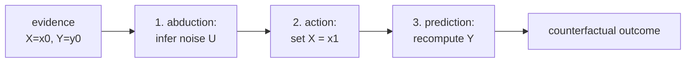

Interventional queries ask: what would happen to a random person if we set
$X = x$? Counterfactual queries are more specific: given that *this particular
person* had $X = x_0$ and outcome $Y = y_0$, what would their outcome have been
under $X = x_1$?

Counterfactuals require reasoning about an individual, not a population average.
The structural causal model provides exactly the machinery to answer them.

## Three levels of causal reasoning

Pearl's **causal hierarchy** distinguishes three types of query<FN n="1" />:

1. **Association** (seeing): $P(Y \mid X = x)$. What is $Y$ for units with $X = x$?
2. **Intervention** (doing): $P(Y \mid do(X = x))$. What happens to $Y$ if we force $X = x$?
3. **Counterfactual** (imagining): $P(Y_{X=x_1} \mid X = x_0, Y = y_0)$. For a unit that had $(X = x_0, Y = y_0)$, what would $Y$ have been under $X = x_1$?

Each level is strictly more informative than the one above it. Observational data
alone cannot answer counterfactual questions without a causal model.

## The three-step procedure

Given an SCM $\mathcal{M}$ and evidence $E = (X_1 = x_1^{\text{obs}}, \ldots)$:

**Step 1 (Abduction).** Update the distribution over exogenous variables $U$ given
the observed evidence:

$$
P(U \mid E = e).
$$

For linear SCMs with deterministic noise, this uniquely pins down $U$ from the
observations.

**Step 2 (Action).** Modify the SCM to $\mathcal{M}_{do(X=x)}$ (remove the
structural equation for $X$, replace with $X = x$).

**Step 3 (Prediction).** Compute $Y$ in the modified SCM $\mathcal{M}_{do(X=x)}$
using the updated $U$ from Step 1.

The result is the **counterfactual outcome** $Y_{X=x}$ for the individual
characterized by evidence $E$<FN n="2" />.

## Example: linear SCM

Consider:

$$
U_X, U_Y \sim \mathcal{N}(0, 1) \quad (\text{independent}),
$$

$$
X = U_X, \quad Y = 2X + U_Y.
$$

**Observation:** $(X = 1, Y = 3)$. Note: $U_X = 1$ (pinned), $U_Y = Y - 2X = 3 - 2 = 1$ (pinned).

**Counterfactual query:** $Y_{X=0}$?

- Step 1: $U_X = 1$, $U_Y = 1$ (abduced from the observation).
- Step 2: modify to $X = 0$.
- Step 3: $Y_{X=0} = 2 \cdot 0 + U_Y = 2 \cdot 0 + 1 = 1$.

The individual treatment effect is $Y_{X=1} - Y_{X=0} = 3 - 1 = 2$, matching the
true structural coefficient.

## Necessity and sufficiency

Counterfactuals underlie two further causal quantities:

- **Probability of necessity (PN):** $P(Y_{X=0} = 0 \mid X=1, Y=1)$. Given that the
  treatment occurred and the outcome occurred, would removing the treatment have
  prevented the outcome?
- **Probability of sufficiency (PS):** $P(Y_{X=1} = 1 \mid X=0, Y=0)$. Given that
  neither occurred, would the treatment have caused the outcome?

These are relevant for legal causation ("but for" causation) and clinical attribution.



## Implementation

```python
import numpy as np

rng = np.random.default_rng(0)
n = 1000

# SCM: C -> X, X -> Y, C -> Y  (C is latent)
# X = a*C + U_X, Y = b*X + c*C + U_Y
a, b, c = 1.0, 2.0, 0.5
U_C = rng.normal(0, 1, n)   # latent confounder
U_X = rng.normal(0, 1, n)
U_Y = rng.normal(0, 0.5, n)

C_obs = U_C
X_obs = a * C_obs + U_X
Y_obs = b * X_obs + c * C_obs + U_Y

# For each unit, observe (X_obs, Y_obs). Counterfactual: what if X had been 0?
# Step 1: Abduction -- back out U_X and U_Y from observations
# (C is latent, so we need to assume C distribution or we can only get E[Y_{X=0}|X,Y])

# For LINEAR SCM with observable C: fully identified
# U_X = X - a*C, U_Y = Y - b*X - c*C
U_X_abduced = X_obs - a * C_obs  # if C were observed
U_Y_abduced = Y_obs - b * X_obs - c * C_obs

# Step 2: action: set X = 0
X_cf = 0.0

# Step 3: prediction
Y_cf = b * X_cf + c * C_obs + U_Y_abduced

# Individual treatment effects
ite = Y_obs - Y_cf
ate_cf = ite.mean()
ate_do = b * (1.0 - 0.0)  # E[Y|do(X=1)] - E[Y|do(X=0)] = b*1 - b*0 = b

print(f"True b (causal effect per unit X): {b}")
print(f"E[ITE] = E[Y(X) - Y(0)]: {ate_cf:.4f}  (approx b * E[X] = {b*X_obs.mean():.4f})")
print(f"Interventional ATE (do(X) - do(0)): {ate_do:.4f}")

# Distribution of ITE: not all units have the same effect (heterogeneity possible)
print(f"Std of ITE: {ite.std():.4f}  (variation across units)")
```

Even with a constant structural coefficient $b=2$, the ITE varies across units
because $X_{\text{obs}}$ differs, and we are asking $Y_i(X_{\text{obs},i}) - Y_i(0)$.

## Exercises

**Exercise 1.** Use the linear SCM from the lesson, $X = U_X$, $Y = 2X + U_Y$ with
$U_X, U_Y \sim \mathcal{N}(0,1)$ independent. A unit is observed at
$(X = 2, Y = 5)$. Compute the counterfactual outcome $Y_{X=-1}$ for this unit by
the three-step procedure, and report its individual treatment effect relative to
the observed outcome.

<details>
<summary>Solution</summary>

**Step 1 (Abduction).** The noise is pinned by the observation. From $X = U_X$,
$U_X = 2$. From $Y = 2X + U_Y$, $U_Y = Y - 2X = 5 - 2 \cdot 2 = 1$.

**Step 2 (Action).** Replace the equation for $X$ with $X = -1$, keeping the
equation $Y = 2X + U_Y$ and the abduced $U_Y = 1$.

**Step 3 (Prediction).** Recompute $Y$ with the modified $X$ and the same noise:

$$
Y_{X=-1} = 2 \cdot (-1) + U_Y = -2 + 1 = -1.
$$

The individual treatment effect relative to the observed outcome is
$Y_{X=2} - Y_{X=-1} = 5 - (-1) = 6$. This equals the structural coefficient times
the change in $X$: $2 \cdot (2 - (-1)) = 2 \cdot 3 = 6$, as a linear SCM requires.

</details>

**Exercise 2.** Pearl's hierarchy ranks association, intervention, and
counterfactual as strictly increasing in information. Give a single SCM on which
two distinct structural models agree on every interventional distribution
$P(Y \mid do(X))$ yet disagree on a counterfactual. Explain why this proves a
counterfactual cannot be deduced from interventional data alone.

<details>
<summary>Solution</summary>

**Step 1.** Take a binary $X$ and binary $Y$ with no confounding, so
$P(Y \mid do(X=x)) = P(Y \mid X=x)$ is fixed by the data. Suppose intervention
gives $P(Y=1 \mid do(X=0)) = 0.5$ and $P(Y=1 \mid do(X=1)) = 0.5$: the treatment
changes nothing on average.

**Step 2.** Model A: $Y = U$ with $U \sim \text{Bernoulli}(0.5)$ independent of
$X$, so $Y$ ignores $X$. Every unit has $Y_{X=0} = Y_{X=1}$: the treatment never
flips the outcome.

**Step 3.** Model B: $Y = X \oplus U$ (exclusive-or) with the same
$U \sim \text{Bernoulli}(0.5)$. Then $P(Y=1 \mid do(X=x)) = 0.5$ for both $x$, so
B matches A on every intervention. But here every unit has
$Y_{X=1} = 1 - Y_{X=0}$: the treatment always flips the outcome.

**Step 4.** The counterfactual probability of necessity
$P(Y_{X=0} = 0 \mid X=1, Y=1)$ is $0$ under model A and $1$ under model B, yet the
two models are indistinguishable at the interventional level. Counterfactuals
depend on the joint behaviour of $Y$ across hypothetical values of $X$ for the
same noise draw, which interventional marginals never reveal.

</details>

**Exercise 3 (code).** For the lesson's confounded SCM
($C \to X$, $C \to Y$, $X \to Y$ with $X = aC + U_X$, $Y = bX + cC + U_Y$,
$a=1, b=2, c=0.5$, $C$ observed), simulate $n = 20000$ units, abduce the noise
for each, and verify that the mean individual treatment effect for the
counterfactual "set $X = 0$" equals the structural coefficient $b$ times the mean
observed $X$, within tolerance. Confirm the per-unit ITE equals $b \cdot X_i$
exactly.

<details>
<summary>Solution</summary>

```python
import numpy as np

rng = np.random.default_rng(0)
n = 20000
a, b, c = 1.0, 2.0, 0.5

U_C = rng.normal(0, 1, n)
U_X = rng.normal(0, 1, n)
U_Y = rng.normal(0, 0.5, n)

C = U_C
X = a * C + U_X
Y = b * X + c * C + U_Y

# Abduction: with C observed the noise is pinned exactly
U_X_ab = X - a * C
U_Y_ab = Y - b * X - c * C

# Action + prediction: set X = 0, reuse abduced noise and observed C
Y_cf = b * 0.0 + c * C + U_Y_ab
ite = Y - Y_cf

# Per-unit ITE is exactly b * X_i (the c*C and U_Y terms cancel)
assert np.allclose(ite, b * X)
assert np.isclose(ite.mean(), b * X.mean(), atol=1e-9)
print(round(ite.mean(), 4), round(b * X.mean(), 4))
```

The per-unit ITE is $Y_i - Y_{i,X=0} = (bX_i + cC_i + U_{Y,i}) - (cC_i + U_{Y,i})
= bX_i$, so the confounder and noise cancel and the assertions hold to machine
precision.

</details>

The next lesson leaves the SCM framework and turns to propensity scores: a
practical strategy for estimating causal effects from observational data when
confounders are measured but the SCM is unknown.

<Footnotes>
  <FNItem n="1">**Pearl, J.** (2009). *Causality: Models, Reasoning, and Inference* (2nd ed.). Cambridge University Press. Defines the ladder of causation and the abduction/action/prediction procedure for counterfactuals.</FNItem>
  <FNItem n="2">**Pearl, J., Glymour, M., & Jewell, N. P.** (2016). *Causal Inference in Statistics: A Primer.* Wiley. Worked counterfactual computations in structural equation models, with probability of necessity and sufficiency.</FNItem>
</Footnotes>
