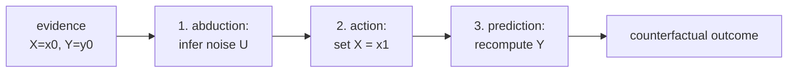

Interventional queries ask: what would happen to a random person if we set
$X = x$? Counterfactual queries are more specific: given that *this particular
person* had $X = x_0$ and outcome $Y = y_0$, what would their outcome have been
under $X = x_1$?

Counterfactuals require reasoning about an individual, not a population average.
The structural causal model provides exactly the machinery to answer them.

## Three levels of causal reasoning

Pearl's **causal hierarchy** distinguishes three types of query<FN n="1" />:

1. **Association** (seeing): $P(Y \mid X = x)$. What is $Y$ for units with $X = x$?
2. **Intervention** (doing): $P(Y \mid do(X = x))$. What happens to $Y$ if we force $X = x$?
3. **Counterfactual** (imagining): $P(Y_{X=x_1} \mid X = x_0, Y = y_0)$. For a unit that had $(X = x_0, Y = y_0)$, what would $Y$ have been under $X = x_1$?

Each level is strictly more informative than the one above it. Observational data
alone cannot answer counterfactual questions without a causal model.

## The three-step procedure

Given an SCM $\mathcal{M}$ and evidence $E = (X_1 = x_1^{\text{obs}}, \ldots)$:

**Step 1 (Abduction).** Update the distribution over exogenous variables $U$ given
the observed evidence:

$$
P(U \mid E = e).
$$

For linear SCMs with deterministic noise, this uniquely pins down $U$ from the
observations.

**Step 2 (Action).** Modify the SCM to $\mathcal{M}_{do(X=x)}$ (remove the
structural equation for $X$, replace with $X = x$).

**Step 3 (Prediction).** Compute $Y$ in the modified SCM $\mathcal{M}_{do(X=x)}$
using the updated $U$ from Step 1.

The result is the **counterfactual outcome** $Y_{X=x}$ for the individual
characterized by evidence $E$<FN n="2" />.

## Example: linear SCM

Consider:

$$
U_X, U_Y \sim \mathcal{N}(0, 1) \quad (\text{independent}),
$$

$$
X = U_X, \quad Y = 2X + U_Y.
$$

**Observation:** $(X = 1, Y = 3)$. Note: $U_X = 1$ (pinned), $U_Y = Y - 2X = 3 - 2 = 1$ (pinned).

**Counterfactual query:** $Y_{X=0}$?

- Step 1: $U_X = 1$, $U_Y = 1$ (abduced from the observation).
- Step 2: modify to $X = 0$.
- Step 3: $Y_{X=0} = 2 \cdot 0 + U_Y = 2 \cdot 0 + 1 = 1$.

The individual treatment effect is $Y_{X=1} - Y_{X=0} = 3 - 1 = 2$, matching the
true structural coefficient.

## Necessity and sufficiency

Counterfactuals underlie two further causal quantities:

- **Probability of necessity (PN):** $P(Y_{X=0} = 0 \mid X=1, Y=1)$. Given that the
  treatment occurred and the outcome occurred, would removing the treatment have
  prevented the outcome?
- **Probability of sufficiency (PS):** $P(Y_{X=1} = 1 \mid X=0, Y=0)$. Given that
  neither occurred, would the treatment have caused the outcome?

These are relevant for legal causation ("but for" causation) and clinical attribution.



## Implementation

```python
import numpy as np

rng = np.random.default_rng(0)
n = 1000

# SCM: C -> X, X -> Y, C -> Y  (C is latent)
# X = a*C + U_X, Y = b*X + c*C + U_Y
a, b, c = 1.0, 2.0, 0.5
U_C = rng.normal(0, 1, n)   # latent confounder
U_X = rng.normal(0, 1, n)
U_Y = rng.normal(0, 0.5, n)

C_obs = U_C
X_obs = a * C_obs + U_X
Y_obs = b * X_obs + c * C_obs + U_Y

# For each unit, observe (X_obs, Y_obs). Counterfactual: what if X had been 0?
# Step 1: Abduction -- back out U_X and U_Y from observations
# (C is latent, so we need to assume C distribution or we can only get E[Y_{X=0}|X,Y])

# For LINEAR SCM with observable C: fully identified
# U_X = X - a*C, U_Y = Y - b*X - c*C
U_X_abduced = X_obs - a * C_obs  # if C were observed
U_Y_abduced = Y_obs - b * X_obs - c * C_obs

# Step 2: action: set X = 0
X_cf = 0.0

# Step 3: prediction
Y_cf = b * X_cf + c * C_obs + U_Y_abduced

# Individual treatment effects
ite = Y_obs - Y_cf
ate_cf = ite.mean()
ate_do = b * (1.0 - 0.0)  # E[Y|do(X=1)] - E[Y|do(X=0)] = b*1 - b*0 = b

print(f"True b (causal effect per unit X): {b}")
print(f"E[ITE] = E[Y(X) - Y(0)]: {ate_cf:.4f}  (approx b * E[X] = {b*X_obs.mean():.4f})")
print(f"Interventional ATE (do(X) - do(0)): {ate_do:.4f}")

# Distribution of ITE: not all units have the same effect (heterogeneity possible)
print(f"Std of ITE: {ite.std():.4f}  (variation across units)")
```

Even with a constant structural coefficient $b=2$, the ITE varies across units
because $X_{\text{obs}}$ differs, and we are asking $Y_i(X_{\text{obs},i}) - Y_i(0)$.

The next lesson leaves the SCM framework and turns to propensity scores: a
practical strategy for estimating causal effects from observational data when
confounders are measured but the SCM is unknown.

<Footnotes>
  <FNItem n="1">**Pearl, J.** (2009). *Causality: Models, Reasoning, and Inference* (2nd ed.). Cambridge University Press. Defines the ladder of causation and the abduction/action/prediction procedure for counterfactuals.</FNItem>
  <FNItem n="2">**Pearl, J., Glymour, M., & Jewell, N. P.** (2016). *Causal Inference in Statistics: A Primer.* Wiley. Worked counterfactual computations in structural equation models, with probability of necessity and sufficiency.</FNItem>
</Footnotes>
