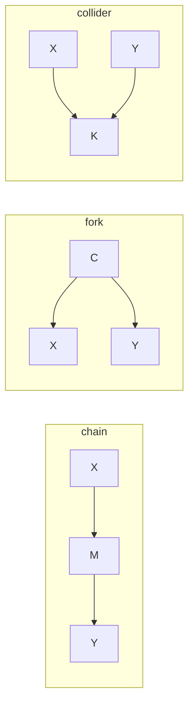

A DAG encodes not only causal structure but also conditional independence. Two
variables are **d-separated** by a set $Z$ in the DAG if every path between them is
blocked by $Z$. D-separation reads independence directly from the graph without
computing a single correlation.

## Paths and blocking

A **path** between $X$ and $Y$ is any sequence of nodes connected by edges
(ignoring direction). A path can transmit statistical dependence unless it is
**blocked** at some node.

Three fundamental path patterns determine whether a node blocks or opens a path.

### Chain: $X \to M \to Y$

Conditioning on $M$ blocks the path: $X \perp Y \mid M$. The mediator $M$ carries
all information from $X$ to $Y$; once $M$ is known, $X$ adds nothing.

Without conditioning, the path is open and $X$ and $Y$ are dependent.

### Fork: $X \leftarrow C \rightarrow Y$

The common cause $C$ creates a dependency between $X$ and $Y$. Conditioning on $C$
blocks the path: $X \perp Y \mid C$. This is the key confounding structure:
$C$ is the confounder; controlling for $C$ removes the spurious association.

Without conditioning, the path is open (confounding).

### Collider: $X \rightarrow K \leftarrow Y$

$K$ is a **collider** on the path: both arrows point into $K$. Without conditioning,
this path is **blocked**: $X \perp Y$ (marginally). Conditioning on $K$ **opens**
the path: $X$ and $Y$ become dependent given $K$.

Collider bias (also called selection bias) is a frequent source of spurious
associations: conditioning on a consequence of both $X$ and $Y$ induces correlation
even when $X$ and $Y$ are causally unrelated.

## D-separation rule

A path between $X$ and $Y$ is **blocked by $Z$** if at least one of:

1. The path contains a non-collider (chain or fork node) $M \in Z$.
2. The path contains a collider $K$, and neither $K$ nor any descendant of $K$ is in $Z$.

$X$ and $Y$ are **d-separated** by $Z$ if every path between them is blocked by $Z$.
D-separation implies conditional independence in any distribution faithful to the DAG.

## Example

Consider: $A \to B \leftarrow C \to D$.

- $A$ and $D$: the path $A \to B \leftarrow C \to D$ has collider $B$. Without conditioning, $B$ blocks the path, so $A \perp D$ marginally.
- $A$ and $D$ given $B$: conditioning on collider $B$ opens $A \to B \leftarrow C \to D$, and $C \to D$ is now open since $C$ is not in $Z$. So $A \not\perp D \mid B$.
- $A$ and $D$ given $\{B, C\}$: conditioning on $C$ (a non-collider on the opened path) blocks $C \to D$. So $A \perp D \mid \{B, C\}$.

## Backdoor paths and adjustment

A **backdoor path** from treatment $X$ to outcome $Y$ is a path that enters $X$
via an incoming arrow (begins with $\leftarrow X$). These paths create confounding.

The **backdoor criterion**: a set $Z$ satisfies the backdoor criterion if it blocks
all backdoor paths from $X$ to $Y$ and contains no descendant of $X$. Conditioning
on $Z$ then identifies the causal effect.



## Implementation

```python
import numpy as np
from itertools import product

rng = np.random.default_rng(0)
n = 5000

# DAG: C -> X, C -> Y, X -> Y  (classic confounding)
C = rng.normal(0, 1, n)
X = C + rng.normal(0, 1, n)
Y = 2*X + C + rng.normal(0, 1, n)

def corr(a, b):
    return np.corrcoef(a, b)[0, 1]

def partial_corr(a, b, controls):
    from numpy.linalg import lstsq
    def resid(x, z):
        coef, *_ = lstsq(np.column_stack([np.ones(len(z)), z]), x, rcond=None)
        return x - coef[0] - z @ coef[1:]
    ar = resid(a, controls)
    br = resid(b, controls)
    return np.corrcoef(ar, br)[0, 1]

# Fork: C -> X, C -> Y
print("Fork (C -> X, C -> Y):")
print(f"  Corr(X, Y)       = {corr(X, Y):.3f}  (open path)")
print(f"  PartialCorr(X,Y|C) = {partial_corr(X, Y, C.reshape(-1,1)):.3f}  (should not be 0: X->Y direct)")

# Collider: build A -> K <- B (A and B independent)
A = rng.normal(0, 1, n)
B = rng.normal(0, 1, n)
K = A + B + rng.normal(0, 0.1, n)   # collider
print("\nCollider (A -> K <- B):")
print(f"  Corr(A, B)       = {corr(A, B):.3f}  (blocked: ~0)")
print(f"  PartialCorr(A,B|K) = {partial_corr(A, B, K.reshape(-1,1)):.3f}  (opened by conditioning: ~nonzero)")
```

The collider result shows: $A$ and $B$ are nearly uncorrelated marginally but become
correlated after conditioning on the collider $K$.

The next lesson introduces the do-operator and do-calculus, which use d-separation
to derive when and how causal effects can be identified from observational data.
