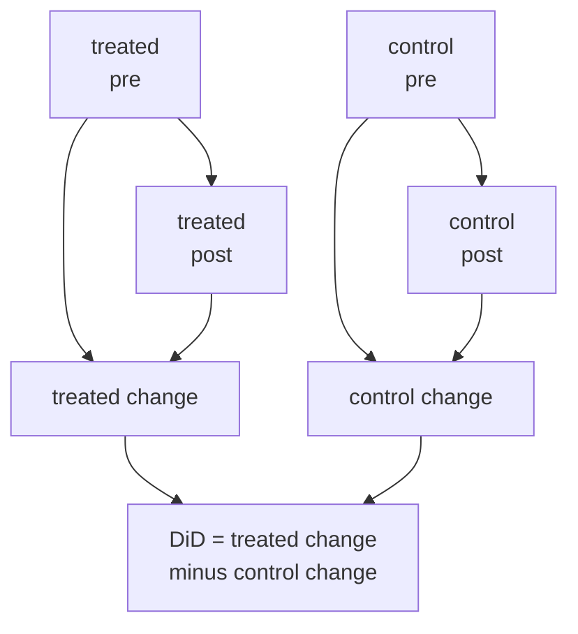

You have panel data: multiple units observed before and after some units are
treated. **Difference-in-differences** (DiD) subtracts pre-treatment trends to
isolate the treatment effect, under the assumption that treated and control units
would have followed the same trend absent treatment.

## The DiD setup

Two groups: **treated** ($W = 1$) and **control** ($W = 0$). Two periods:
**pre** ($t = 0$) and **post** ($t = 1$). Treatment occurs between periods 0 and 1
for the treated group only.

**Parallel trends assumption:** absent treatment, the change in the outcome for
treated units would equal the change for control units<FN n="1" />.

Under this assumption, the ATT estimator is:

$$
\hat\tau_{\mathrm{DiD}} = \underbrace{(\bar Y_{1,1} - \bar Y_{1,0})}_{\text{treated change}} - \underbrace{(\bar Y_{0,1} - \bar Y_{0,0})}_{\text{control change}},
$$

where $\bar Y_{w,t}$ is the mean outcome for group $w$ in period $t$.

**Interpretation.** The first difference removes within-unit time trends (things
that changed for everyone). The second difference (subtracting the control trend)
removes common time effects.

A concrete 2x2 makes the two subtractions visible and shows why the naive
before-after number misleads. Take the Card-Krueger setting: full-time-equivalent
employment per fast-food store, with New Jersey (treated, it raised the minimum
wage) and Pennsylvania (control, it did not).

- **Treated, pre:** $\bar Y_{1,0} = 20.0$ FTE. **Treated, post:** $\bar Y_{1,1} = 21.0$.
- **Control, pre:** $\bar Y_{0,0} = 23.0$. **Control, post:** $\bar Y_{0,1} = 22.0$.

A naive analyst looks only at the treated group and reports a $+1.0$ change, then
worries the minimum wage barely moved employment. But control employment fell by
$1.0$ over the same window, a common shock (a regional downturn) that would have
hit New Jersey too. The DiD nets it out: $\hat\tau_{\mathrm{DiD}} = (21.0 - 20.0) -
(22.0 - 23.0) = 1.0 - (-1.0) = 2.0$. The treatment added 2.0 FTE relative to the
shared trend, double the naive figure, because the naive figure silently charged
the regional downturn against the policy.

## OLS implementation

DiD is equivalent to OLS with an interaction term:

$$
Y_{it} = \alpha + \beta W_i + \gamma t + \delta (W_i \cdot t) + \varepsilon_{it},
$$

where $\delta = \hat\tau_{\mathrm{DiD}}$ is the coefficient on the treated-post
interaction. Including unit fixed effects ($\alpha_i$) and time fixed effects ($\gamma_t$)
extends DiD to multiple periods and multiple treated cohorts.

## Parallel trends: testing and violations

The parallel trends assumption is untestable at the treatment time (the counterfactual
trend is never observed). However, **pre-trends tests** check whether treated and
control units had parallel trends in pre-treatment periods. A statistically significant
pre-trend is evidence against the assumption.

## Synthetic control (Abadie, Diamond, Hainmueller, 2010)<FN n="2" />

When there is only one treated unit (a country, a state), DiD requires finding a
single control unit with a parallel trend, which may not exist. The **synthetic
control** constructs a weighted average of donor (control) units whose pre-treatment
outcome trajectory matches the treated unit.

**Estimator:** Find weights $w_j \ge 0$, $\sum_j w_j = 1$, minimizing:

$$
\sum_{t < T_0} \left(Y_{1t} - \sum_j w_j Y_{jt}\right)^2.
$$

The treatment effect is:

$$
\hat\tau_t = Y_{1t} - \sum_j w_j Y_{jt} \quad \text{for } t \ge T_0.
$$

Inference uses **permutation tests**: apply the synthetic control to each donor
unit (as if it were treated) and compare the post-treatment gap to the treated unit's gap.



## Implementation

```python-static
import numpy as np
from scipy.optimize import minimize

rng = np.random.default_rng(0)

# DiD simulation: 2 groups, 2 periods
n = 200   # per group
pre_treat  = 5.0 + rng.normal(0, 1, n)
pre_ctrl   = 5.0 + rng.normal(0, 1, n)
true_ate   = 2.0
post_treat = pre_treat + 1.0 + true_ate + rng.normal(0, 1, n)  # common trend = 1.0
post_ctrl  = pre_ctrl  + 1.0 + rng.normal(0, 1, n)

did = (post_treat.mean() - pre_treat.mean()) - (post_ctrl.mean() - pre_ctrl.mean())
print(f"True ATT: {true_ate:.2f},  DiD estimate: {did:.4f}")

# Synthetic control: J=5 donors, T=20 pre-periods, 10 post-periods
T_pre, T_post, J = 20, 10, 5
T = T_pre + T_post
# Treated: true outcome = 5 + time trend + noise
time = np.arange(T)
y_true    = 5 + 0.1 * time + rng.normal(0, 0.3, T)
y_treat   = y_true.copy()
y_treat[T_pre:] += 2.0   # true effect = 2 post-treatment

# Donor units: similar trends, different levels
donors = [3 + (0.1 + rng.normal(0, 0.05)) * time + rng.normal(0, 0.3, T) for _ in range(J)]
donors = np.array(donors)   # (J, T)

# Minimize pre-treatment fit
Y_pre = donors[:, :T_pre]   # (J, T_pre)
y_pre = y_treat[:T_pre]
def objective(w):
    return np.sum((y_pre - w @ Y_pre)**2)
constraints = [{'type': 'eq', 'fun': lambda w: w.sum() - 1}]
bounds = [(0, 1)] * J
w0 = np.ones(J) / J
res = minimize(objective, w0, method='SLSQP', bounds=bounds, constraints=constraints)
w_opt = res.x

synth_post = w_opt @ donors[:, T_pre:]
effect = y_treat[T_pre:] - synth_post
print(f"\nSynthetic control estimated average effect: {effect.mean():.4f}  (true: 2.0)")
print(f"Optimal donor weights: {w_opt.round(3)}")
```

The synthetic control recovers the treatment effect of 2.0 by matching the pre-period
trajectory of the treated unit.

The next lesson introduces double/debiased ML, which uses the Frisch-Waugh-Lovell
theorem to handle high-dimensional confounders with flexible ML estimators.

<Footnotes>
  <FNItem n="1">**Card, D., & Krueger, A. B.** (1994). "Minimum wages and employment: a case study of the fast-food industry in New Jersey and Pennsylvania". *American Economic Review*, 84(4), 772-793. The canonical difference-in-differences study, using the parallel-trends design.</FNItem>
  <FNItem n="2">**Angrist, J. D., & Pischke, J.-S.** (2009). *Mostly Harmless Econometrics.* Princeton University Press. Derives the DiD estimator, its OLS interaction form, and pre-trends diagnostics.</FNItem>
</Footnotes>
