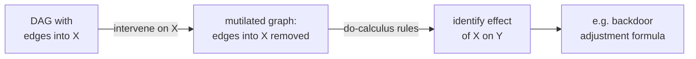

D-separation tells us what a DAG implies about conditional independence. The
**do-operator** formalizes causal intervention in that same language, and
**do-calculus** provides three inference rules that can transform interventional
expressions into observational ones when identification is possible.

## The do-operator

$P(Y \mid do(X=x))$ is the distribution of $Y$ when $X$ is set to $x$ by
intervention. In the SCM, this corresponds to removing all edges into $X$ and
computing the resulting distribution.

The key difference from conditioning:

$$
P(Y \mid X = x) \ne P(Y \mid do(X = x)),
$$

unless there is no confounding ($X$ is randomized or the DAG has no backdoor paths).

## The three rules of do-calculus<FN n="1" />

Let $G$ be the DAG, $\overline{X}$ the graph with incoming edges to $X$ removed
($do(X)$ graph), and $\underline{X}$ the graph with outgoing edges from $X$ removed.

**Rule 1 (Insertion/deletion of observations):**

$$
P(Y \mid do(X), Z, W) = P(Y \mid do(X), W) \quad \text{if } Y \perp_{G_{\overline{X}}} Z \mid X, W.
$$

**Rule 2 (Action/observation exchange):**

$$
P(Y \mid do(X), do(Z), W) = P(Y \mid do(X), Z, W) \quad \text{if } Y \perp_{G_{\overline{X}\underline{Z}}} Z \mid X, W.
$$

This rule allows replacing $do(Z)$ with an observation of $Z$ (or vice versa)
when the relevant independence holds.

**Rule 3 (Deletion of actions):**

$$
P(Y \mid do(X), do(Z), W) = P(Y \mid do(X), W) \quad \text{if } Y \perp_{G_{\overline{X}\overline{Z(W)}}} Z \mid X, W,
$$

where $Z(W)$ is the set of nodes in $Z$ that are not ancestors of any $W$-node.

The three rules are **complete**: any identifiable interventional distribution can
be derived from observational data using these rules alone<FN n="2" />.

## Backdoor adjustment

The **backdoor criterion** is the most common identification strategy.

**Theorem.** If $Z$ satisfies the backdoor criterion (blocks all backdoor paths from
$X$ to $Y$ and contains no descendant of $X$), then:

$$
P(Y \mid do(X=x)) = \sum_z P(Y \mid X=x, Z=z) P(Z=z).
$$

This is the **adjustment formula**: average the conditional distribution $P(Y \mid X, Z)$
over the distribution of $Z$. It generalizes ordinary conditioning.

## Frontdoor adjustment

When direct confounders are unobserved but all causal paths from $X$ to $Y$ go
through an observed mediator $M$ (the **frontdoor criterion**):

$$
P(Y \mid do(X=x)) = \sum_m P(M=m \mid X=x) \sum_{x'} P(Y \mid X=x', M=m) P(X=x').
$$

This identifies the causal effect without observing the confounder.



## Implementation

```python
import numpy as np

rng = np.random.default_rng(0)
n = 20000

# Backdoor: C -> X, C -> Y, X -> Y
C = rng.normal(0, 1, n)
X = (C + rng.normal(0, 1, n) > 0).astype(float)
Y = 2.0 * X + 1.5 * C + rng.normal(0, 0.5, n)   # true effect of X = 2.0

# Naive estimate (biased)
naive = Y[X==1].mean() - Y[X==0].mean()

# Backdoor adjustment: stratify on C (discretized)
C_bin = np.digitize(C, np.percentile(C, np.arange(0, 101, 10)))
ate_adj = 0.0
for b in range(1, 11):
    mask   = C_bin == b
    p_c    = mask.mean()
    eff_c  = Y[mask & (X==1)].mean() - Y[mask & (X==0)].mean()
    ate_adj += p_c * eff_c

print(f"True ATE:   2.0")
print(f"Naive ATE:  {naive:.4f}")
print(f"Backdoor adj ATE: {ate_adj:.4f}")

# Frontdoor: U -> X, X -> M -> Y, U -> Y  (U unobserved)
U = rng.normal(0, 1, n)
X2 = (0.8 * U + rng.normal(0, 1, n) > 0).astype(float)  # X confounded by U
M  = 1.5 * X2 + rng.normal(0, 0.5, n)             # mediator
Y2 = 2.0 * M + 0.8 * U + rng.normal(0, 0.5, n)   # Y confounded by U

# Frontdoor: sum_m P(M=m|X) * sum_x' P(Y|X',M) P(X')
# Discretize M
M_bin = np.digitize(M, np.percentile(M, np.arange(0, 101, 5)))
n_bins = M_bin.max()
p_x   = np.array([np.mean(X2==0), np.mean(X2==1)])
fd_ate = 0.0
for m in range(1, n_bins+1):
    p_m1 = np.mean(M_bin[X2==1] == m)
    p_m0 = np.mean(M_bin[X2==0] == m)
    inner = sum(
        (Y2[(M_bin==m) & (X2==xp)].mean() if np.any((M_bin==m) & (X2==xp)) else 0) * p_x[xp]
        for xp in [0, 1]
    )
    fd_ate += (p_m1 - p_m0) * inner

naive2 = Y2[X2==1].mean() - Y2[X2==0].mean()
print(f"\nFrontdoor (true effect X->M->Y: 1.5*2.0=3.0):")
print(f"Naive: {naive2:.4f}, Frontdoor adj: {fd_ate:.4f}")
```

The backdoor adjustment recovers 2.0 and the frontdoor formula recovers 3.0 from
observational data, without ever randomizing $X$.

The next lesson addresses counterfactual queries: given that unit $i$ received
treatment and had outcome $Y_i$, what would $Y_i$ have been under control?

<Footnotes>
  <FNItem n="1">**Pearl, J.** (2009). *Causality: Models, Reasoning, and Inference* (2nd ed.). Cambridge University Press. States and proves the three rules of do-calculus and the backdoor/frontdoor adjustment formulas.</FNItem>
  <FNItem n="2">**Pearl, J., Glymour, M., & Jewell, N. P.** (2016). *Causal Inference in Statistics: A Primer.* Wiley. Works through adjustment and identification with concrete graphs.</FNItem>
</Footnotes>
