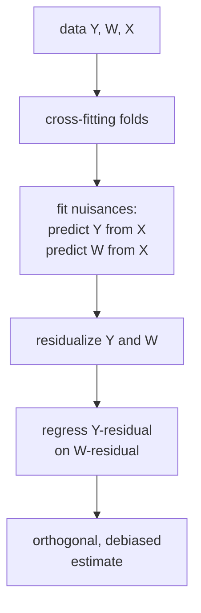

The partially linear model $Y = \theta W + g(X) + \varepsilon$ has a treatment
effect $\theta$ and a nonparametric nuisance function $g(X)$. OLS is biased when
$g$ is misspecified. Using a flexible ML estimator for $g$ introduces a **regularization
bias**: regularized estimators shrink coefficients, which biases $\hat\theta$.

**Double / debiased ML** (DML; Chernozhukov et al., 2018) removes this bias via
two orthogonalization steps and cross-fitting<FN n="1" />.

## The Frisch-Waugh-Lovell theorem

For OLS with multiple regressors, the FWL theorem says: the coefficient on $W$ in
$Y = \theta W + X\beta + \varepsilon$ equals the coefficient from regressing the
residual $\tilde Y$ (after projecting $Y$ on $X$) on the residual $\tilde W$
(after projecting $W$ on $X$):

$$
\hat\theta_{\mathrm{OLS}} = \frac{\mathrm{Cov}(\tilde Y, \tilde W)}{\mathrm{Var}(\tilde W)},
\quad \tilde Y = Y - X\hat\beta_Y, \quad \tilde W = W - X\hat\gamma_W.
$$

DML extends this to nonparametric $g$ and $m$ (the propensity model).

## The DML estimator

Let $\ell_0(X) = E[Y \mid X]$ be the outcome regression (nuisance) and
$m_0(X) = E[W \mid X]$ the treatment regression (propensity). Form residuals:

$$
\tilde Y = Y - \hat\ell(X), \quad \tilde W = W - \hat m(X).
$$

The DML estimator of $\theta$ is:

$$
\hat\theta_{\mathrm{DML}} = \frac{\frac{1}{n}\sum_i \tilde W_i \tilde Y_i}{\frac{1}{n}\sum_i \tilde W_i^2}.
$$

Under mild conditions, $\hat\theta_{\mathrm{DML}}$ is $\sqrt{n}$-consistent and
asymptotically normal even when $\hat\ell$ and $\hat m$ are estimated at slower
rates (e.g., $n^{-1/4}$ in high dimensions), and it achieves the semiparametric
efficiency bound<FN n="2" />.

## Cross-fitting

Plugging in $\hat\ell$ and $\hat m$ estimated on the same data as $\tilde Y$ and
$\tilde W$ induces a **regularization bias** of order $n^{-1/2}$ or slower.
**Cross-fitting** removes this by using out-of-sample predictions:

1. Split data into $K$ folds.
2. For each fold $k$: estimate $\hat\ell$ and $\hat m$ on the other $K-1$ folds.
3. Predict $\hat\ell(X_i)$ and $\hat m(X_i)$ for all $i$ in fold $k$.
4. Compute $\tilde Y_i$ and $\tilde W_i$ using these out-of-sample predictions.
5. Estimate $\theta$ on all $\tilde Y_i$, $\tilde W_i$.

Cross-fitting ensures that the residuals are independent of the estimated nuisance
functions, eliminating the regularization bias.

## Why "double"?

The name "double ML" comes from the two regressions: one for the outcome ($Y \sim X$)
and one for the treatment ($W \sim X$). Both must be flexible. Using a misspecified
nuisance in either step reintroduces bias.



## Implementation

```python-static
import numpy as np
from sklearn.ensemble import GradientBoostingRegressor
from sklearn.linear_model import LinearRegression
from sklearn.model_selection import KFold

rng = np.random.default_rng(0)
n, d = 500, 10
theta_true = 2.0

# Partially linear model: Y = theta*W + g(X) + e
X = rng.normal(0, 1, (n, d))
g = np.sin(X[:, 0]) + 0.5 * X[:, 1]**2      # nonlinear nuisance
m = 0.5 * X[:, 0] + 0.3 * X[:, 1]           # propensity
W = m + rng.normal(0, 0.5, n)
Y = theta_true * W + g + rng.normal(0, 0.5, n)

# Naive OLS (biased: misspecified g)
from sklearn.linear_model import LinearRegression as LR
Xw = np.column_stack([W, X])
theta_ols = LR().fit(Xw, Y).coef_[0]

# DML with cross-fitting (GBM nuisances)
K = 5
kf = KFold(n_splits=K, shuffle=True, random_state=0)
Y_tilde = np.zeros(n)
W_tilde = np.zeros(n)

for train_idx, val_idx in kf.split(X):
    # Outcome nuisance
    l_model = GradientBoostingRegressor(n_estimators=100, random_state=0)
    l_model.fit(X[train_idx], Y[train_idx])
    Y_tilde[val_idx] = Y[val_idx] - l_model.predict(X[val_idx])
    # Treatment nuisance
    m_model = GradientBoostingRegressor(n_estimators=100, random_state=0)
    m_model.fit(X[train_idx], W[train_idx])
    W_tilde[val_idx] = W[val_idx] - m_model.predict(X[val_idx])

theta_dml = (W_tilde * Y_tilde).mean() / (W_tilde**2).mean()

print(f"True theta: {theta_true}")
print(f"OLS theta:  {theta_ols:.4f}  (biased)")
print(f"DML theta:  {theta_dml:.4f}  (debiased)")
```

DML recovers the true $\theta = 2.0$ even though the nuisance function $g$ is
nonlinear and estimated with a gradient-boosted model.

## Exercises

**Exercise 1.** In the partially linear model $Y = \theta W + g(X) + \varepsilon$
with $\theta = 2$, suppose the residualized covariances come out to
$\frac{1}{n}\sum_i \tilde W_i \tilde Y_i = 1.8$ and
$\frac{1}{n}\sum_i \tilde W_i^2 = 0.9$. Compute the DML estimate of $\theta$ by
hand, and explain why it uses residualized quantities rather than raw $W$ and $Y$.

<details>
<summary>Solution</summary>

**Step 1.** The DML estimator is the ratio of the residual covariance to the
residual variance:

$$
\hat\theta_{\mathrm{DML}} = \frac{\frac{1}{n}\sum_i \tilde W_i \tilde Y_i}{\frac{1}{n}\sum_i \tilde W_i^2} = \frac{1.8}{0.9} = 2.
$$

**Step 2.** Residualizing $Y$ and $W$ against $X$ (subtracting $\hat\ell(X)$ and
$\hat m(X)$) strips out the part of each that the confounders $X$ explain. What
remains in $\tilde W$ is variation in treatment not driven by $X$, so regressing
$\tilde Y$ on $\tilde W$ isolates the treatment channel. Using raw $W$ and $Y$
would let the nuisance $g(X)$ leak into the coefficient.

</details>

**Exercise 2.** Prove the Frisch-Waugh-Lovell identity for linear regression: in
$Y = \theta W + X\beta + \varepsilon$, the OLS coefficient on $W$ equals
$\mathrm{Cov}(\tilde Y, \tilde W) / \mathrm{Var}(\tilde W)$, where $\tilde Y$ and
$\tilde W$ are the residuals of $Y$ and $W$ after projecting onto $X$.

<details>
<summary>Solution</summary>

**Step 1.** Let $P = X(X^\top X)^{-1}X^\top$ be the projection onto the column
space of $X$ and $M = I - P$ the residual-maker, so $\tilde Y = MY$ and
$\tilde W = MW$. $M$ is symmetric and idempotent ($M = M^\top$, $M^2 = M$) and
annihilates $X$, meaning $MX = 0$.

**Step 2.** Left-multiply the regression equation by $M$:

$$
MY = \theta\, MW + MX\beta + M\varepsilon = \theta\, MW + M\varepsilon,
$$

since $MX = 0$. This is a simple regression of $\tilde Y$ on $\tilde W$ with the
same slope $\theta$.

**Step 3.** The OLS slope of that simple regression is

$$
\hat\theta = \frac{\tilde W^\top \tilde Y}{\tilde W^\top \tilde W} = \frac{(MW)^\top (MY)}{(MW)^\top (MW)} = \frac{\mathrm{Cov}(\tilde Y, \tilde W)}{\mathrm{Var}(\tilde W)},
$$

using $M^\top M = M$ to fold the two projections into one. This is the FWL
identity, the linear special case of the DML moment.

</details>

**Exercise 3 (code).** Implement DML with linear nuisances and 2-fold
cross-fitting in numpy only (OLS via `np.linalg.lstsq`). On a partially linear
model with true $\theta = 2.0$ and a nonlinear $g(X)$, verify with a fixed seed
that naive OLS that ignores the nuisance (regressing $Y$ on $[1, W]$ alone) is
biased and that cross-fit DML lands within tolerance of $2.0$.

<details>
<summary>Solution</summary>

```python
import numpy as np

rng = np.random.default_rng(0)
n, d = 4000, 5
theta = 2.0

X = rng.normal(0, 1, (n, d))
g = np.sin(X[:, 0]) + 0.5 * X[:, 1]**2          # nonlinear nuisance
m = 0.5 * X[:, 0] + 0.3 * X[:, 1]               # propensity mean
W = m + rng.normal(0, 0.5, n)
Y = theta * W + g + rng.normal(0, 0.5, n)

# rich linear basis so a linear fit can approximate the nonlinear nuisance
B = np.column_stack([np.ones(n), X, X**2, np.sin(X[:, :1])])

def ols_predict(Btr, ytr, Bte):
    coef = np.linalg.lstsq(Btr, ytr, rcond=None)[0]
    return Bte @ coef

# naive OLS that ignores the nuisance: Y on [1, W] alone
naive = np.linalg.lstsq(np.column_stack([np.ones(n), W]), Y, rcond=None)[0][1]

# 2-fold cross-fitting
idx = rng.permutation(n)
folds = [idx[:n // 2], idx[n // 2:]]
Yt = np.zeros(n)
Wt = np.zeros(n)
for k in range(2):
    val = folds[k]
    tr = folds[1 - k]
    Yt[val] = Y[val] - ols_predict(B[tr], Y[tr], B[val])     # outcome residual
    Wt[val] = W[val] - ols_predict(B[tr], W[tr], B[val])     # treatment residual

theta_dml = (Wt * Yt).mean() / (Wt**2).mean()

assert abs(naive - theta) > 0.1        # ignoring the nuisance biases naive OLS
assert abs(theta_dml - theta) < 0.1    # cross-fit DML recovers the truth
print(f"naive {naive:.3f}, DML {theta_dml:.3f}")
```

The naive coefficient is pulled off $2.0$ because $W$ and the omitted $g(X)$ share
the covariates $X$, while residualizing both $Y$ and $W$ on the richer basis and
cross-fitting recovers $\theta$ within tolerance.

</details>

The next lesson uses similar ideas to estimate **heterogeneous** treatment effects:
the treatment effect as a function of unit characteristics.

<Footnotes>
  <FNItem n="1">**Chernozhukov, V., Chetverikov, D., Demirer, M., Duflo, E., Hansen, C., Newey, W., & Robins, J.** (2018). "Double/debiased machine learning for treatment and structural parameters". *The Econometrics Journal*, 21(1), C1-C68. Introduces Neyman-orthogonal scores and cross-fitting ([doi:10.1111/ectj.12097](https://doi.org/10.1111/ectj.12097)).</FNItem>
  <FNItem n="2">**Hernán, M. A., & Robins, J. M.** (2020). *Causal Inference: What If.* Chapman & Hall/CRC. Background on doubly robust and semiparametric-efficient estimation of treatment effects.</FNItem>
</Footnotes>
