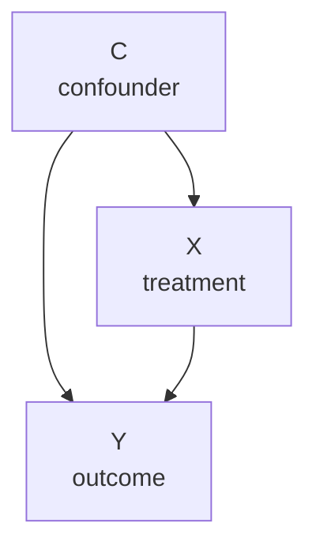

The potential outcomes framework is a calculus for causal effects. Structural causal
models (SCMs) provide a generative language for *why* those effects arise. An SCM
represents the data-generating mechanism as a directed acyclic graph (DAG) plus a
set of structural equations, one per variable.

## Structural causal model

An SCM $\mathcal{M}$ consists of<FN n="1" />:

1. **Endogenous variables** $V = \{V_1, \ldots, V_n\}$: the observed quantities.
2. **Exogenous variables** $U = \{U_1, \ldots, U_n\}$: independent background noise.
3. **Structural equations**: $V_i = f_i(\mathrm{Pa}(V_i), U_i)$, where
   $\mathrm{Pa}(V_i)$ are the direct causes (parents) of $V_i$ in the DAG.

Each equation describes how $V_i$ is generated from its causes and noise, not just
correlation.

**Example: education, experience, and salary.**

$$
E = f_E(U_E), \quad X = f_X(E, U_X), \quad S = f_S(E, X, U_S).
$$

Here education $E$ affects both experience $X$ and salary $S$; experience also
affects salary.

## The DAG

The DAG $G = (V, \mathcal{E})$ has a directed edge $V_i \to V_j$ if $V_i \in \mathrm{Pa}(V_j)$.
"Acyclic" means no variable is its own ancestor. The DAG encodes causal structure,
not statistical structure (correlations can arise via shared causes without direct edges).

**Vocabulary:**

- **Parent:** $V_i$ is a parent of $V_j$ if $V_i \to V_j$.
- **Ancestor:** $V_i$ is an ancestor of $V_j$ if there is a directed path $V_i \to \cdots \to V_j$.
- **Descendant:** $V_j$ is a descendant of $V_i$ if $V_i$ is an ancestor of $V_j$.
- **Confounder:** a common cause $C$ with $C \to V_i$ and $C \to V_j$.

## Intervention: the do-operator

In the observational distribution, conditioning on $V_i = v$ changes the distribution
over all variables by selecting a subpopulation. An **intervention** $do(V_i = v)$
instead *sets* $V_i = v$ by severing its incoming edges<FN n="2" />:

$$
do(V_i = v): \text{ replace } V_i = f_i(\mathrm{Pa}(V_i), U_i) \text{ with } V_i = v.
$$

The interventional distribution $P(V \mid do(V_i = v))$ is computed from the
**mutilated graph**: the original DAG with all edges into $V_i$ removed.

**Observation vs. intervention.** In the salary example:

$$
P(S \mid E = e) \ne P(S \mid do(E = e)).
$$

$P(S \mid E = e)$ conditions on a subpopulation with high $E$ (which may also have
higher $X$). $P(S \mid do(E = e))$ forcibly sets education for the whole population.

This gap is the named confusion at the heart of causal inference: a contrast
between two cars on a hill reads as the effect of pressing the accelerator, when
some of it is the hill. The closing code makes the size of the error visible on a
$C \to X \to Y$ graph where the true effect of $X$ on $Y$ is $2.0$. Comparing the
two treatment groups as they appear in the data (the conditional, naive contrast)
gives $3.24$, inflated because the confounder $C$ raises both the chance of
treatment and the outcome. Setting treatment by intervention, $do(X)$, severs the
$C \to X$ edge and recovers $1.98$. Reading the observational difference as a causal
effect overstates it here by more than 60%.

## Identification conditions

For the ATE to equal the naive difference in means, the potential outcomes framework
requires **ignorability** (unconfoundedness):

$$
(Y(0), Y(1)) \perp W \mid X.
$$

In the SCM/DAG language, this means: once $X$ is conditioned on, no open
back-door path connects $W$ to $Y$. The next lessons formalize this via d-separation.



## Implementation

```python
import numpy as np

rng = np.random.default_rng(0)
n = 2000

# SCM: C -> X, C -> Y, X -> Y
# C: confounder, X: treatment, Y: outcome
U_C = rng.normal(0, 1, n)
U_X = rng.normal(0, 1, n)
U_Y = rng.normal(0, 1, n)

C = U_C
X = 0.7 * C + U_X > 0     # binary treatment, P(X=1) increases with C
X = X.astype(float)
Y = 2.0 * X + 1.5 * C + U_Y  # true causal effect of X on Y is 2.0

# Observational distribution
naive_ate = Y[X==1].mean() - Y[X==0].mean()
print(f"Naive ATE: {naive_ate:.4f}  (true: 2.0)")

# Interventional: do(X=1) vs do(X=0) -- set X, break C->X edge
Y_do1 = 2.0 * 1 + 1.5 * C + rng.normal(0, 1, n)
Y_do0 = 2.0 * 0 + 1.5 * C + rng.normal(0, 1, n)
true_ate = (Y_do1 - Y_do0).mean()
print(f"Interventional ATE: {true_ate:.4f}")

# Conditional on C (adjusting for confounder)
bins = np.percentile(C, [0, 25, 50, 75, 100])
strata_ates = []
for lo, hi in zip(bins[:-1], bins[1:]):
    mask = (C >= lo) & (C < hi)
    eff  = Y[mask & (X==1)].mean() - Y[mask & (X==0)].mean()
    strata_ates.append(eff)
print(f"Stratified ATE:     {np.mean(strata_ates):.4f}  (adjusting for C)")
```

Conditioning on the confounder $C$ removes the selection bias and recovers the
true effect.

## Exercises

**Exercise 1.** In the SCM with structural equations $E = f_E(U_E)$,
$X = f_X(E, U_X)$, $S = f_S(E, X, U_S)$, list the parents of each variable, name
the confounder of the pair $(X, S)$, and state which edges the intervention
$do(E = e)$ removes.

<details>
<summary>Solution</summary>

**Step 1.** Read the parents straight off the equations: each $f_i$ takes the
direct causes as arguments. $E$ has no endogenous parents (only its noise $U_E$);
$X$ has parent $E$; $S$ has parents $E$ and $X$.

**Step 2.** A confounder of $(X, S)$ is a common cause with an edge into each.
Education $E$ satisfies $E \to X$ and $E \to S$, so $E$ confounds the $X \to S$
relationship.

**Step 3.** The do-operator severs all edges into the intervened variable. $E$
has no incoming edges from endogenous variables, so $do(E = e)$ removes only the
dependence on $U_E$ (the equation $E = f_E(U_E)$ is replaced by $E = e$); the
outgoing edges $E \to X$ and $E \to S$ stay.

</details>

**Exercise 2.** On the graph $C \to X$, $C \to Y$, $X \to Y$ from the lesson, the
naive contrast $E[Y\mid X=1] - E[Y\mid X=0]$ overstates the causal effect of $X$.
Explain in SCM terms which path makes association exceed causation, and which
operation closes it.

<details>
<summary>Solution</summary>

**Step 1.** Two routes connect $X$ to $Y$. The direct edge $X \to Y$ is the causal
effect being targeted. The path $X \leftarrow C \to Y$ runs backward through the
common cause $C$: it is a back-door path, carrying association that is not caused
by $X$.

**Step 2.** Conditioning on $X$ alone leaves the back-door path open, so the naive
contrast sums the causal effect and the confounding flow through $C$. In the lesson
simulation this inflates the true $2.0$ to $3.24$.

**Step 3.** Two operations close the back-door path. The intervention $do(X)$
severs $C \to X$, which physically breaks the path; equivalently, conditioning on
$C$ (stratifying or adjusting) blocks the flow at the common cause. Both recover
the true effect near $2.0$.

</details>

**Exercise 3 (code).** On a fresh SCM $C \to X \to Y$ with $C \to Y$ and a true
effect of $X$ on $Y$ of $3.0$, confirm with a fixed seed that the naive contrast
exceeds the truth, that simulating $do(X)$ by severing the $C \to X$ edge recovers
the effect within tolerance, and that adjusting for $C$ by regressing $Y$ on
$(X, C)$ recovers the coefficient near $3.0$ as well.

<details>
<summary>Solution</summary>

```python
import numpy as np

rng = np.random.default_rng(0)
n = 200_000
C = rng.normal(0, 1, n)
X = (0.9 * C + rng.normal(0, 1, n) > 0).astype(float)   # C -> X
Y = 3.0 * X + 1.5 * C + rng.normal(0, 1, n)             # X -> Y, C -> Y

# observational (naive) contrast leaves the back-door path open
naive = Y[X == 1].mean() - Y[X == 0].mean()

# do(X): assign X independently of C, severing C -> X
X_do = rng.integers(0, 2, n).astype(float)
Y_do = 3.0 * X_do + 1.5 * C + rng.normal(0, 1, n)
do_effect = Y_do[X_do == 1].mean() - Y_do[X_do == 0].mean()

# back-door adjustment: OLS of Y on [1, X, C], read coefficient on X
M = np.column_stack([np.ones(n), X, C])
beta = np.linalg.lstsq(M, Y, rcond=None)[0]
adj = beta[1]

assert naive > 3.0 + 0.1            # confounding inflates the naive contrast
assert abs(do_effect - 3.0) < 0.05  # intervention recovers the truth
assert abs(adj - 3.0) < 0.05        # so does adjusting for C
print(f"naive {naive:.3f}, do(X) {do_effect:.3f}, adjusted {adj:.3f}")
```

The naive contrast clears $3.0$ by the confounding flow through $C$, while both
graph surgery and back-door adjustment land within tolerance of the true $3.0$.

</details>

The next lesson introduces d-separation, the graphical rule for reading which
conditional independencies follow from a DAG.

<Footnotes>
  <FNItem n="1">**Pearl, J.** (2009). *Causality: Models, Reasoning, and Inference* (2nd ed.). Cambridge University Press. Defines structural causal models, DAGs, and the structural equations that generate them.</FNItem>
  <FNItem n="2">**Pearl, J., Glymour, M., & Jewell, N. P.** (2016). *Causal Inference in Statistics: A Primer.* Wiley. An accessible treatment of interventions as graph surgery and the do-operator.</FNItem>
</Footnotes>
