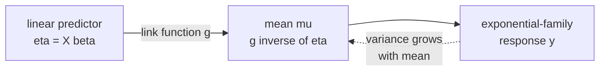

Linear, logistic, and softmax regression look like distinct models, but they
are three instances of the same template: a linear predictor inside an
exponential-family distribution, connected by a **link function**. The
**generalized linear model (GLM)** framework formalizes this and turns model
choice into picking a distribution and a link.

## The three ingredients

A GLM is specified by:

1. **Random component**: $y \mid x$ follows an exponential-family distribution
   with mean $\mu(x)$.
2. **Linear predictor**: $\eta(x) = x^\top \beta$.
3. **Link function**: $g(\mu) = \eta$, an invertible function connecting the
   mean to the linear predictor.

Equivalently, $\mu = g^{-1}(\eta) = g^{-1}(x^\top\beta)$. The link's job is to
match the support of $\mu$ to the real line $\mathbb{R}$ that $\eta$ lives on<FN n="1" />.

## The natural (canonical) link

The exponential-family lesson defined the natural parameter $\theta$ of a
distribution. The **canonical link** sets $\theta = \eta$: the linear predictor
*is* the natural parameter<FN n="2" />. With the canonical link the math simplifies
dramatically:

- **Gradient**: $\nabla \ell = X^\top(\mathbf{y} - \boldsymbol\mu)$, a clean
  data-residual expression.
- **Hessian**: $-X^\top V X$ with $V = \operatorname{diag}(\text{variance}(y_i))$,
  always PSD, so the log-likelihood is concave.
- **IRLS** has the same shape across all canonical-link GLMs.

## The standard catalog

| Response | Distribution | Canonical link $g(\mu)$ | Inverse link $g^{-1}(\eta)$ | Result |
|---|---|---|---|---|
| Continuous | Gaussian | identity $\mu$ | $\eta$ | Linear regression |
| Binary | Bernoulli | logit $\log\frac{\mu}{1 - \mu}$ | sigmoid $\frac{1}{1 + e^{-\eta}}$ | Logistic regression |
| Counts | Poisson | log $\log \mu$ | exp $e^{\eta}$ | Poisson regression |
| Positive continuous | Gamma | reciprocal $1/\mu$ (or log) | $1/\eta$ | Gamma regression |
| Multi-class | Categorical | log $\log p_k$ | softmax | Softmax regression |

Each row is a model you have already met or are about to meet. The framework
makes their relationship explicit, and the implementation generalizes:
**iteratively reweighted least squares (IRLS)** with the right $W$ and $z$ fits
any of them.

## Why pick a different link

Two reasons to use a noncanonical link:

- **Match the data scale.** For positive continuous responses, the log link
  keeps the predicted mean positive even when the linear predictor is large
  negative. The reciprocal canonical link can produce negative means.
- **Interpretation.** A log link on counts (Poisson regression) means
  coefficients are multiplicative effects on the rate. A logit link on binary
  outcomes means coefficients are log-odds-ratios. These are the units of the
  conclusions you want to report.

Canonical links give the cleanest math; the right link gives the cleanest
inference.

## The deviance

The GLM analogue of squared error is the **deviance**, twice the gap between
the log-likelihood of the fitted model and the log-likelihood of a saturated
model that perfectly fits every observation:

$$
D = 2\big(\ell_{\text{sat}} - \ell(\hat\beta)\big).
$$<FN n="3" />

For Gaussian + identity link, the deviance is exactly the residual sum of
squares. For other GLMs it generalizes appropriately, and is the goodness-of-fit
quantity that hypothesis tests and information criteria are built on.



## Check it on arrays

```python
import numpy as np

rng = np.random.default_rng(0)

def fit_glm(X, y, link, inverse_link, var_fn, steps=20):
    """Generic IRLS for a canonical-link GLM.
    link: g(mu),  inverse_link: g^{-1}(eta),  var_fn: variance V(mu)."""
    n, d = X.shape
    mu = (y + y.mean()) / 2 + 1e-3                  # init
    eta = link(mu)
    for _ in range(steps):
        W = 1.0 / var_fn(mu)                         # canonical-link weights
        z = eta + (y - mu) / mu * 0 + (y - mu) * (1 / mu) * 0  # placeholder
        # working response for canonical link: z = eta + (y - mu) / (dmu/deta)
        # canonical link has dmu/deta = var(mu), so z = eta + (y - mu) / var(mu)
        z = eta + (y - mu) / var_fn(mu)
        beta = np.linalg.solve(X.T @ (W[:, None] * X), X.T @ (W * z))
        eta = X @ beta
        mu = inverse_link(eta)
    return beta, mu

n, d = 800, 3
X = np.column_stack([np.ones(n), rng.normal(size=(n, d - 1))])

# Gaussian + identity = linear regression
beta_lin_true = np.array([1.0, 2.0, -1.0])
y_lin = X @ beta_lin_true + 0.3 * rng.normal(size=n)
b_lin, _ = fit_glm(X, y_lin, link=lambda m: m, inverse_link=lambda e: e, var_fn=lambda m: np.ones_like(m))
print("Gaussian/identity beta:", np.round(b_lin, 3), " (vs OLS)")

# Bernoulli + logit = logistic regression
beta_log_true = np.array([-0.3, 1.5, -1.0])
p_true = 1 / (1 + np.exp(-X @ beta_log_true))
y_bin = (rng.random(n) < p_true).astype(float)
b_log, _ = fit_glm(X, y_bin,
                   link=lambda m: np.log(m / (1 - m)),
                   inverse_link=lambda e: 1 / (1 + np.exp(-e)),
                   var_fn=lambda m: m * (1 - m) + 1e-8)
print("Bernoulli/logit beta:  ", np.round(b_log, 3), " (vs true ", beta_log_true, ")")

# Poisson + log = Poisson regression
beta_pois_true = np.array([0.5, 0.4, -0.3])
mu_true = np.exp(X @ beta_pois_true)
y_count = rng.poisson(mu_true)
b_pois, _ = fit_glm(X, y_count,
                    link=lambda m: np.log(m),
                    inverse_link=lambda e: np.exp(e),
                    var_fn=lambda m: m)
print("Poisson/log beta:      ", np.round(b_pois, 3), " (vs true", beta_pois_true, ")")
```

A single IRLS routine, parameterized by link and variance function, recovers
linear, logistic, and Poisson regression. The next lesson zeroes in on the
last two GLMs from the table: Poisson for counts and Gamma for durations.

<Footnotes>
  <FNItem n="1">**Nelder, J. A., & Wedderburn, R. W. M.** (1972). "Generalized linear models". *JRSS-A*, 135(3), 370-384. [doi:10.2307/2344614](https://doi.org/10.2307/2344614). The paper that introduced the GLM framework.</FNItem>
  <FNItem n="2">**McCullagh, P., & Nelder, J. A.** (1989). *Generalized Linear Models* (2nd ed.), §2. Chapman & Hall. Exponential family, canonical links, and the catalog of GLMs.</FNItem>
  <FNItem n="3">**Hastie, T., Tibshirani, R., & Friedman, J.** (2009). *The Elements of Statistical Learning* (2nd ed.), §4.4. Springer. [doi:10.1007/978-0-387-84858-7](https://doi.org/10.1007/978-0-387-84858-7). Deviance as the GLM goodness-of-fit.</FNItem>
</Footnotes>
