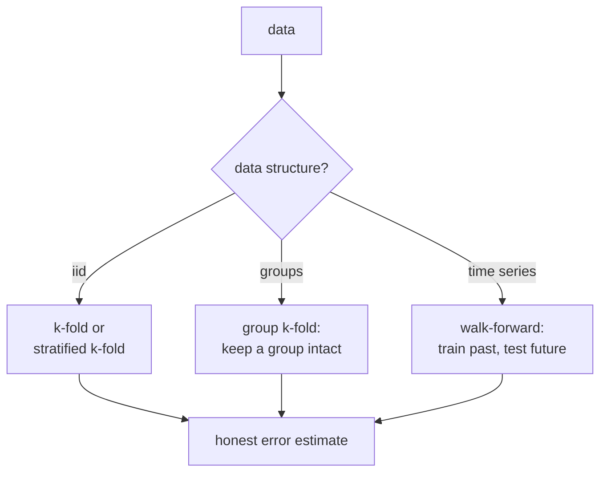

Cross-validation estimates test performance by reusing the same data for
training and evaluation in disjoint folds<FN n="1" />. The right CV strategy matches
the **test distribution**: the data the model will see in production.
Mismatched CV produces over-optimistic numbers and disappointing
deployments.

## Plain k-fold

Split the data into $k$ equal-sized folds. For each fold $i$: train on the
other $k - 1$ folds, evaluate on fold $i$. The CV score is the mean across
folds.

- **Pros**: Uses all data for both training and evaluation. Variance of
  the estimate is lower than a single train/test split.
- **Cons**: Assumes folds are i.i.d. Wrong for imbalanced classes (each
  fold may have a different positive rate), time-ordered data, or grouped
  data.
- **Default $k$**: 5 or 10. Smaller $k$ = larger training sets per fold
  (less bias) and noisier estimates (fewer folds to average). Larger $k$
  = stable estimates but expensive.

## Stratified k-fold

For classification with imbalanced classes, sample folds so that each
fold has roughly the same class distribution as the full dataset. Same
algorithm, constrained sampling.

Use stratified k-fold by default for any classification problem; the cost
is zero and the variance reduction is real.

## Group k-fold

When examples cluster into **groups** (multiple records per patient,
multiple snapshots per user, repeated measurements per device), random
k-fold leaks: a patient appears in both train and test, and the model
learns patient-specific shortcuts that do not generalize.

**Group k-fold** keeps all of a group's records in the same fold. The
test fold is genuinely "new groups". Use it whenever the production task
involves predicting on a new patient/user/device.

## Time-series CV

Random shuffling **does not work** for temporal data. A future event in
the training set can leak into past predictions. Two correct strategies:

- **Walk-forward CV (rolling)**: split the data chronologically into
  $k$ folds. Train on fold 1, test on fold 2. Train on folds 1+2, test
  on fold 3. Etc. The training set grows monotonically; each test fold
  is in the future.
- **Sliding window**: train on a fixed-size window, test on the next
  window. Useful when older data is no longer representative.

Always do time-series CV when predicting future events. Doing standard
k-fold on time-series gives wildly optimistic numbers because of leakage.

## Nested CV

If you do hyperparameter selection with CV and then evaluate with the
*same* CV, you overfit on the validation folds. **Nested CV** has an
outer loop for performance estimation and an inner loop for
hyperparameter selection:

- Outer: $k$-fold over the data.
- For each outer fold, inner CV on the outer-training set picks
  hyperparameters; refit on the outer training set with those hypers;
  evaluate on the outer test fold.

Computationally expensive but the only honest way to estimate
generalization with hyperparameter tuning<FN n="1" />.

## Leave-one-out (LOO)

$k = n$. Train on $n - 1$, test on the remaining 1, repeat. High
variance, low bias. Expensive (one full training per data point).

LOO has theoretical appeal for very small datasets but is rarely
used in practice; 5-fold or 10-fold is usually enough.

## Cross-validation under shift

If train and test come from different distributions (concept drift,
covariate shift), CV measures the wrong thing. Standard remedies:

- **Stratify by domain**: ensure each fold has a representative mix.
- **Cluster-based CV**: cluster the data and hold out whole clusters at
  a time. Approximates "new mode" generalization.
- **Adversarial validation**: train a classifier to distinguish train
  from test; if it succeeds, you have shift and need to adjust.

CV cannot fix distribution shift. It can only honestly estimate
performance under the assumption that your CV setup mimics production.



## Check it on arrays

```python
import numpy as np

rng = np.random.default_rng(0)

# Synthetic dataset with groups (multiple samples per "patient")
n_patients = 100
samples_per_patient = 10
n = n_patients * samples_per_patient
group = np.repeat(np.arange(n_patients), samples_per_patient)
y_patient = rng.normal(size=n_patients)
y = y_patient[group] + 0.1 * rng.normal(size=n)         # patient-specific signal
X = np.column_stack([y_patient[group], rng.normal(size=n)])

# Linear regression: train coefficient on X
def fit_lr(X, y):
    return np.linalg.lstsq(X, y, rcond=None)[0]

def mse(y, y_hat): return np.mean((y - y_hat)**2)

# Random k-fold: optimistic because patient feature is in both train and test
random_fold = np.array_split(rng.permutation(n), 5)
random_scores = []
for i in range(5):
    test = random_fold[i]
    train = np.setdiff1d(np.arange(n), test)
    beta = fit_lr(X[train], y[train])
    random_scores.append(mse(y[test], X[test] @ beta))
print(f"random k-fold MSE:  {np.mean(random_scores):.4f}  (each fold has same patients as train)")

# Group k-fold: hold out entire patients
groups_per_fold = np.array_split(rng.permutation(n_patients), 5)
group_scores = []
for i in range(5):
    test_pat = groups_per_fold[i]
    test = np.where(np.isin(group, test_pat))[0]
    train = np.setdiff1d(np.arange(n), test)
    beta = fit_lr(X[train], y[train])
    group_scores.append(mse(y[test], X[test] @ beta))
print(f"group k-fold MSE:   {np.mean(group_scores):.4f}  (test patients are new)")

# Time-series walk-forward: train on past, test on future
n_test_folds = 4
fold_size = n // (n_test_folds + 1)
ts_scores = []
for i in range(n_test_folds):
    end = (i + 2) * fold_size                            # train: 0..(i+1)*fold_size; test: (i+1)*fold_size..(i+2)*fold_size
    train = np.arange(0, (i + 1) * fold_size)
    test = np.arange((i + 1) * fold_size, end)
    beta = fit_lr(X[train], y[train])
    ts_scores.append(mse(y[test], X[test] @ beta))
print(f"walk-forward MSE:    {np.mean(ts_scores):.4f}  (each test is future)")
```

The random k-fold reports a low MSE that overestimates real generalization
because patient-specific signal leaks; group k-fold gives the honest
number for "new patient" generalization.

## Exercises

**Exercise 1.** A dataset has $n = 1000$ records, each tagged with one of
$200$ patient ids (5 records per patient), and the production task is to
predict on patients never seen in training. A colleague proposes stratified
5-fold CV stratified on the binary label. State which leakage this fails to
prevent and which CV strategy fixes it, and explain why the stratified
estimate will read too optimistic.

<details>
<summary>Solution</summary>

**Step 1.** Stratified k-fold balances the *label* across folds but assigns
individual records to folds at random. With 5 records per patient, almost
every patient has records in several folds, so the same patient appears in
both train and test.

**Step 2.** The model can then learn patient-specific shortcuts (a patient's
baseline, habits, device quirks) and reuse them on the held-out records of
that same patient. That is the group-leakage the production task forbids,
since real deployment sees entirely new patients.

**Step 3.** The fix is **group k-fold** keyed on patient id, which keeps all
five records of a patient in a single fold so each test fold contains only
unseen patients.

**Step 4.** Because the stratified estimate scores on records whose patients
were partly trained on, it credits the model for memorized
patient signal that will not exist at deployment, so it reads too
optimistic relative to the group-k-fold number.

</details>

**Exercise 2.** Explain precisely why standard shuffled k-fold leaks on
time-ordered data, and why walk-forward CV does not. Give a concrete example
of a feature whose leakage inflates the shuffled estimate.

<details>
<summary>Solution</summary>

**Step 1.** Shuffled k-fold places some future-timestamped records in the
training fold while testing on earlier-timestamped records. The model is
then trained on information from after the test period.

**Step 2.** Many time-series features are computed over windows that, after
shuffling, can span the test point. A rolling mean of the target over the
next 7 days, or a feature normalized by the full-series mean, both encode
future values. Trained on those, the model effectively reads the answer; the
shuffled CV score inflates because that information vanishes in real
forecasting.

**Step 3.** Walk-forward CV splits chronologically: train on
$[t_0, t_k]$, test on $[t_k, t_{k+1}]$, always with the test window strictly
after the training window. No future record ever enters training, so the
estimate matches the deployed setting where only the past is known.

**Step 4.** The cost is a smaller and growing training set per fold and
fewer test folds, but that is the price of an estimate that does not
silently leak the future.

</details>

**Exercise 3 (code).** Reproduce the group-leakage gap with a memorizing
predictor. Build data where each group has its own strong intercept, then
compare random k-fold against group k-fold for a model that predicts the
training mean of a test record's group. Assert that random k-fold reports a
lower (over-optimistic) MSE.

<details>
<summary>Solution</summary>

```python
import numpy as np

rng = np.random.default_rng(0)
n_groups, per = 60, 8
n = n_groups * per
group = np.repeat(np.arange(n_groups), per)
g_effect = rng.normal(0, 3, n_groups)              # strong per-group intercept
y = g_effect[group] + 0.3 * rng.normal(size=n)

def predict_group_mean(train, test, group, y):
    glob = y[train].mean()
    means = {g: y[train][group[train] == g].mean() for g in np.unique(group[train])}
    return np.array([means.get(group[t], glob) for t in test])

def mse(a, b): return np.mean((a - b) ** 2)

# Random k-fold: a group's records straddle train and test, so the mean leaks
random_folds = np.array_split(rng.permutation(n), 5)
random_mse = np.mean([
    mse(y[test], predict_group_mean(np.setdiff1d(np.arange(n), test), test, group, y))
    for test in random_folds
])

# Group k-fold: hold out whole groups, so test groups are unseen
group_folds = np.array_split(rng.permutation(n_groups), 5)
group_mse = np.mean([
    mse(y[np.isin(group, gf)],
        predict_group_mean(np.where(~np.isin(group, gf))[0],
                           np.where(np.isin(group, gf))[0], group, y))
    for gf in group_folds
])

print(f"random k-fold MSE: {random_mse:.4f}")
print(f"group  k-fold MSE: {group_mse:.4f}")
assert random_mse < group_mse
```

Random k-fold reports about $0.12$ because every test record's group mean
was learned from that group's other records; group k-fold reports about
$8.1$, the honest error on genuinely new groups. The gap is the leakage.

</details>

The next lesson picks the hyperparameters using these CV scores.

<Footnotes>
  <FNItem n="1">**Hastie, T., Tibshirani, R., & Friedman, J.** (2009).
    *The Elements of Statistical Learning* (2nd ed.). Springer.
    Cross-validation and model assessment (Ch. 7).
    [doi:10.1007/978-0-387-84858-7](https://doi.org/10.1007/978-0-387-84858-7)</FNItem>
</Footnotes>
