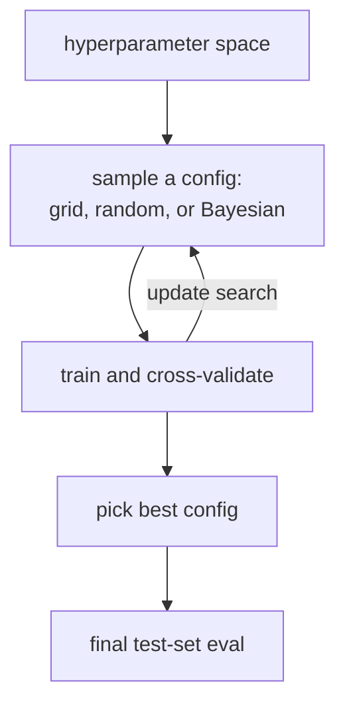

Almost every algorithm has hyperparameters that affect performance
substantially. The default values are seldom optimal. **Hyperparameter
optimization (HPO)** is the search over those parameters, with the
evaluation done by cross-validation. The search is itself an
optimization problem with its own pitfalls: budget, bias toward over-
fitting on the validation set, and variance of the picked configuration.

## Grid search

Define a finite grid of hyperparameter values, evaluate every
combination, pick the best.

- **Pros**: simple, exhaustive, reproducible.
- **Cons**: scales exponentially in the number of hyperparameters
  ($K^d$). Spends compute on all dimensions equally, even the ones that
  do not matter.

Useful for 1-2 hyperparameters with few values, but quickly impractical.

## Random search

Sample hyperparameters from distributions (uniform on a scale, log-uniform
on a regularization strength, categorical for choices). Evaluate $T$
samples. Pick the best.

**Random search beats grid search** (Bergstra & Bengio, 2012) on most
problems because real importance is concentrated in a few hyperparameters
and grid wastes evaluations on the unimportant ones. With the same
compute budget, random covers a wider range and finds better
configurations.

Random search is the right default when you do not want to think hard.

## Bayesian optimization

Build a surrogate model of "loss as a function of hyperparameters",
typically a Gaussian process or tree-based estimator (TPE in Optuna /
Hyperopt). Use the surrogate's posterior to choose the next
configuration via expected improvement or similar acquisition functions.

The A3 lesson on Bayesian optimization is the foundation. For HPO
specifically:

- **Sequential**: each evaluation informs the next. Inherently serial.
- **Parallel BO** exists (Thompson sampling with parallel chains, batch
  acquisition) but is harder.
- **Cold start**: needs a handful of random evaluations before the
  surrogate is useful.

BO usually beats random search at moderate budgets (50-200 evaluations)
on continuous hyperparameter spaces. For very small or very large
budgets, random is competitive.

## Successive halving and Hyperband

For expensive training runs, you can save compute by **early-stopping**
configurations that look bad after a few epochs. **Successive halving**:

1. Run $T$ configurations for $r_0$ epochs (or steps).
2. Keep the top half; run them for $2 r_0$ epochs.
3. Continue until one survives at full budget.

**Hyperband** picks multiple $T$ / $r_0$ combinations to handle the
case where slow-starting configurations beat fast-starting ones in the
long run.

Both methods give you many more configurations per unit compute than
naive full-budget search. Combine with random sampling for the standard
**ASHA** (asynchronous successive halving) production setup.

## The bias of repeated CV

If you pick the best CV score over many configurations, the best score
is **optimistically biased**: you implicitly searched over the noise in
the CV estimate. The standard fix:

- Estimate generalization on a held-out **test set** that the search
  never sees.
- Or: nested CV with the inner loop doing HPO and the outer loop
  estimating generalization.

The bias gets worse as the number of configurations grows. Bayesian
optimization, by efficiently focusing on the good region, can paradoxically
reduce this bias (fewer wasted evaluations means less search noise) but
the principle still applies: keep a test set the search never touches.

## How much to spend

Diminishing returns set in quickly. The first 20-50 evaluations buy most
of the gain; the next 200 buy a small extra fraction. Match HPO budget to
the value of the marginal improvement. For most production problems, a
few hours of random search is enough.

## What to tune

- **Learning rate** and **regularization strength** matter most for
  linear and neural models.
- **Tree depth** and **number of estimators** for tree-based models.
- **Number of neighbors** $k$ for k-NN.

Some hyperparameters look important but are not (e.g. random seeds in
some settings). Sensitivity analysis on a small budget reveals which
parameters are worth tuning.



## Check it on arrays

A minimal random search + Bayesian-ish refinement for a single
hyperparameter.

```python
import numpy as np

rng = np.random.default_rng(0)

# Synthetic CV-like objective: cv_score as a function of hyperparameter lambda
# (something with one clear optimum, plus noise per evaluation)
def cv_eval(lam, noise=0.02, rng=rng):
    true = -0.5 + 0.3 * (np.log10(lam) + 1)**2
    return true + noise * rng.normal()

# Grid search
lams_grid = np.logspace(-3, 2, 11)
grid_scores = [cv_eval(l) for l in lams_grid]
best_grid = lams_grid[int(np.argmin(grid_scores))]
print(f"grid search:        best lambda = {best_grid:.3f}, score = {min(grid_scores):.3f}, evals = {len(lams_grid)}")

# Random search with same compute budget
lams_rand = 10**(rng.uniform(-3, 2, 11))
rand_scores = [cv_eval(l) for l in lams_rand]
best_rand = lams_rand[int(np.argmin(rand_scores))]
print(f"random search:      best lambda = {best_rand:.3f}, score = {min(rand_scores):.3f}, evals = {len(lams_rand)}")

# "BO": after a few random init points, sample near the best
lams_bo = list(10**(rng.uniform(-3, 2, 5)))
bo_scores = [cv_eval(l) for l in lams_bo]
for _ in range(6):
    best_so_far = lams_bo[int(np.argmin(bo_scores))]
    new_lam = best_so_far * 10**rng.normal(0, 0.5)        # explore around best
    new_lam = max(min(new_lam, 100), 1e-3)
    lams_bo.append(new_lam); bo_scores.append(cv_eval(new_lam))
best_bo = lams_bo[int(np.argmin(bo_scores))]
print(f"BO-like local:      best lambda = {best_bo:.3f}, score = {min(bo_scores):.3f}, evals = {len(lams_bo)}")
```

All three methods land near the optimum; BO-like local refinement gets
slightly tighter than the others at the same evaluation budget. The
final C10 lesson visualizes the model's behavior across training-set
sizes: learning curves.
