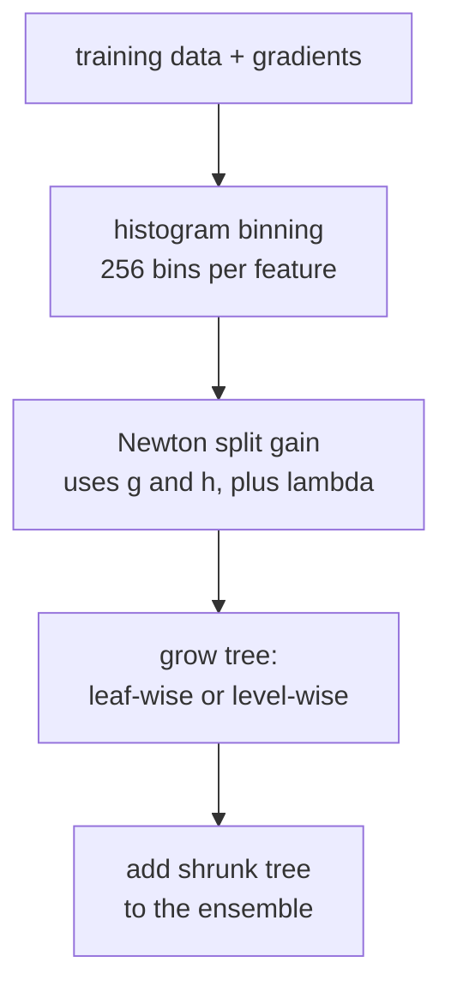

Plain gradient boosting is already the best tabular learner; **XGBoost**,
**LightGBM**, and **CatBoost** are the production implementations that made
it fast, regularized, and easy to tune. They share four key innovations:
**second-order Newton steps**, an **explicit regularization term** in the
split criterion<FN n="1" />, **histogram-based** splits, and **leaf-wise (best-first)**
or **level-wise (depth-first)** tree growth<FN n="2" />.

## Newton boosting (second-order)

Plain gradient boosting uses the first-order gradient $g_i = \partial \ell/\partial F$.
**Newton boosting** also uses the second derivative
$h_i = \partial^2 \ell / \partial F^2$. Locally, the loss is a quadratic in
the prediction increment $f$:

$$
\ell(y_i, F_{t-1}(x_i) + f) \approx \ell(y_i, F_{t-1}(x_i)) + g_i f + \tfrac{1}{2} h_i f^2.
$$

XGBoost adds an $L_2$ regularizer on leaf weights, so the per-leaf objective
is $\sum_{i \in S}(g_i f + \tfrac{1}{2}h_i f^2) + \tfrac{1}{2}\lambda f^2$.
Setting the derivative in $f$ to zero gives the regularized Newton step:

$$
f^\star = -\frac{\sum_{i \in S} g_i}{\sum_{i \in S} h_i + \lambda},
$$

with the unregularized $f^\star = -G/H$ as the $\lambda = 0$ special case. For
squared loss $h_i = 1$ and $\lambda = 0$ recover the residual mean; for
log-loss the local curvature $h_i = p_i(1 - p_i)$ adjusts the step, and the
$+\lambda$ shrinks leaf weights of small or noisy leaves. Second-order
information makes training converge in fewer rounds.

## Regularized split criterion

XGBoost adds an $L_2$ penalty on leaf weights and a per-leaf cost $\gamma$.
The gain of a split with left and right groups $S_L, S_R$ is

$$
\text{Gain} = \tfrac{1}{2}\!\left(\frac{G_L^2}{H_L + \lambda} + \frac{G_R^2}{H_R + \lambda} - \frac{(G_L + G_R)^2}{H_L + H_R + \lambda}\right) - \gamma,
$$

with $G_S = \sum_{i \in S} g_i$ and $H_S = \sum_{i \in S} h_i$. A split is
taken only if Gain > 0. $\lambda$ shrinks leaf weights (smoother predictions);
$\gamma$ prunes splits that barely help, replacing a separate pruning step.

## Histogram-based splits

Naive split finding sorts each feature at every node, costing $O(n d \log n)$
per tree. **Histogram** methods (LightGBM's default, XGBoost's `hist` mode)
bucket each feature into a fixed number of bins (typically 256) once. Each
node then iterates over bins, computing $G$ and $H$ accumulators in $O(d \cdot \text{bins})$.
The result: orders of magnitude faster on large datasets, with negligible
accuracy loss.

## Leaf-wise vs level-wise

- **Level-wise** (depth-first, XGBoost's default): grow every node at depth
  $d$ before moving to depth $d + 1$. Predictable structure, easy to
  vectorize.
- **Leaf-wise** (best-first, LightGBM's default): always grow the leaf with
  the largest gain next. Trees become unbalanced but achieve lower training
  loss for the same number of leaves. Risk of overfitting on small datasets;
  control with `max_leaves`.

## CatBoost's contribution: categoricals

XGBoost and LightGBM require categorical features to be one-hot or
target-encoded. **CatBoost** uses **ordered target statistics** to encode
categoricals without leakage and produces symmetric **oblivious trees** that
make inference vectorized.

## Hyperparameter cheat sheet

The knobs that matter most, roughly in order:

1. **`learning_rate`** (`eta`): smaller is safer; 0.05 with many trees beats
   0.3 with few.
2. **`n_estimators` (`num_boost_round`)**: as many as fit budget, paired with
   early stopping on a validation set.
3. **`max_depth` or `num_leaves`**: complexity per tree. 6 levels or 31
   leaves is a sensible default.
4. **`min_child_weight` (XGBoost) / `min_data_in_leaf` (LightGBM)**: refuse
   splits that produce tiny leaves.
5. **`subsample` and `colsample_bytree`**: stochastic boosting (per-round
   row and column subsampling).
6. **`reg_lambda` / `reg_alpha`**: leaf-weight regularization.

Cross-validation with **early stopping** is the standard fitting recipe:
add trees while held-out loss improves, stop when it plateaus.



## Check it on arrays

```python
import numpy as np

rng = np.random.default_rng(0)

# Newton boosting from scratch for log-loss, with histogram binning + L2 reg.
n, d = 1500, 4
X = rng.normal(size=(n, d))
true_f = 0.5 * X[:, 0] + 0.3 * X[:, 1] - 0.3 * X[:, 0] * X[:, 1]
p = 1 / (1 + np.exp(-true_f))
y = (rng.random(n) < p).astype(int)

def histogram(x, n_bins=64):
    """Map a 1D float array to integer bins; returns bins and bin edges."""
    qs = np.quantile(x, np.linspace(0, 1, n_bins + 1)[1:-1])
    return np.searchsorted(qs, x), qs

X_bins = np.column_stack([histogram(X[:, j])[0] for j in range(d)])
n_bins = 64

def fit_tree_hist(X_bins, g, h, max_depth=4, lam=1.0, gamma=0.0):
    """Newton tree on binned features, with L2-regularized gain."""
    n, d = X_bins.shape
    G_total, H_total = g.sum(), h.sum()
    indices = np.arange(n)

    class Node:
        def __init__(self): self.leaf = self.f = self.b = self.L = self.R = None

    def split(idx, depth):
        if depth == 0 or len(idx) < 2:
            return None, None, 0.0
        G_par, H_par = g[idx].sum(), h[idx].sum()
        best = (None, None, 0.0)
        for j in range(d):
            for b in range(n_bins - 1):
                mask = X_bins[idx, j] <= b
                Gl = g[idx[mask]].sum(); Hl = h[idx[mask]].sum()
                if mask.sum() < 2 or (~mask).sum() < 2: continue
                Gr, Hr = G_par - Gl, H_par - Hl
                gain = 0.5 * (Gl**2 / (Hl + lam) + Gr**2 / (Hr + lam) - G_par**2 / (H_par + lam)) - gamma
                if gain > best[2]: best = (j, b, gain)
        return best

    def build(idx, depth):
        node = Node()
        j, b, gain = split(idx, depth)
        if j is None or gain <= 0:
            node.leaf = -g[idx].sum() / (h[idx].sum() + lam); return node
        m = X_bins[idx, j] <= b
        node.f, node.b = j, b
        node.L = build(idx[m], depth - 1); node.R = build(idx[~m], depth - 1)
        return node

    return build(indices, max_depth)

def predict(tree, X_bins):
    out = np.zeros(len(X_bins))
    for i, x in enumerate(X_bins):
        node = tree
        while node.leaf is None:
            node = node.L if x[node.f] <= node.b else node.R
        out[i] = node.leaf
    return out

idx_tr = rng.choice(n, size=1100, replace=False)
idx_te = np.setdiff1d(np.arange(n), idx_tr)

# Newton boosting for log-loss. Build each tree on TRAINING rows only (so
# splits and leaf weights are unpolluted by test data), then apply it to the
# full X_bins to extend F to both train and test rows.
F = np.zeros(n)
eta = 0.1
trees = []
X_bins_tr = X_bins[idx_tr]
for t in range(60):
    p_t = 1 / (1 + np.exp(-F[idx_tr]))
    g_tr = p_t - y[idx_tr]
    h_tr = p_t * (1 - p_t) + 1e-3
    tree = fit_tree_hist(X_bins_tr, g_tr, h_tr, max_depth=3, lam=1.0)
    F = F + eta * predict(tree, X_bins)
    trees.append(tree)

p_hat = 1 / (1 + np.exp(-F))
y_hat = (p_hat > 0.5).astype(int)
tr_acc = np.mean(y_hat[idx_tr] == y[idx_tr])
te_acc = np.mean(y_hat[idx_te] == y[idx_te])
log_loss_te = -np.mean(y[idx_te] * np.log(p_hat[idx_te] + 1e-12) + (1 - y[idx_te]) * np.log(1 - p_hat[idx_te] + 1e-12))
print(f"train acc: {tr_acc:.3f}, test acc: {te_acc:.3f}, test log-loss: {log_loss_te:.3f}")
print(f"trees: {len(trees)}, leaf weights via Newton step (g/h + lam)")
```

The Newton-boosted ensemble reaches strong test accuracy with a few dozen
shallow trees, using binned features and an L2-regularized split criterion.
This closes the C3 tree-based track; the next subsection covers instance-
based and probabilistic classifiers, where the inductive bias is very
different.

<Footnotes>
  <FNItem n="1">**Chen, T., & Guestrin, C.** (2016). "XGBoost: a scalable tree boosting system". *KDD*. Second-order Newton boosting with a regularized split objective ([doi:10.1145/2939672.2939785](https://doi.org/10.1145/2939672.2939785)).</FNItem>
  <FNItem n="2">**Ke, G., Meng, Q., Finley, T., et al.** (2017). "LightGBM: a highly efficient gradient boosting decision tree". *NeurIPS*. Histogram-based splits and leaf-wise tree growth.</FNItem>
</Footnotes>
