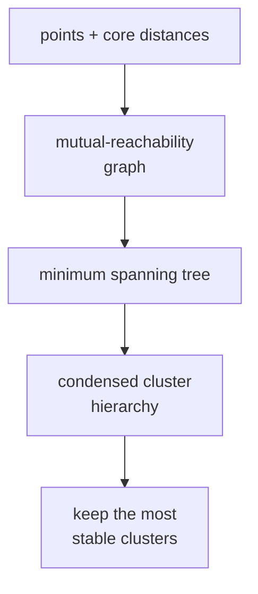

DBSCAN needs a single $\varepsilon$, which fails when clusters have very
different densities: a small $\varepsilon$ misses the sparse clusters, a
large one merges the dense ones<FN n="1" />. **HDBSCAN**<FN n="2" /> builds a *hierarchy* of DBSCAN
clusterings across all $\varepsilon$ values and extracts the most stable
clusters, automatically handling varying density.

## The mutual reachability graph

For each point, the **core distance** at scale `min_cluster_size` is the
distance to its $k$-th nearest neighbor (where $k$ = min_cluster_size). The
**mutual reachability distance** between two points combines the geometric
distance with both points' core distances:

$$
d_{\text{mreach}}(a, b) = \max\!\big(\text{core}(a),\ \text{core}(b),\ d(a, b)\big).
$$

Sparse-region points have large core distances, so their pairwise mutual
reachability is inflated. Dense-region points keep their original geometric
distances. The result: dense clusters are easier to grow than sparse ones at
small thresholds.

## The condensed cluster hierarchy

Build the minimum spanning tree on the mutual-reachability graph. Cutting it
at decreasing thresholds produces a binary tree (dendrogram) of clusterings.
At a very high threshold, all points are in one cluster; as you lower the
threshold, clusters split.

HDBSCAN **condenses** the tree: any split where one side has fewer than
`min_cluster_size` points is treated as a single cluster losing those points
to noise, not a genuine split.

## Cluster stability and extraction

A cluster's **stability** is its lifetime in the condensed tree: how long it
persists as the threshold decreases. HDBSCAN extracts clusters by picking the
selection that maximizes total stability subject to the rule "no cluster is
both selected and a descendant of a selected cluster"<FN n="2" />. The result is a flat
clustering where each cluster persists for a long density range.

The intuition: durable clusters (visible across many density thresholds) are
real. Clusters that appear briefly and split are not.

## Why HDBSCAN is the default density clusterer

- **No $\varepsilon$**: only `min_cluster_size` to pick, and the algorithm is
  fairly insensitive to it.
- **Handles varying density**: each cluster lives at its own scale.
- **Identifies noise**: points that never join a stable cluster are noise.
- **Cluster probabilities**: every assigned point gets a soft membership.

## Limits

- **Quadratic worst case** in distance computation (mitigated by indices).
- **Hierarchy depth on huge datasets** can become expensive in memory.
- **High dimensions** still suffer from the curse of dimensionality.



## Check it on arrays

This implementation is a minimal sketch (HDBSCAN's full machinery is
intricate); use the `hdbscan` library in production.

```python
import numpy as np

rng = np.random.default_rng(0)

# Two blobs of very different densities + noise
X = np.vstack([
    rng.normal(loc=[0.0, 0.0], scale=0.3, size=(200, 2)),       # dense
    rng.normal(loc=[4.0, 0.0], scale=1.5, size=(100, 2)),       # sparse
    rng.uniform(-3, 8, size=(15, 2)),                            # noise
])

def core_distance(X, k):
    """Distance from each point to its k-th nearest neighbor."""
    n = len(X)
    D = np.linalg.norm(X[:, None] - X[None, :], axis=2)
    return np.sort(D, axis=1)[:, k]

def mutual_reach(X, k):
    n = len(X)
    cd = core_distance(X, k)
    D = np.linalg.norm(X[:, None] - X[None, :], axis=2)
    return np.maximum(np.maximum(D, cd[:, None]), cd[None, :])

def mst_clusters(mreach, threshold):
    """Connected components of the graph with edges <= threshold."""
    n = len(mreach)
    parent = list(range(n))
    def find(x):
        while parent[x] != x: parent[x] = parent[parent[x]]; x = parent[x]
        return x
    def union(a, b):
        ra, rb = find(a), find(b)
        if ra != rb: parent[ra] = rb
    for i in range(n):
        for j in range(i + 1, n):
            if mreach[i, j] <= threshold: union(i, j)
    roots = [find(i) for i in range(n)]
    _, labels = np.unique(roots, return_inverse=True)
    return labels

min_cluster_size = 5
mreach = mutual_reach(X, k=min_cluster_size)

# Show how the number of clusters evolves with the threshold
print("threshold  clusters (with >=5 points)")
for thr in [0.1, 0.3, 0.5, 1.0, 2.0, 5.0]:
    labels = mst_clusters(mreach, thr)
    big = sum(1 for c in set(labels) if (labels == c).sum() >= min_cluster_size)
    noise = sum(1 for c in set(labels) if (labels == c).sum() < min_cluster_size)
    print(f"  {thr:>5}    {big} large clusters, {noise} singletons/small")

# Final flat clustering at an intermediate threshold
labels = mst_clusters(mreach, threshold=0.6)
sizes = {c: int((labels == c).sum()) for c in set(labels)}
sizes_sorted = sorted(sizes.values(), reverse=True)
print(f"\nfinal cluster sizes (top 5): {sizes_sorted[:5]}")
print(f"singletons: {sum(1 for s in sizes_sorted if s == 1)}")
```

Increasing the threshold merges clusters, but the dense cluster persists
across a much wider range than the noise; HDBSCAN's stability criterion
picks out the persistent ones. The next lesson abandons the flat clustering
and walks the whole dendrogram explicitly.

<Footnotes>
  <FNItem n="1">**Ester, M., Kriegel, H.-P., Sander, J., & Xu, X.** (1996). "A
    density-based algorithm for discovering clusters in large spatial databases
    with noise". *KDD*. The single-$\varepsilon$ DBSCAN that HDBSCAN generalizes.</FNItem>
  <FNItem n="2">**Campello, R. J. G. B., Moulavi, D., & Sander, J.** (2013).
    "Density-based clustering based on hierarchical density estimates". *PAKDD*.
    [doi:10.1007/978-3-642-37456-2_14](https://doi.org/10.1007/978-3-642-37456-2_14).
    Mutual reachability, the condensed tree, and stability-based extraction.</FNItem>
</Footnotes>
