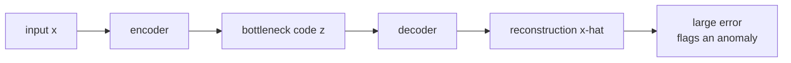

The simplest neural anomaly detector: train an **autoencoder** to compress
and reconstruct normal data, then score test points by reconstruction error.
Normal points reconstruct well (the model has seen their structure); anomalies
do not (the model has no template for them)<FN n="1" />. The idea works with any
reconstruction model, including linear PCA.

## The setup

An autoencoder is a pair of networks: an **encoder** $f_\phi: \mathcal{X} \to \mathbb{R}^k$
maps inputs to a low-dimensional code, and a **decoder** $g_\theta: \mathbb{R}^k \to \mathcal{X}$
maps the code back<FN n="2" />. Training minimizes reconstruction loss on a dataset of
normal examples:

$$
\min_{\theta, \phi}\; \sum_i \lVert x_i - g_\theta(f_\phi(x_i))\rVert^2.
$$

The bottleneck dimension $k$ forces the network to throw away information,
keeping only the structure most useful for reconstruction. For normal data,
that structure is enough; for anomalies, it is not, so they reconstruct
poorly.

**Anomaly score:** $s(x) = \lVert x - g_\theta(f_\phi(x))\rVert^2$.
Threshold on a held-out validation set of normal examples; choose the
quantile that matches your target false-alarm rate.

## Linear AE = PCA

When encoder and decoder are linear and the loss is squared error, the
autoencoder reduces to PCA: the optimal $f$ and $g$ project onto the top-$k$
principal directions. Reconstruction error becomes the residual in the
complement of the principal subspace, which is exactly what Hotelling's
T^2 statistic measures.

For purely linear structure, PCA is the right tool: it has a closed-form
solution, no hyperparameters beyond $k$, and no risk of overfitting in the
nonlinear sense. The autoencoder framing matters when the normal data lives
on a curved manifold.

## Variants

- **Sparse autoencoder**: add an L1 penalty on the code so each example
  activates only a few latent units.
- **Denoising autoencoder**: train to reconstruct from a corrupted input,
  which forces the network to learn the data manifold (not just memorize).
  Robust to noise.
- **Variational autoencoder**: turns the bottleneck into a probabilistic
  latent variable. The reconstruction probability under the posterior is the
  anomaly score; arguably more principled than raw reconstruction error.
- **Adversarial autoencoder (AnoGAN family)**: train a generator and
  discriminator; anomalies are points that the generator cannot reproduce
  even with optimization.

## Strengths

- **Scales** to large datasets and high dimensions.
- **Handles structured inputs** (images, sequences) when the encoder/decoder
  are CNNs/transformers.
- **No labels of anomalies needed** at training time, only normal data.

## Limits

- **Threshold calibration** is hard without a small labeled anomaly set; the
  reconstruction-error distribution on normal data depends on architecture
  and training.
- **Subtle anomalies** can reconstruct well if their high-level features look
  normal (this is why VAE / generative-model AD is sometimes better than
  raw reconstruction).
- **Distribution shift** in normal data over time degrades the threshold.



## Check it on arrays

A linear autoencoder = PCA. The reconstruction error from the top-$k$ PCs
gives a clean implementation of the idea.

```python
import numpy as np

rng = np.random.default_rng(0)

# Normal data: lives near a 1D line in 4D
n_normal = 400
t = rng.normal(size=n_normal)
X_normal = np.column_stack([t, 2 * t, -t, 0.5 * t]) + 0.1 * rng.normal(size=(n_normal, 4))

# Anomalies: off the line
X_anom = rng.normal(scale=2.0, size=(40, 4))
X = np.vstack([X_normal, X_anom])
labels = np.concatenate([np.zeros(n_normal), np.ones(40)])

# Linear AE = top-k PCA
X_mean = X_normal.mean(axis=0)
Xc = X_normal - X_mean
U, S, Vt = np.linalg.svd(Xc, full_matrices=False)
k = 1                                                # bottleneck dimension
V_k = Vt[:k]                                         # top-k directions

def reconstruct(X, V_k, X_mean):
    Xc = X - X_mean
    code = Xc @ V_k.T                                # encode
    return code @ V_k + X_mean                       # decode

recon = reconstruct(X, V_k, X_mean)
scores = np.linalg.norm(X - recon, axis=1)**2

print(f"mean recon. error on normal:    {scores[labels == 0].mean():.3f}")
print(f"mean recon. error on anomalies: {scores[labels == 1].mean():.3f}")

# Threshold at 99th percentile of normal scores
thr = np.quantile(scores[labels == 0], 0.99)
flagged = scores > thr
print(f"threshold (99th percentile of normal): {thr:.3f}")
print(f"anomalies flagged: {int(flagged[labels == 1].sum())} / 40")
print(f"normal points falsely flagged: {int(flagged[labels == 0].sum())} / {n_normal}")
```

The linear autoencoder (= PCA) reconstructs the 1D normal manifold cleanly;
off-manifold anomalies have much larger reconstruction errors.

## Exercises

**Exercise 1.** A point $x = (3, 1)$ is encoded to a 1D code by projecting onto
the unit direction $v = (1, 0)$ (so the encoder is $z = v^\top x$ and the decoder
is $\hat x = z\,v$, with zero mean). Compute the reconstruction $\hat x$ and the
squared-error anomaly score $s(x) = \lVert x - \hat x\rVert^2$.

<details>
<summary>Solution</summary>

**Step 1.** Encode: $z = v^\top x = 1 \cdot 3 + 0 \cdot 1 = 3$.

**Step 2.** Decode: $\hat x = z\,v = 3 \cdot (1, 0) = (3, 0)$. The reconstruction
keeps the component along $v$ and discards the rest.

**Step 3.** The residual is $x - \hat x = (3, 1) - (3, 0) = (0, 1)$, so

$$
s(x) = \lVert (0, 1)\rVert^2 = 0^2 + 1^2 = 1.
$$

The score is the squared length of the part of $x$ orthogonal to the code
direction, the information the bottleneck threw away.

</details>

**Exercise 2.** A linear autoencoder with a $k$-dimensional bottleneck projects
onto the top-$k$ principal directions. Show that its reconstruction error on a
point equals the sum of squared projections onto the discarded directions
$v_{k+1}, \dots, v_d$, and conclude that adding a principal direction can only
lower (never raise) any point's score.

<details>
<summary>Solution</summary>

**Step 1.** Center the data and write a point in the orthonormal eigenbasis
$\{v_1, \dots, v_d\}$ as $x = \sum_{j=1}^d c_j v_j$ with $c_j = v_j^\top x$. The
top-$k$ encoder-decoder keeps the first $k$ coordinates: $\hat x = \sum_{j=1}^k c_j v_j$.

**Step 2.** The residual is the tail $x - \hat x = \sum_{j=k+1}^d c_j v_j$. Because
the $v_j$ are orthonormal, its squared norm is

$$
s(x) = \Big\lVert \sum_{j=k+1}^d c_j v_j \Big\rVert^2 = \sum_{j=k+1}^d c_j^2.
$$

**Step 3.** Increasing the bottleneck from $k$ to $k+1$ moves the term $c_{k+1}^2$
out of the discarded sum into the kept part, so the new score is
$s(x) - c_{k+1}^2 \le s(x)$. Since $c_{k+1}^2 \ge 0$, every point's score is
non-increasing in $k$: a wider bottleneck reconstructs everything at least as
well, which is exactly why an over-wide bottleneck erases the anomaly gap.

</details>

**Exercise 3 (code).** Generate normal data on a 2D plane embedded in 5D plus
off-plane anomalies. Using the PCA-equivalent linear autoencoder, compute the
gap between mean anomaly and mean normal reconstruction error for bottleneck
sizes $k = 1, 2, 5$. Show that $k = 2$ (matching the intrinsic dimension) gives
the cleanest separation while $k = 5$ (full rank) collapses it.

<details>
<summary>Solution</summary>

```python
import numpy as np

rng = np.random.default_rng(0)

# Normal data on a 2D plane embedded in 5D, plus off-plane anomalies.
n_normal = 400
Z = rng.normal(size=(n_normal, 2))
basis = np.array([[1, 0, 1, 0, 1],
                  [0, 1, 0, 1, 0]], float)
X_normal = Z @ basis + 0.05 * rng.normal(size=(n_normal, 5))
X_anom = rng.normal(scale=3.0, size=(40, 5))
X = np.vstack([X_normal, X_anom])
labels = np.concatenate([np.zeros(n_normal), np.ones(40)])

X_mean = X_normal.mean(axis=0)
U, S, Vt = np.linalg.svd(X_normal - X_mean, full_matrices=False)

def recon_error(k):
    V_k = Vt[:k]
    code = (X - X_mean) @ V_k.T
    recon = code @ V_k + X_mean
    return np.linalg.norm(X - recon, axis=1) ** 2

sep = {}
for k in [1, 2, 5]:
    s = recon_error(k)
    gap = s[labels == 1].mean() - s[labels == 0].mean()
    sep[k] = gap
    print(f"k={k}: normal={s[labels==0].mean():.3f}, anom={s[labels==1].mean():.3f}, gap={gap:.3f}")

assert sep[2] > sep[5]      # k matching intrinsic dim separates best
assert sep[5] < 0.5         # full-rank bottleneck reconstructs all, gap vanishes
```

With $k = 2$ the normal points reconstruct almost perfectly (mean error near
$0.008$) while anomalies keep a large residual, a gap of about $24.7$. At full
rank $k = 5$ the bottleneck reconstructs every point, anomalies included, so both
errors drop to zero and the gap vanishes: the bottleneck must be narrower than
the ambient dimension to deny anomalies a faithful reconstruction.

</details>

This closes the C6 anomaly-detection track; the next subsection turns from
outlier detection to combining many models: ensembles.

<Footnotes>
  <FNItem n="1">**Sakurada, M., & Yairi, T.** (2014). "Anomaly detection using autoencoders with nonlinear dimensionality reduction". *MLSDA Workshop*. [doi:10.1145/2689746.2689747](https://doi.org/10.1145/2689746.2689747). Shows reconstruction error from an autoencoder flags anomalies and improves on linear PCA on curved manifolds.</FNItem>
  <FNItem n="2">**Goodfellow, I., Bengio, Y., & Courville, A.** (2016). *Deep Learning.* MIT Press. Encoder/decoder formulation and the sparse, denoising, and variational autoencoder variants (Ch. 14).</FNItem>
</Footnotes>
