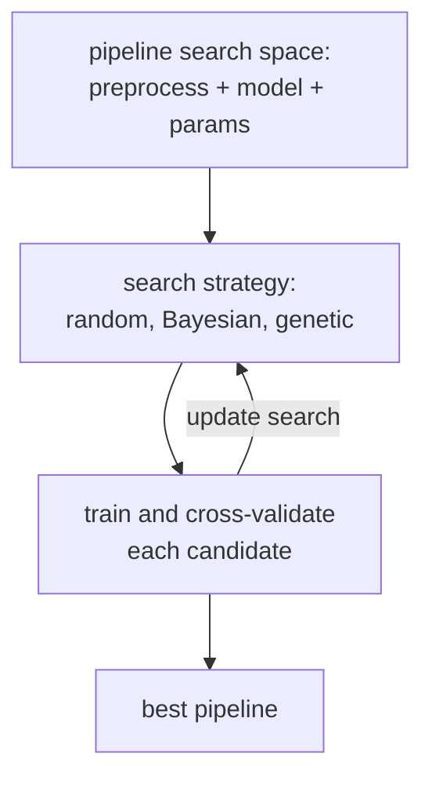

**AutoML** is the family of systems that automate the messy parts of
classical ML: feature engineering, model selection, hyperparameter tuning,
and ensembling. The good ones produce results competitive with expert
hand-tuning on tabular data, with no expert in the loop<FN n="1" />. The not-so-good
ones over-promise on automation while requiring expert hand-holding anyway.

## The search problem

AutoML systems search a **pipeline space**: combinations of preprocessing
steps (imputation, encoding, scaling), feature engineering (polynomial
features, target encoding, embeddings), model class (linear, tree,
boosting), and per-component hyperparameters. The space is enormous (often
exponential in the number of choices), so search efficiency matters.

Three search strategies dominate<FN n="2" />:

- **Random search**: surprisingly hard to beat, especially as a baseline.
- **Bayesian optimization (BO)**: model the objective with a Gaussian process
  or tree-based surrogate (TPE), pick promising configurations via expected
  improvement. The A3 lesson on BO is the foundation.
- **Evolutionary / genetic**: TPOT mutates and crossbreeds pipelines.

Successful systems combine these (e.g. BO over the high-level pipeline,
random search over fine hyperparameters), early-stop bad runs (Hyperband),
and meta-learn from previous datasets (warm-start with configurations that
worked on similar tasks).

## Major flavors

- **`auto-sklearn`** (Bayesian + meta-learning + ensembling)<FN n="3" />. Open source,
  scikit-learn ecosystem.
- **TPOT** (genetic programming over scikit-learn pipelines).
- **H2O AutoML** (random forest + GLM + GBM + deep learning stacking).
- **LightAutoML, AutoGluon** (focus on tabular, automatic stacking).
- **Vertex AI AutoML, AWS SageMaker Autopilot, Azure AutoML** (managed
  cloud).
- **Neural Architecture Search (NAS)**: AutoML for deep learning
  architectures. Cost (in compute) limits to specific architecture families
  in practice.

## What AutoML does well

- **Tabular structured data**: AutoGluon, H2O, and others often match or beat
  expert pipelines.
- **Routine baseline jobs**: pick a target, point the AutoML, get a
  reasonable model.
- **Hyperparameter tuning**: BO and Hyperband consistently outperform manual
  grid search.

## What it does poorly

- **Heavy feature engineering** needing domain knowledge. AutoML cannot
  invent the right ratio of two features unless the search space includes
  it explicitly.
- **Distribution shift** and **calibration** in production. AutoML optimizes
  for held-out accuracy on the given data; it does not anticipate
  distribution change.
- **Causal questions** and **interpretability**. AutoML cares about
  predictive accuracy, not why something works.
- **Custom losses, custom constraints**. Off-the-shelf AutoML loss menus are
  narrow.

## Practical guidance

- Run an AutoML system **early** as a baseline to know what is achievable
  with no effort. Beat it later with hand-tuned features.
- Set a time/compute budget. AutoML scales spending with budget; you can
  spend a lot and get little extra accuracy.
- Inspect the resulting pipeline before deploying. AutoML can pick exotic
  preprocessing or ensembles that are hard to maintain.
- Hold out a **separate test set** the AutoML never sees, to estimate
  generalization honestly.



## Check it on arrays

The core of AutoML is BO over configurations. A skeleton, scaled down:

```python
import numpy as np

rng = np.random.default_rng(0)

# Synthetic dataset
n, d = 800, 5
X = rng.normal(size=(n, d))
y = ((X[:, 0] + X[:, 1] > 0) ^ (X[:, 2] > 0.5)).astype(int)

# Validation split
idx = rng.permutation(n); tr, va = idx[:600], idx[600:]
Xtr, ytr = X[tr], y[tr]; Xva, yva = X[va], y[va]

# Search space: 2D configuration of (k for k-NN, C for logistic)
# Objective: validation accuracy of a small ensemble of (k-NN, logistic)

def knn_acc(k):
    d = np.sqrt(((Xva[:, None] - Xtr[None, :])**2).sum(axis=2))
    nn = np.argsort(d, axis=1)[:, :k]
    pred = (ytr[nn].mean(axis=1) > 0.5).astype(int)
    return np.mean(pred == yva)

def logistic_acc(C, n_iter=200):
    X1 = np.column_stack([np.ones(len(Xtr)), Xtr])
    beta = np.zeros(X1.shape[1])
    lam = 1 / C
    for _ in range(n_iter):
        p = 1 / (1 + np.exp(-X1 @ beta))
        beta += 0.1 * (X1.T @ (ytr - p) / len(ytr) - lam * beta)
    Xv1 = np.column_stack([np.ones(len(Xva)), Xva])
    return np.mean((1 / (1 + np.exp(-Xv1 @ beta)) > 0.5) == yva)

def eval_config(k, C):
    return 0.5 * (knn_acc(k) + logistic_acc(C))

# Random search baseline
candidates_k = [3, 5, 7, 11, 15, 21, 31, 51, 71, 101]
candidates_C = [0.01, 0.1, 1.0, 10.0, 100.0]
results = []
for _ in range(15):
    k = int(rng.choice(candidates_k))
    C = float(rng.choice(candidates_C))
    results.append((k, C, eval_config(k, C)))
best = max(results, key=lambda r: r[2])
print(f"random search best: k={best[0]}, C={best[1]}, acc={best[2]:.3f}")

# A tiny "BO": after a few random points, try configurations near the best
random_init = results[:6]
best_idx = int(np.argmax([r[2] for r in random_init]))
k_best, C_best = random_init[best_idx][0], random_init[best_idx][1]
# Explore neighbors
neighbors = [(k, C) for k in [max(1, k_best - 2), k_best, k_best + 2] for C in [C_best * 0.5, C_best, C_best * 2]]
neighbor_results = [(k, C, eval_config(k, C)) for k, C in neighbors]
best_neighbor = max(neighbor_results, key=lambda r: r[2])
print(f"local search around best init: k={best_neighbor[0]}, C={best_neighbor[1]}, "
      f"acc={best_neighbor[2]:.3f}")
```

The random search produces a respectable result; the local search around the
best initial point refines it modestly. Real AutoML systems do this at scale
across pipeline spaces with hundreds of dimensions.

## Exercises

**Exercise 1.** An AutoML pipeline search has $4$ preprocessing choices, $3$
feature-engineering choices, $5$ model classes, and on average $20$ hyperparameter
settings per model class. How large is the pipeline space, and what does its size
imply about the choice between exhaustive grid search and a guided search strategy?

<details>
<summary>Solution</summary>

**Step 1.** The choices compose multiplicatively because each is made
independently along the pipeline:

$$
4 \times 3 \times 5 \times 20 = 1200
$$

distinct pipelines.

**Step 2.** Evaluating each pipeline means a full train-and-cross-validate run.
At, say, one minute per evaluation, exhaustive grid search over $1200$ candidates
costs $20$ hours, and this is a deliberately small space: realistic spaces are
exponential in the number of components and quickly reach millions of
configurations.

**Step 3.** Exhaustive search is therefore infeasible at scale, which is why
AutoML leans on guided strategies (Bayesian optimization, evolutionary search)
and early-stopping (Hyperband) that spend the evaluation budget on the promising
regions instead of the whole grid.

</details>

**Exercise 2.** Bayesian optimization spends part of its budget on configurations
it expects to be poor. Explain the exploration-exploitation trade-off this
reflects, and why a pure "always evaluate the configuration with the best
predicted score" strategy can get stuck.

<details>
<summary>Solution</summary>

**Step 1.** The surrogate model predicts both a mean score and an uncertainty for
each untried configuration. Exploitation evaluates where the predicted mean is
high; exploration evaluates where the uncertainty is high, even if the predicted
mean is mediocre.

**Step 2.** A pure-exploitation strategy evaluates only near the current best.
Once it has a local optimum, the surrogate's mean is highest there, so it keeps
sampling the same neighborhood and never tests distant regions whose true score
it cannot know.

**Step 3.** That strategy can get stuck in a local optimum: a better
configuration in an unexplored region is never evaluated because its predicted
mean, under an uninformed surrogate, looks unremarkable. Acquisition functions
like expected improvement add value for uncertainty, deliberately probing
high-variance regions so the search can escape and find globally better
pipelines.

</details>

**Exercise 3 (code).** Demonstrate the Bergstra-Bengio result: when only one of
several hyperparameters matters, random search explores more distinct values of
the important one than grid search at the same budget, and so lands closer to the
optimum. Use an objective that depends only on the first coordinate.

<details>
<summary>Solution</summary>

```python
import itertools
import numpy as np

rng = np.random.default_rng(0)

D = 4
def objective(x):
    return -((x[0] - 0.7) ** 2)        # maximize; depends only on x[0]

budget = 16

# Grid search: 2 values per dim over 4 dims = 16 configs, but only 2 distinct
# values of the one important coordinate x[0].
grid_axis = [0.25, 0.75]
grid = list(itertools.product(grid_axis, repeat=D))
grid_best = max(objective(np.array(c)) for c in grid)
grid_distinct_x0 = len(set(c[0] for c in grid))

# Random search: 16 configs, each x[0] a fresh uniform draw -> 16 distinct values.
rand = rng.random((budget, D))
rand_best = max(objective(rand[i]) for i in range(budget))
rand_distinct_x0 = len(set(np.round(rand[:, 0], 6)))

print(f"grid:   best={grid_best:.4f}, distinct x0 tried={grid_distinct_x0}")
print(f"random: best={rand_best:.4f}, distinct x0 tried={rand_distinct_x0}")

# Random always covers the important axis more densely (16 distinct vs 2).
assert rand_distinct_x0 > grid_distinct_x0
# Beating grid on a single run is seed-dependent, but the win holds on average:
# over many restarts the typical random run lands closer to the optimum.
wins = [max(objective(r) for r in np.random.default_rng(s).random((budget, D)))
        > grid_best for s in range(200)]
assert np.mean(wins) > 0.7                    # random beats grid in most runs
```

Grid search wastes its $16$ evaluations testing only $2$ values of the coordinate
that matters (the rest vary the irrelevant dimensions), so its best score stalls
near $-0.0025$. Random search tries $16$ distinct values of $x_0$ and lands within
$0.0002$ of the optimum. The lesson generalizes: random search is hard to beat as
a baseline precisely because real objectives have few effective dimensions.

</details>

This closes the C7 ensembles track; the next subsection turns to recommendation
systems.

<Footnotes>
  <FNItem n="1">**He, X., Zhao, K., & Chu, X.** (2021). "AutoML: a survey of the state-of-the-art". *Knowledge-Based Systems*, 212, 106622. Surveys the pipeline-search problem across feature engineering, model selection, and tuning ([doi:10.1016/j.knosys.2020.106622](https://doi.org/10.1016/j.knosys.2020.106622)).</FNItem>
  <FNItem n="2">**Hastie, T., Tibshirani, R., & Friedman, J.** (2009). *The Elements of Statistical Learning* (2nd ed.). Springer. Model selection and search over the bias-variance frontier ([doi:10.1007/978-0-387-84858-7](https://doi.org/10.1007/978-0-387-84858-7)).</FNItem>
  <FNItem n="3">**Feurer, M., Klein, A., Eggensperger, K., et al.** (2015). "Efficient and robust automated machine learning". *NeurIPS*. Introduces auto-sklearn, combining Bayesian optimization, meta-learning, and ensemble construction.</FNItem>
</Footnotes>
